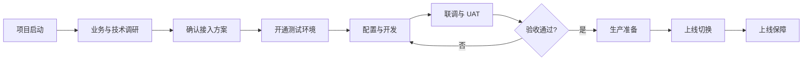

本指南面向首次接入 Longport Whale 的 Broker 项目团队，说明双方在商务确认后需要完成的准备、方案确认、环境开通、联调验收和上线工作。

## 端到端流程

## 1. 项目启动

双方确定项目负责人和固定沟通机制，并明确以下角色：

| 角色 | 主要职责 |
| --- | --- |
| Broker 项目负责人 | 范围、排期、跨团队协调与验收 |
| Broker Developer | 服务端接口、网络与数据对接 |
| Broker App Developer | 客户端或 WhaleSDK 集成 |
| Broker Operator | 账户、资金、交易等业务验收 |
| Whale 实施与技术支持 | 方案确认、环境与配置、联调支持 |

启动阶段应形成一份包含范围、负责人、里程碑、风险和待决事项的实施计划。

## 2. 前期调研

在申请环境前，至少确认以下内容：

- **业务范围**：市场、产品、账户类型、币种，以及是否包含开户、资金、交易、新股等能力。
- **接入边界**：采用 WhaleSDK、Broker API 或自研客户端；由哪一方维护 Customer 用户体系。
- **账户体系**：Broker 用户唯一标识、Whale 用户标识和证券账户号码之间的映射方式。
- **合规流程**：开户资料、KYC、风险测评、审批方式和失败处理。
- **消息通知**：选择 Whale 托管推送或 Broker 自有推送，确认 App 标识、厂商渠道和消息分发责任。
- **基础设施**：测试与生产出口 IP、域名放行、密钥保管和回调地址。
- **交付方式**：配置项、初始化数据、联调案例、UAT 标准、上线窗口和回退负责人。

接入产品的选择见[接入方式选择](/cn/docs/integration-options)。

## 3. 环境与资料准备

### Broker 需要提供

- 测试和生产环境的出口 IP 白名单。
- 技术联系人、业务验收人和生产事件联系人。
- 用户、账户及业务字段映射。
- 开户、资金、交易等计划接入场景及预期用量。
- UAT 测试数据和验收人员名单。

### Whale 需要提供

- 对应环境的访问地址和连通性要求。
- 按接入范围签发的凭证及安全交付方式。
- 已确认的业务配置、字段约束和测试账号。
- 接口文档、错误处理规则及联调支持渠道。

<Warning>
凭证必须由 Broker 服务端保管，不得写入 App、网页代码、日志或工单。测试与生产凭证不可混用。
</Warning>

## 4. 开发、联调与验收

建议按“最小闭环”逐步验证，而不是一次性覆盖全部接口：

1. 验证网络、凭证和最简单的只读请求。
2. 跑通用户绑定与开户，并保存所有业务标识。
3. 跑通资金、交易和状态查询等核心场景。
4. 按[消息推送接入](/cn/docs/message-push)验证设备通知或 Server-to-Server 消息转发。
5. 验证异步处理、重试、重复请求和失败恢复。
6. 完成权限、限流、日志脱敏和监控告警检查。
7. 由业务团队执行 UAT 并记录验收结果。

详细的技术流程见[实施与上线](/cn/docs/implementation)。

## 5. 生产上线

上线前应共同确认：

- 生产域名、IP 白名单和凭证已验证。
- 生产配置与已验收配置一致，差异有明确记录。
- 关键业务、错误率、延迟和异步任务均有监控。
- 发布步骤、观察指标、停止条件和回退方案已演练。
- 上线窗口内双方技术及业务负责人可以响应。

上线后进入约定的保障期，集中跟踪生产请求、业务结果和遗留问题；保障期结束后转入常规支持流程。
