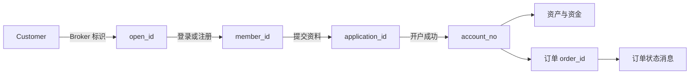
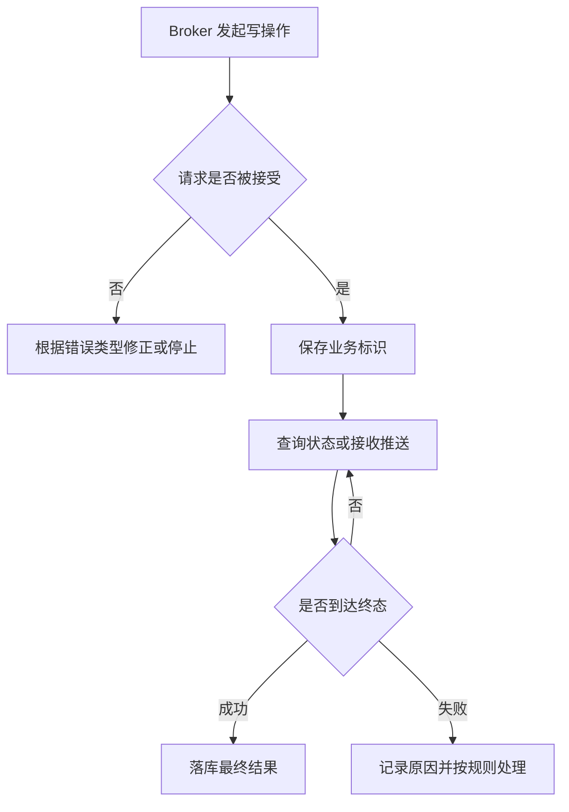

本页建立 Broker 接入时共同使用的业务模型。它说明各标识由谁产生、何时保存以及它们如何串联；具体字段仍以对应 API 文档为准。

## 核心对象

| 对象 | 关键标识 | 产生方 | Broker 需要做什么 |
| --- | --- | --- | --- |
| Customer | `open_id` | Broker | 为同一 Customer 提供稳定且唯一的标识，不得复用 |
| Whale 用户 | `member_id` | Whale | 保存与 `open_id` 的映射，并校验资源归属 |
| Customer 会话 | `token`、`refresh_token`、`sid` | Whale | 将初始凭证设置到 WhaleApp SDK / WhaleCore SDK；校验与续期由 SDK 层管理 |
| 开户申请 | `application_id` | Whale | 提交后落库，持续查询直至成功或失败 |
| 证券账户 | `account_no` | Whale | 开户成功后落库；资产、资金和交易操作以其定位账户 |
| 订单 | `order_id` | Whale | 将同步提交结果与异步状态推送关联起来 |
| 消息 | `post_id` 或项目约定的唯一消息 ID | Whale | 去重、记录处理结果，并按消息类型分发 |

<Warning>
标识存在不等于调用合法。Broker 服务端必须校验 `member_id`、`application_id`、`account_no` 和 `order_id` 是否属于当前 Customer 或当前 Broker 的授权范围。
</Warning>

## 用户、会话与账户不是同一对象

- `open_id` 用于将 Broker 用户与 Whale 用户关联起来。
- `member_id` 标识 Whale 用户，不等同于证券账户。
- 一个业务流程在获得 `member_id` 后，仍可能处于未开户、开户中或开户失败状态。
- 只有开户成功并获得 `account_no` 后，才能按证券账户执行资产、资金和交易操作。
- `token` 表示 Customer 会话。WhaleApp SDK / WhaleCore SDK 负责有效性检查和自动续期；Broker App 仅处理不可恢复的失效事件。token 不会替代 Broker Server 的资源归属校验。

详细接入顺序见[用户系统接入](/cn/docs/user-system-integration)和[用户绑定与证券账户开户](/cn/docs/account-opening)。

## 同步响应与异步终态

开户、订单和消息都可能包含异步阶段。接口接受请求，只能证明请求已被接收，不能直接证明业务已经完成。

因此，所有写操作都应明确：

1. 用哪个业务标识查询结果。
2. 哪些状态仍在处理中，哪些状态是终态。
3. 超时后如何查询状态，避免直接重复提交。
4. 重复响应或重复消息如何去重。
5. 最终失败时向 Customer 展示什么信息、由谁处理。

## 三条技术链路

| 链路 | 运行位置 | 身份边界 | 主要用途 |
| --- | --- | --- | --- |
| Broker App 与 Whale | Broker App / Web 容器 | 单个 Customer | WhaleApp SDK UI，或 WhaleCore SDK + Trading API 自行实现证券功能 UI |
| Broker Server 与 Whale | Broker 服务端 | Broker 机构或项目约定范围 | Broker API、用户关联、开户及机构级业务 |
| Whale 与 Broker Server | 双方服务端 | Broker | Broker 自有推送渠道的消息转发 |

<Note>
OpenAPI 面向 Broker 的 Developer Customer，用于策略交易、量化分析和 AI 应用，不是 Broker 实施团队建设机构级集成的替代方案。
</Note>

## Broker 应维护的最小关联记录

| 字段 | 何时写入 | 用途 |
| --- | --- | --- |
| `open_id` | 首次建立 Whale 用户关联前 | 发起登录或绑定 |
| `member_id` | 登录注册成功后 | 后续用户级调用与归属校验 |
| `application_id` | 开户申请被接受后 | 查询开户状态及防止重复提交 |
| 开户状态与 `reason` | 每次状态同步后 | Broker App 展示及异常处理 |
| `account_no` | 开户成功后 | 资产、资金、交易和对账 |
| 最近处理的消息 ID | 消息处理后 | 消息幂等与问题追踪 |

日志可以记录这些业务标识以便追踪，但 token、密钥、证件号码和联系方式必须脱敏。
