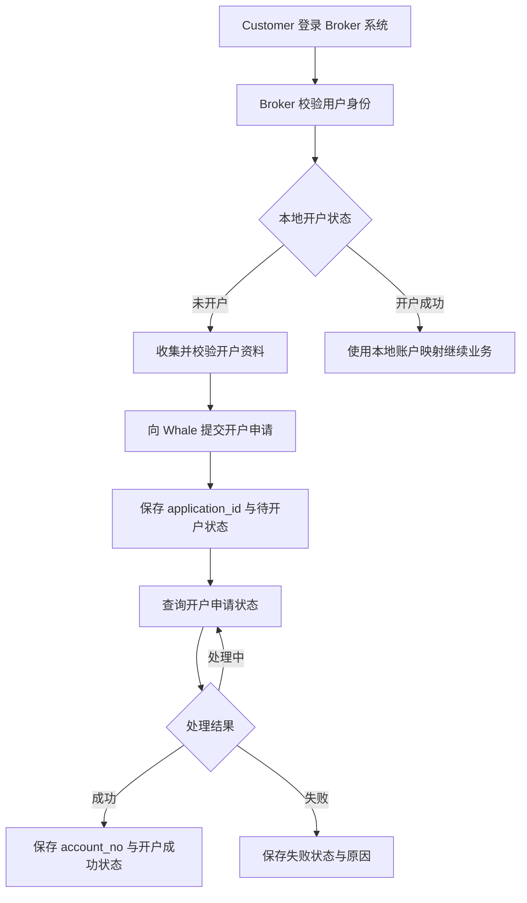
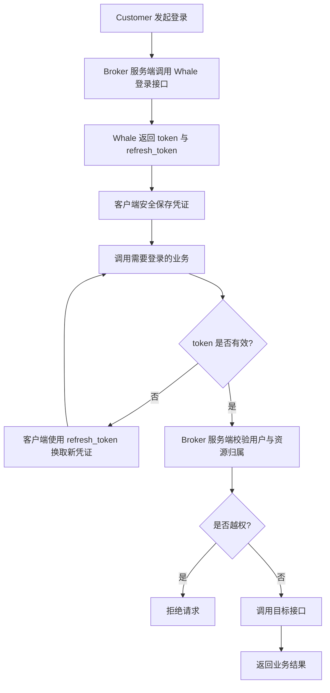
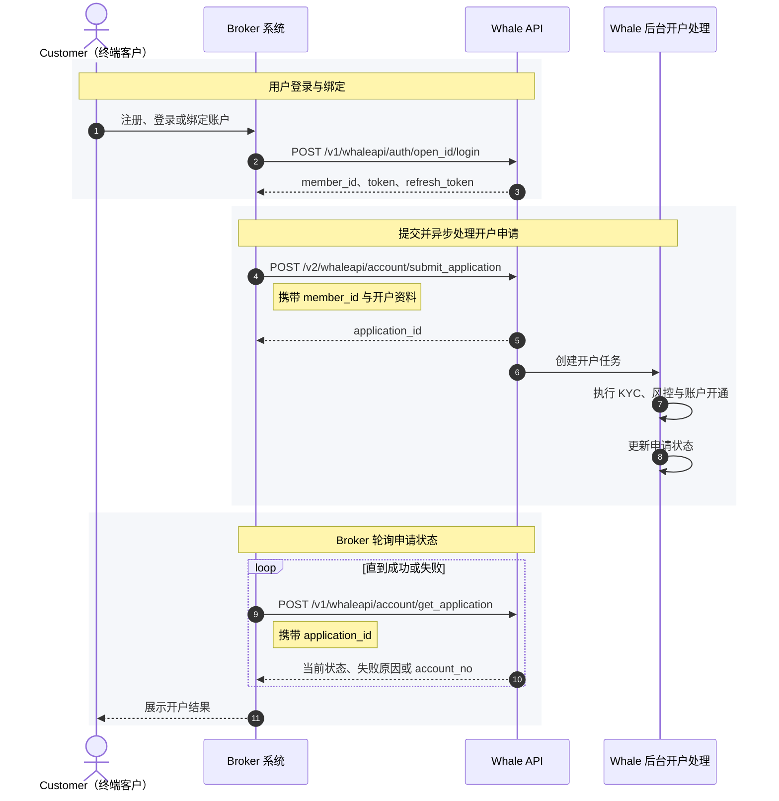

本页说明 Broker 在技术实施阶段如何选择用户体系，并完成 Customer 绑定、开户和状态同步。示例路径沿用历史 Whale 接口命名；实际可用接口和字段以项目获批范围及当前 API Reference 为准。

## 选择用户体系

### Broker 自建用户体系

Customer 的注册、登录和鉴权均由 Broker 管理。Broker 在提交开户时建立自身用户与 Whale 证券账户的关联，并在自己的系统中保存开户状态。

建议在 Broker 系统中至少保存 `未开户`、`待开户`、`开户成功` 和 `开户失败` 四种状态。注销等异步流程也应保存中间状态，并在状态确定前持续同步 Whale 的最终结果。

### 使用 Whale 用户体系

在此模式下，Broker 服务端需要组合 Whale 提供的原子接口，不能仅将客户端请求原样透传。

退出登录后，应使当前 `token` 和 `refresh_token` 一并失效。服务端仍须校验 Customer 与所访问账户的归属关系，不能只依赖客户端传入的标识。

## 用户绑定与开户

以下时序图由原交付材料中的图片重绘为可维护的 Mermaid 文本。

### 标识与持久化

| 标识 | 含义 | Broker 应如何处理 |
| --- | --- | --- |
| `open_id` | Broker 系统内的 Customer 唯一标识 | 保持稳定，不应被其他 Customer 复用 |
| `member_id` | Whale 用户唯一标识 | 登录/绑定后保存，并与 `open_id` 建立一对一映射 |
| `application_id` | 单次开户申请标识 | 提交成功后立即保存，用于查询异步状态 |
| `account_no` | 证券账户号码 | 开户成功后保存，后续资金、交易和对账以此识别账户 |

<Note>
Broker 无需按港股或美股上手方拆分账户逻辑。资金划拨和对账以 `account_no` 为准；账户内资金可按已开通能力用于换汇及不同市场交易。
</Note>

### 开户状态

历史接口的开户申请状态如下。接入时应使用状态值而不是文案做程序判断。

| 状态值 | 含义 | 建议处理 |
| --- | --- | --- |
| `5` | 已提交 | 记录申请并进入查询队列 |
| `6` | 审核通过 | 继续等待账户开通 |
| `7` | 开通中 | 按约定间隔再次查询 |
| `8` | 开通失败 | 保存并展示 `reason`，按规则决定是否允许修正 |
| `9` | 开通成功 | 保存 `account_no`，停止轮询 |

<Warning>
收到 `application_id` 只表示申请提交成功，不表示证券账户已经开通。只有终态为开通成功且返回 `account_no` 后，才能进入依赖证券账户的后续流程。
</Warning>

## 联调检查

- 首次登录能建立 `open_id` 与 `member_id` 的稳定映射。
- 重复登录不会创建错误的重复用户。
- 开户提交后即使服务重启，也能继续通过 `application_id` 查询。
- 处理中、成功和失败分支都有明确的界面与补偿行为。
- 重复提交、超时和网络重试不会生成非预期的重复业务。
- 日志会记录请求关联 ID 和业务标识，但不会记录凭证或完整敏感资料。
- 退出登录会使对应会话凭证失效。

完成联调后，再按[客户接入与交付流程](/cn/docs/broker-onboarding)执行 UAT、生产检查和上线切换。
