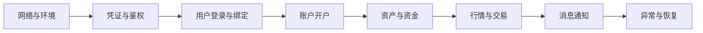

本页承接前期方案、用户系统和开户接入，说明如何组织联调、业务验收和生产切换。

## 开始前

应先完成：

1. [Broker 接入总览](/cn/docs/broker-onboarding)中的角色、范围和环境准备。
2. [接入方式选择](/cn/docs/integration-options)，明确 WhaleSDK、 WhaleCore + Trading API 或 Broker API 的边界。
3. [用户系统接入](/cn/docs/user-system-integration)，确认身份、会话和授权模型。
4. 如包含开户，完成[账户绑定与开户](/cn/docs/account-opening)的数据映射。
5. 如包含 App 通知，确认[消息推送接入](/cn/docs/message-push)方案。

## 联调顺序

建议按照最小闭环逐步扩大范围：

每个阶段都应记录输入数据、预期结果、实际结果、请求关联 ID 和负责人。写请求发生超时时，应先查询业务状态再决定是否重试。

## UAT 场景

### 正常流程

- 新 Customer 与已有 Customer 登录。
- 首次开户、开户成功及已有证券账户进入产品。
- 资产查询、资金变动和目标市场交易。
- 订单状态变化及消息通知。
- Customer 主动退出及重新登录。

### 异常流程

- token 和 refresh token 失效。
- Customer、账户或资源归属不匹配。
- 开户审核失败、重复提交和长期处理中。
- 网络超时、服务端错误及限流。
- 重复消息、通知关闭和无效跳转链接。
- App 或页面在处理中被关闭后重新进入。

## 生产就绪检查

- 生产域名、DNS、TLS、出口 IP 和白名单均已验证。
- 生产凭证通过安全渠道交付，且与 UAT 完全隔离。
- Customer、用户、申请和账户映射可以查询和追踪。
- 错误率、延迟、异步任务、消息积压和关键业务终态均有监控。
- 日志已脱敏，并记录环境、接口、请求关联 ID 和业务标识。
- 发布步骤、观察指标、停止条件和回退方案已评审。
- 上线窗口内双方技术、业务和事件负责人可以响应。

## 上线与保障期

上线时从小范围真实业务开始，确认登录、账户、交易和通知闭环后再扩大范围。保障期内集中跟踪生产请求、Customer 反馈、失败任务和配置差异；所有临时修复都应在保障期结束前形成正式配置、代码或运维记录。

<Warning>
不要用 UAT 的“接口返回成功”代替业务验收。开户、资金、订单和消息均包含异步阶段，验收必须检查最终业务状态。
</Warning>
