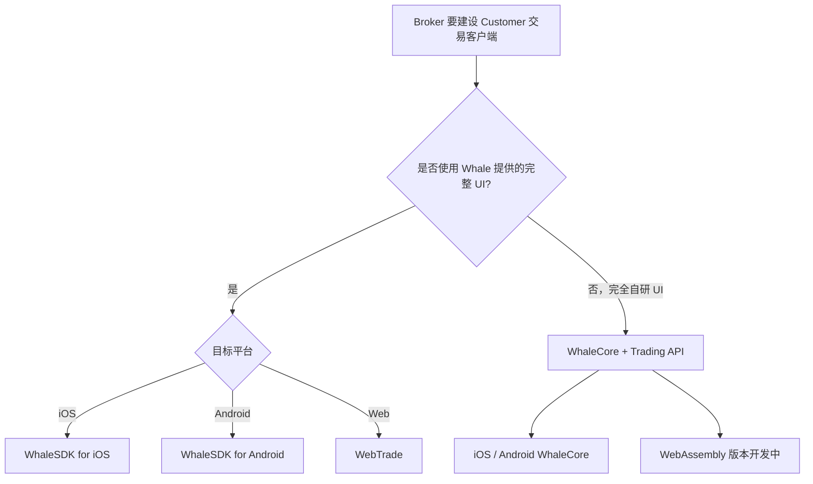

选择接入方式时，先判断是否需要 Whale 提供图形界面，再判断调用方代表 Broker 机构还是单个 Customer。

## 对比

| 产品 | 调用方 | 授权主体 | 形态 | 适合场景 | 状态 |
| --- | --- | --- | --- | --- | --- |
| [WhaleSDK](/cn/whalesdk/overview) | Broker App 开发团队 | Customer | iOS / Android / WebTrade 图形界面 | 直接集成完整行情与交易 UI | 可用 |
| [WhaleCore + Trading API](/cn/trading-api/introduction) | Broker App | Customer | iOS / Android 数据 SDK + HTTP API | Broker 完全自研证券功能 UI | iOS / Android 可用；WebAssembly 开发中 |
| [Broker API](/cn/broker-api/overview) | Broker 后端服务 | Broker | Server-to-Server API | 机构级数据与 SaaS 柜台能力 | 可用 |
| [OpenAPI ↗](https://open.longportapp.com) | Broker 的开发者 Customer、AI 应用 | Customer | Open API / SDK / MCP | 策略交易、量化分析及 AI 接入 Customer 账户与市场数据 | 可用（外部站点） |

## 图形界面还是完全自研

- **需要现成 UI**：选择 **WhaleSDK**。iOS 和 Android 提供可嵌入 Broker App 的原生图形界面；WebTrade 提供可通过新标签页、iframe 或 WebView 集成的 Web 图形界面。
- **完全自研 UI**：使用 **WhaleCore + Trading API**。WhaleCore 是 WhaleSDK 的无 UI 底层，提供行情订阅、WebSocket 连接、认证签名和 token 续期等客户端基础机制；Trading API 通过 HTTP 提供账户、资产和交易等业务能力。

## 授权边界

- **Broker 机构授权**：代表 Broker 运行的后端集成使用 Broker API。
- **Customer 授权**：WhaleSDK、 WhaleCore、Trading API 和 OpenAPI 均以单个 Customer 的权限访问私有数据。
- **Broker Developer 与 Developer Customer**：前者代表 Broker 建设产品；后者是 Broker 的 Customer，使用 OpenAPI 开发策略交易、量化分析或 AI 应用。两者不共享凭证和授权范围。

<Note>
WhaleCore 不提供任何图形界面，也不是 Trading API 的替代品。自研客户端通常同时使用 WhaleCore 的长连接和客户端基础机制，以及 Trading API 的 HTTP 业务接口。
</Note>
