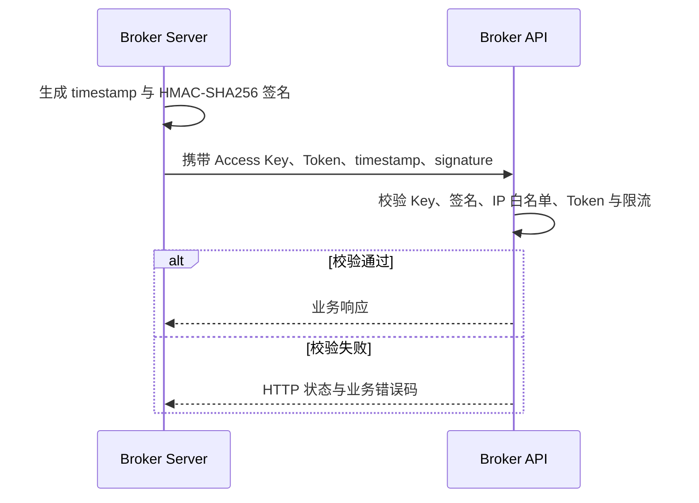

<Note>
Broker API 是机构级 API，可用于 Server-to-Server 集成，也可作为 Broker 自研管理后台的数据与业务接口。实际请求应由 Broker 服务端发起，不应在浏览器代码或 Broker App 中保存 Access Key 或直接请求。
</Note>

Broker API 用于实现证券柜台业务，主要覆盖用户账户、资产、交易和新股等模块。完整接口参考见 [Broker API](/cn/broker-api/overview)。

## 认证

Broker API 使用一组 Access Key 凭证完成机构级认证。

| 凭证 | 用途 |
| --- | --- |
| `AccessKeyId` | 每次请求通过 `x-api-key` Header 发送 |
| `AccessKeySecret` | 在 Broker Server 内生成请求签名，不随请求直接发送 |
| `AccessKeyToken` | 作为 Access Token 通过 `authorization` Header 发送 |

Broker API 会校验：Access Key 是否存在、请求签名是否正确、请求 IP 是否在白名单中、Access Token 是否有效，以及接口是否触发限流。

### 请求头

| Header | 说明 | 示例 |
| --- | --- | --- |
| `x-api-key` | Access Key ID | `<access-key-id>` |
| `authorization` | Access Token | `<access-token>` |
| `x-timestamp` | 请求时间戳 | `1685518362.111` |
| `x-api-signature` | 请求签名 | `HMAC-SHA256 SignedHeaders=x-api-key;authorization;x-timestamp,Signature=<signature>` |

由于是服务端调用服务端，这里不会有 session 和 refresh session 的场景。基本调用流程如下：



<Warning>
AccessKeySecret、AccessKeyToken 和完整签名不得写入日志、提交到仓库或下发给 Broker App。
</Warning>

## WebSocket 交易推送

我们会提供 WebSocket 交易网关用于订单状态变更信息的推送。Broker API 的 WebSocket 交易网关与 [OpenAPI WebSocket 交易网关](https://open.longportapp.com/en/docs/socket/subscribe_trade)一致，数据交互使用的私有协议也与 [OpenAPI 协议](https://open.longportapp.com/en/docs/socket/protocol/overview)一致。Broker 通过 Broker API 提交订单，订单状态更新时会通过 WebSocket 网关推送。

相关参考：

- [订单状态推送内容](https://open.longportapp.com/docs/trade/trade-definition#websocket-%E6%8E%A8%E9%80%81%E9%80%9A%E7%9F%A5)
- [WebSocket 订阅交易主题](https://open.longportapp.com/en/docs/socket/subscribe_trade)
- [私有协议说明](https://open.longportapp.com/en/docs/socket/protocol/overview)

### 首次连接

<Steps>
  <Step title="获取 OTP">
    调用[获取 OTP 接口](https://open.longportapp.com/en/docs/socket-token-api)。
  </Step>
  <Step title="建立 WebSocket">
    使用项目确认的交易网关地址建立连接。
  </Step>
  <Step title="完成认证">
    使用 OTP 执行 [auth 操作](https://open.longportapp.com/en/docs/socket/control-command#auth)。成功响应会返回可用于重连的 Session ID。
  </Step>
  <Step title="订阅交易消息">
    订阅 `private` Topic，接收订单状态变化。
  </Step>
</Steps>

### 断线重连

<Steps>
  <Step title="重新建立 WebSocket">
    创建新的 WebSocket 连接。
  </Step>
  <Step title="使用 Session ID 重连">
    使用上一次保存的 Session ID 执行 [reconnect 操作](https://open.longportapp.com/en/docs/socket/control-command#reconnect)。成功响应会返回下一次重连使用的新 Session ID。
  </Step>
  <Step title="恢复订阅">
    重新订阅 `private` Topic，并按 `order_id` 处理可能重复到达的订单消息。
  </Step>
</Steps>

## 历史 Go 调用示例

以下代码保留原始对接材料中的完整示例，用于说明配置、HTTP 调用和 WebSocket 订阅的组合方式，不应不经修改直接用于当前项目。运行前需要确认当前仍支持的客户端库，并把地址和凭证替换为项目实际配置。

<Warning>
示例中的 `openapi.longbridge.xyz` 地址来自历史材料，不代表当前 Broker API 环境。必须使用 Whale 项目团队为当前项目确认的 HTTP 与 WebSocket 地址。
</Warning>

```go
package main

import (
        "context"
        "encoding/json"
        "log"
        "net/url"
        std_http "net/http"
        "syscall"
        "time"
        "os"
        "os/signal"

        "github.com/longbridgeapp/openapi-go/config"
        "github.com/longbridgeapp/openapi-go/http"
        "github.com/longbridgeapp/openapi-go/trade"
)

var (
        accessKeyId     = ""
        accessKeySecret = ""
        accessToken     = ""

        httpAddr           = "https://openapi.longbridge.xyz"
        tradeWebsocketAddr = "wss://openapi-trade.longbridge.xyz"
)

func main() {
        // init config
        conf := &config.Config{
                AppKey:      accessKeyId,
                AppSecret:   accessKeySecret,
                AccessToken: accessToken,
                HttpURL:     httpAddr,
                TradeUrl:    tradeWebsocketAddr,
                LogLevel:    "warn",
        }

        // init go std http client
        hc := &std_http.Client{
                Transport: &std_http.Transport{
                        MaxIdleConnsPerHost: 20,
                },
                Timeout: 10 * time.Second,
        }
        conf.Client = hc

        // new trade context
        // this operation will establish websocket connection to trade gateway
        tctx, err := trade.NewFromCfg(conf)

        if err != nil {
                log.Fatal(err)
        }

        // subscribe private topic to receive order change events
        if _, err = tctx.Subscribe(context.Background(), []string{"private"}); err != nil {
                log.Fatal(err)
        }

        // register order change event callback
        tctx.OnTrade(func(ev *trade.PushEvent) {
                log.Println("received trade event")
        })

        // new http client for rest api calling
        client, err := http.New(http.WithAppKey(conf.AppKey), http.WithAppSecret(conf.AppSecret), http.WithURL(conf.HttpURL), http.WithAccessToken(conf.AccessToken))

        if err != nil {
                log.Fatal(err)
        }

        // create order
        createOrder(client)

        ch := make(chan os.Signal, 1)
        signal.Notify(ch, os.Interrupt, syscall.SIGTERM)
        s := <-ch
        log.Println("exit for " + s.String())
}

func createOrder(c *http.Client) {
        doRequest(c, Request{
                Name:   "SubmitOrder",
                Method: std_http.MethodPost,
                Path:   "/v1/whaleapi/trade/order",
                Parameters: Parameters{
                        Body: map[string]interface{}{
                                "account_no":         "<account-no>",
                                "symbol":             "AAPL.US",
                                "order_type":         "MO",
                                "submitted_quantity": "100",
                                "side":               "Buy",
                                "time_in_force":      "Day",
                        },
                },
        })
}

type Request struct {
        Name       string
        Method     string
        Path       string
        Parameters Parameters
}

type Parameters struct {
        Query  map[string]string
        Header map[string]string
        Body   map[string]interface{}
}

func doRequest(c *http.Client, req Request) {
        var resp json.RawMessage

        log.Println("calling api " + req.Name)

        q := make(url.Values)

        for k, v := range req.Parameters.Query {
                q.Set(k, v)
        }

        var body interface{}

        if len(req.Parameters.Body) != 0 {
                body = req.Parameters.Body
        }

        // call api
        err := c.Call(context.Background(), req.Method, req.Path, q, body, &resp)

        if err != nil {
                log.Printf("[ERR] failed to invoke %s error: %v\n", req.Name, err)
        } else {
                log.Println(req.Name + " resp: " + string(resp))
        }

}
```

将代码保存为本地 Go 文件，然后在同一目录执行：

```shell
go mod init main
go mod tidy
go run ./
```

示例运行结果：


### 初始化配置

```go
conf := &config.Config{
                AppKey:      accessKeyId,
                AppSecret:   accessKeySecret,
                AccessToken: accessToken,
                HttpURL:     httpAddr,
                TradeUrl:    tradeWebsocketAddr,
                LogLevel:    "warn",
        }
```

### 初始化交易上下文

```go
// init go std http client
        hc := &std_http.Client{
                Transport: &std_http.Transport{
                        MaxIdleConnsPerHost: 20,
                },
                Timeout: 10 * time.Second,
        }
        conf.Client = hc

        // new trade context
        // this operation will establish websocket connection to trade gateway
        tctx, err := trade.NewFromCfg(conf)

        if err != nil {
                log.Fatal(err)
        }
```

### 建立连接并订阅订单事件

```go
// subscribe private topic to receive order change events
        if _, err = tctx.Subscribe(context.Background(), []string{"private"}); err != nil {
                log.Fatal(err)
        }

        // register order change event callback
        tctx.OnTrade(func(ev *trade.PushEvent) {
                log.Println("received trade event")
        })
```

### 调用 HTTP API

```go
// new http client for rest api calling
        client, err := http.New(http.WithAppKey(conf.AppKey), http.WithAppSecret(conf.AppSecret), http.WithURL(conf.HttpURL), http.WithAccessToken(conf.AccessToken))

        if err != nil {
                log.Fatal(err)
        }

        // create order
        createOrder(client)
```

## 历史对接问答

<AccordionGroup>
  <Accordion title="Broker API 的访问限频是多少？">
    历史材料记录为按 API Key 总计每秒 `200` 次，并认为该数量通常足够、一般业务难以达到。限频可能按环境和项目调整，上线前应以当前 Broker API 契约和 Whale 项目团队确认结果为准。
  </Accordion>
  <Accordion title="当日成交以收市还是日清流程作为截止时间？">
    历史材料记录：美股当日成交的时间范围为北京时间 `09:00` 至次日 `12:00`，之后归入历史成交；夏令时通常整体提前一小时。实际时间边界应以当前交易日历和项目配置为准。
  </Accordion>
</AccordionGroup>
