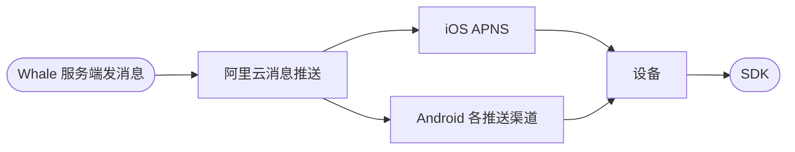
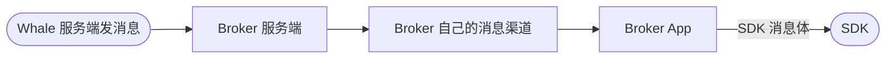

SDK 提供两种消息对接方案

## 方案一：走 Whale 的消息推送渠道

**优点：**Broker 接入成本低，没有服务端工作。

**缺点：**需要向 Whale 提供推送渠道配置信息（iOS：APNs 推送证书，Android：对应渠道的 appId、appSecret 信息）

**对接过程：**

1. Broker 提供各渠道信息，见[推送渠道信息收集](/cn/docs/push-channel-credentials)。

2. Whale 项目团队负责将第一步收集的渠道信息配置到云推送后台。

3. Broker App 对接 SDK 相关 API。

## 方案二：走 Broker 自己的消息推送渠道

**优点：**

1. Broker 使用自己的推送渠道，Whale 不需要管理具体下游渠道。

2. Broker 可以决定该消息是否通知。

**缺点：**Broker 服务端有开发工作。

**对接过程：**

1. Broker 服务端开发**接收消息接口。**

2. Broker 将**接收消息接口**提供给 Whale 项目团队配置进系统。完整接口约定见[Broker 自有推送渠道](/cn/docs/server-message-forwarding)。

3. Broker App 对接 SDK 相关 API。
