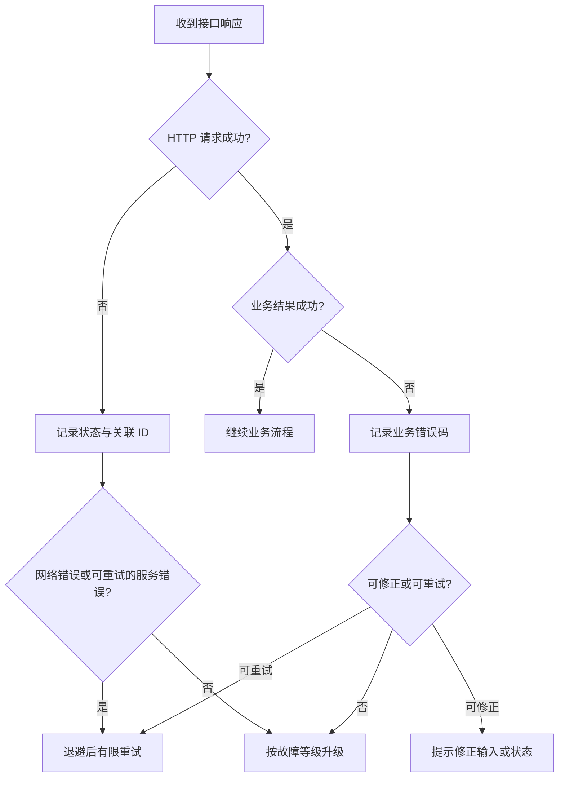

日常运行中需要排查问题时的入口：环境、错误处理、变更通知与支持升级路径。

各 API 产品的具体错误模型与限制以对应产品栏目为准，例如 [Broker API 运维参考](/cn/broker-api/operations)。

## 环境与连通性

- 将测试与生产的访问地址、出口 IP、DNS、TLS 和代理配置分别维护。
- 在写业务代码前，用只读接口验证域名解析、TLS、白名单和凭证。
- 不要将历史材料中的环境地址直接写死；上线前向 Whale 项目团队确认当前地址。
- 对连接失败、超时和服务端错误设置有限次数重试与退避，业务失败不能盲目重试。

## 错误处理

记录 HTTP 状态、响应体业务错误码、请求关联 ID、接口名称和发生时间。日志中的 token、密钥、证件号码和联系方式必须脱敏。

## 提交支持请求

为便于定位，支持请求应包含：环境、发生时间和时区、接口与方法、脱敏后的请求摘要、HTTP 状态、业务错误码、请求关联 ID、影响范围以及是否可以稳定复现。不要通过聊天或工单发送密钥和完整 Customer 敏感资料。

## 变更与生产事件

- 对 API、配置和字段映射的变更保留版本及生效时间。
- 生产事件期间先控制影响，再收集证据和恢复服务。
- 事件关闭后记录根因、恢复动作、遗留风险和防复发措施。
- 影响生产上线窗口的变更应同步更新上线步骤和回退方案。
