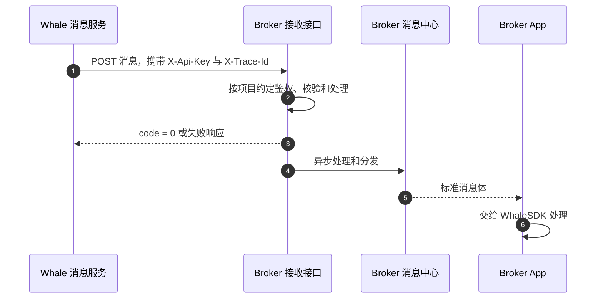

Whale 通过 Server-to-Server 接口把标准业务消息转发给 Broker Server。Broker 负责接收和下游分发；鉴权、幂等、可靠落库和用户映射方式需要在项目中确认。

## 接入流程



<Steps>
  <Step title="Broker 提供接口约定">
    Broker 提供 UAT 与生产 HTTPS 地址、认证方式、网络要求、超时限制和联系人。
  </Step>
  <Step title="Whale 配置转发">
    Whale 将接收地址和认证信息配置到对应环境，并使用测试消息验证连通性。
  </Step>
  <Step title="双方完成消息联调">
    建议验证正常消息、重复 `post_id`、鉴权失败、接口超时、返回失败和多 Customer 消息；实际范围由双方确认。
  </Step>
  <Step title="Broker App 验收">
    验证前台、后台、冷启动、Customer 登出、通知权限关闭和安全跳转。
  </Step>
</Steps>

## HTTP 接口约定

**Method：** `POST`

| Header | 原始方案 | 说明 |
| --- | --- | --- |
| `X-Api-Key` | 提供 | Broker 提供给 Whale 的接口认证 Key；是否必填及轮换方式需确认 |
| `X-Trace-Id` | 提供 | 链路追踪标识；格式、必填性和记录方式需确认 |

### 请求字段

下表根据原始请求示例整理，用于帮助阅读，不替代双方确认的正式接口契约；字段类型、必填性及允许值需在项目中确认。

| 字段 | 类型 | 说明 |
| --- | --- | --- |
| `member_ids` | `string[]` | Whale Customer 标识列表，Broker 需映射到自己的用户与设备 |
| `template_key` | `string` | 消息模板 Key |
| `post_id` | `string` | 消息唯一标识，应作为幂等键 |
| `channel` | `string` | 消息渠道，当前示例为 `push` |
| `language` | `string` | 消息语言，例如 `zh-CN` |
| `title` | `string` | 消息标题 |
| `body` | `string` | 消息摘要或正文 |
| `template_params` | `object` | 由具体模板定义的业务参数 |
| `pre_params` | `object` | Whale 内置预设变量，可能包含 Customer 资料 |
| `user_info` | `object` | 透传给 Broker App 与 WhaleSDK 的消息数据 |

### 通用请求示例

```json
{
  "member_ids": ["<member-id>"],
  "template_key": "<template-key>",
  "post_id": "<unique-message-id>",
  "channel": "push",
  "language": "zh-CN",
  "title": "消息标题",
  "body": "消息摘要",
  "template_params": {
    "key": "value",
    "date": "2026-01-21",
    "url": "https://example.com"
  },
  "pre_params": {
    "key": "value",
    "member_real_name": "示例 Customer"
  },
  "user_info": {
    "t": "<message-type>",
    "tn": "<trace-id>",
    "id": "<unique-message-id>",
    "lb_push_from": "xx",
    "link": "broker-app://example",
    "json": "{\"key\":\"value\"}"
  }
}
```

### 响应示例

```json
{
  "success": true,
  "message": "success",
  "code": 0
}
```

`code` 为 `0` 表示成功，非 `0` 表示失败。原始方案注明失败消息目前不会重试；Broker 应据此设计接收处理，但实际成功判定和重试策略必须在项目上线前再次确认。

## 完整订单消息示例

```json
{
  "member_ids": ["<member-id>"],
  "template_key": "order_done_v2_lb",
  "post_id": "<unique-message-id>",
  "channel": "push",
  "language": "zh-CN",
  "title": "买入 全部成交",
  "body": "股票名称：示例股票（00001.HK）\n成交数量: 500\n成交价格: 16.0000\n账户：示例综合账户（<account-no>）\n交易方向：买入\n订单类型：增强限价单\n有效期：当日有效\n委托数量：500\n委托价格：13.6000\n\n\n示例证券有限公司",
  "template_params": {
    "st": "CS",
    "gtd": "2026.04.14T16:00:00+08:00",
    "qty": "500",
    "code": "2333",
    "doom": "2026-04-14",
    "eqty": "500",
    "time": "",
    "price": "13.6000",
    "action": 1,
    "eprice": "16.0000",
    "market": "",
    "orderID": "<order-id>",
    "orderTag": 1,
    "originId": "<account-no>",
    "orderType": "ELO",
    "cancel_qty": "",
    "messageType": "order_done_v2_lb",
    "timeInForce": 1,
    "tickerRegion": "02333.HK",
    "accountChannel": "lb",
    "multilegDetail": "",
    "multilegStrategy": 0,
    "stock_counter_id": "ST/HK/2333",
    "multilegCombinedCode": ""
  },
  "pre_params": {
    "org_id": "1",
    "org_name": "示例证券有限公司",
    "member_id": "<member-id>",
    "account_aaid": "<account-aaid>",
    "member_email": "",
    "account_email": "customer@example.com",
    "member_app_id": "longbridge",
    "sender_prefix": "Longbridge",
    "account_org_id": "1",
    "member_account": "<member-account>",
    "org_short_name": "示例证券",
    "account_channel": "lb",
    "member_language": "zh-CN",
    "member_timezone": "Asia/Shanghai",
    "org_check_title": "Long Bridge HK Limited",
    "account_language": "zh-CN",
    "member_real_name": "LB",
    "org_account_name": "示例综合账户",
    "org_phone_number": "+852 0000 0000",
    "account_member_id": "<account-member-id>",
    "account_real_name": " LB",
    "account_account_no": "<account-no>",
    "member_user_region": "CN",
    "org_recipient_name": "开户部",
    "member_phone_number": "+86 13800000000",
    "account_phone_number": "+86 13900000000",
    "org_delivery_address": "示例机构地址",
    "org_check_description": "至少 10,000 港币或 1,500 美元的香港银行账户支票。",
    "member_phone_number_suffix": "2596",
    "account_phone_number_suffix": "5021",
    "member_privacy_phone_number": "86-888****2596",
    "account_privacy_phone_number": "86-666****5021"
  },
  "user_info": {
    "t": "order_done_v2_lb",
    "tn": "43c13033d04444f9b0e9ca8ac12441be",
    "id": "<unique-message-id>",
    "lb_push_from": "",
    "link": "lb://page/trade/order_detail?id=<order-id>&account_channel=lb",
    "json": "{\n  \"message_type\": \"order_done_v2_lb\"\n}"
  }
}
```

## SDK 消息对接格式

Broker App 从自有推送渠道取得消息后，需要保留 `title`、`body` 和完整 `user_info`，并交给 WhaleSDK 的消息处理入口。

```jsonc
{
    "title": "消息标题", // WhaleSDK 需要
    "body": "消息摘要",
    "user_info": {
        "t": "xx", // 消息类型或埋点字段
        "tn": "xx", // 追踪或埋点字段
        "id": "xx", // 消息标识
        "lb_push_from": "xx", // 原始字段用于判断消息来源，具体取值需确认
        "link": "跳转链接",
        "json": "业务内容 JSON 字串"
    }
}
```

<Warning>
Broker App 必须校验 `link` 的 scheme、目标和参数后再跳转，不能直接执行未识别的外部 URL。未知消息类型应安全降级，不应导致 App 崩溃。
</Warning>

## 已有模板文件

- `pre_function`：内置函数说明；当前已使用的函数包含在模板文件中

- `templates`：模板定义

- `template_locales`：模板多语言内容及配置

[下载完整模板文件](/files/whalesdk/gbltpl.zip)

```text
tpl.xxx 从请求体的 template_params 读取参数。
pre.xxx 从请求体的 pre_params 读取参数。

例如模板表达式 {{stock_name(tpl.stock_counter_id)}}
对应的请求参数为：

template_params: {
  stock_counter_id: "ST/US/BABA"
}
```
