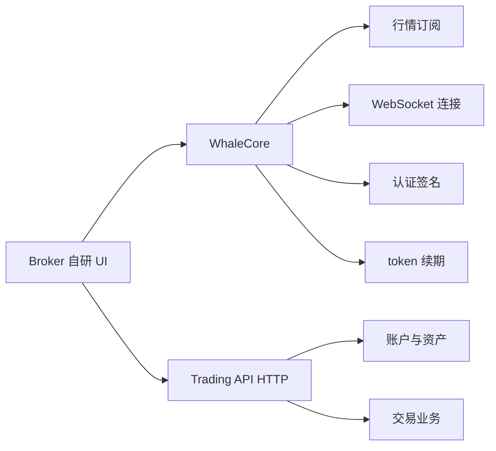

Broker 如果希望完全自研 App 图形界面，可以组合使用 **WhaleCore** 和 **Trading API**。

- **WhaleCore** 是 WhaleSDK 的无 UI 底层数据 SDK，负责适合在 Broker App 中封装的连接与会话基础能力。
- **Trading API** 是以单个 Customer 身份授权的 HTTP API，提供账户、资产、交易等业务能力。

## 组合架构

## 平台状态

| 平台 | WhaleCore 形态 | 状态 |
| --- | --- | --- |
| iOS | 原生客户端库 | 可用 |
| Android | 原生客户端库 | 可用 |
| Web | WebAssembly | 开发中 |

## 何时使用

- 需要完全控制信息架构、视觉设计和交互体验。
- 已有自己的行情、资产和交易页面，不希望嵌入 Whale 提供的 UI。
- 愿意自行组合数据流、HTTP 业务接口、页面状态和错误恢复。

如果希望直接获得完整图形界面，应选择 [WhaleSDK](/cn/whalesdk/overview)。

<Note>
WhaleCore 只提供基础机制，不包含图形界面，也不会替 Broker App 组合完整业务流程。具体库、Trading API 端点和版本兼容矩阵由 Whale 项目团队按接入范围提供。
</Note>
