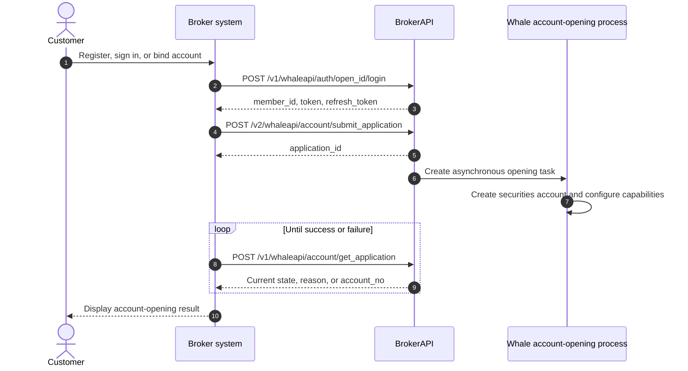
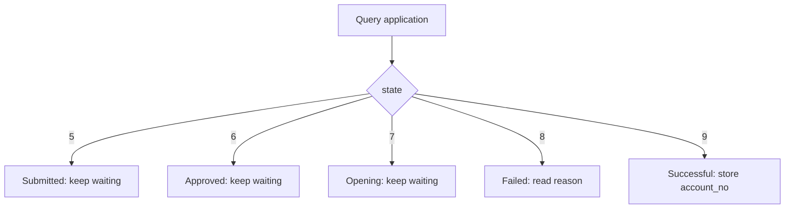

User binding and account opening are not a single synchronous call. First establish the `open_id → member_id` mapping, then submit an account-opening application and query its asynchronous result until an `account_no` is returned.

<CardGroup cols={3}>
  <Card title="Sign in and bind" icon="link" />
  <Card title="Submit application" icon="file-pen" />
  <Card title="Query application status" icon="rotate" />
</CardGroup>

## API overview {/* api-overview */}

- User registration and sign-in (`POST /v1/whaleapi/auth/open_id/login`)

    - The first sign-in registers the user.

    - Bind the third-party user to the Whale user (`open_id → member_id`).

        - `open_id`: unique user identifier in the third-party system.

        - `member_id`: unique user identifier in Whale.

    - Issue the SDK sign-in token.

- User logout (`POST /v1/whaleapi/auth/session/logout`)

    - Log the user out with the token and invalidate the token.

    - Two parameters are required:

        - `member_id`: returned by the sign-in API.

        - `sid`: decode the JWT payload of the returned `token` to obtain `sid`.

- Securities account opening

    - Submit account-opening information (`POST /v2/whaleapi/account/submit_application`).

    - Poll the application status (`POST /v1/whaleapi/account/get_application`) or receive an account-opened notification when custom delivery has been agreed for the project.

## Mapping and status model {/* mapping-and-status-model */}

| Identifier | Owning system | Purpose | Recommended storage |
| --- | --- | --- | --- |
| `open_id` | Broker | Stable unique identifier for a Customer in Broker's user system | Broker Server |
| `member_id` | Whale | Unique Whale user identifier returned by the sign-in API | Broker Server |
| `application_id` | Whale | Identifier for one account-opening application, used to query asynchronous status | Broker Server |
| `account_no` | Whale | Securities account number after successful opening | Broker Server |
| `sid` | Whale session | Session ID required for logout; decode it from the sign-in token's JWT payload | Session storage |

<Warning>
`open_id` must be stable and must never be reused by another Customer. Broker Server must verify the ownership relationships among `member_id`, `application_id`, and `account_no`; it must not trust related identifiers supplied directly by Broker App.
</Warning>

## Detailed design {/* detailed-design */}

### End-to-end flow {/* end-to-end-flow */}



### Flow details {/* flow-details */}

<Steps>
  <Step title="Register, sign in, and bind the user">

Broker Server calls the registration and sign-in API.

| Scenario | System behavior |
| --- | --- |
| User is not registered | Create a platform user (Member) |
| User is registered | Sign in directly |
| First third-party integration | Establish the `open_id → member_id` mapping |

  </Step>
  <Step title="Submit account-opening information">

After the account-opening information passes validation, the system creates an application record and returns its ID.

This means only that the **application was submitted successfully**; it does not mean that the account is open. Broker must store the returned `application_id`.

  </Step>
  <Step title="Wait for asynchronous account opening">
    Whale processes the application asynchronously, including securities-account creation and account-capability configuration. Broker polls the application status or, when agreed for the project, receives the result through a custom notification.
  </Step>
  <Step title="Persist the final result">
    Store `account_no` when the status is successful, or `reason` when it fails. Broker App should enter securities-account functionality only after a successful status is received.
  </Step>
</Steps>

### Status decision {/* status-decision */}



<Note>
Use `state` as the source of truth: `5` submitted, `6` approved, `7` opening, `8` failed, and `9` successful. Read `reason` on failure and `account_no` on success.
</Note>

## API details {/* api-details */}

### Register or sign in a user {/* register-or-sign-in-a-user */}

`POST /v1/whaleapi/auth/open_id/login`

##### Request fields {/* request-fields */}

| Field | Type | Required | Description |
| --- | --- | --- | --- |
| `open_id` | string | Y | Unique third-party user identifier (`userid`) |

#### Request and response examples {/* request-and-response-examples */}

```json
{
  "open_id": "roleid"
}
```

```json
{
  "code": 0,
  "message": "",
  "data": {
    "member_info": {
      "member": {
        "member_id": "123",
        "uuid": "default_value",
        "phone_number": "default_value",
        "email": "default_value",
        "lang": "default_value",
        "country_code": 0,
        "email_check": false,
        "avatar": "default_value",
        "nickname": "default_value",
        "can_nick_modified": false,
        "user_region": "default_value"
      },
      "lang": "zh-CN",
      "setting": {
        "currency": "USD",
        "lang": "auto"
      }
    },
    "credentials": {
      "token": "xxxxx",
      "refresh_token": "xxxxx"
    },
    "first_login": true
  }
}
```

| Field | Type | Required | Description |
| --- | --- | --- | --- |
| `code` | number | Y | `0`: success; greater than `0`: failure |
| `message` | string | Y | Error message |
| `data` | object | Y | |
| `+ member_info` | object \[MemberInfo\] | Y | User information |

##### MemberInfo {/* memberinfo */}

| Field | Type | Required | Description |
| --- | --- | --- | --- |
| `member_info` | object | Y | Basic community information |
| `+ member_id` | string | Y | Whale user ID |
| `+ nickname` | string | Y | Nickname, generated by default |
| `+ avatar` | string | Y | Avatar, generated by default |
| `+ lang` | string | Y | Current language; defaults to Traditional Chinese (`zh-HK`) |
| `setting` | object | Y | User settings, including language and market-color preference |
| `+ lang` | string | Y | Language setting:<br />- `auto`: follow system language<br />- `en`: English<br />- `zh-CN`: Simplified Chinese<br />- `zh-HK`: Traditional Chinese (default) |

### Submit an account-opening application {/* submit-an-account-opening-application */}

`POST /v2/whaleapi/account/submit_application`

##### Request fields {/* request-fields-1 */}

| Field | Type | Required | Description |
| --- | --- | --- | --- |
| `member_id` | integer | Y | User ID |
| `client_type` | integer | Y | Customer type: `1` individual, `2` corporate |
| `open_info` | object | Y | Account-opening form |
| `+ account_no` | string | N | Securities account number |
| `+ mark` | string | N | Account marker |
| `+ upload` | object | Y | Identity-document information |
| `++ card_country` | string | Y | Document-issuing country or region; see [ISO 3166-1 alpha-2](https://en.wikipedia.org/wiki/ISO_3166-1_alpha-2#Officially_assigned_code_elements) |
| `++ card_type` | integer | Y | Document type: `0` identity card, `1` passport |
| `++ card_id` | string | Y | Document number |
| `++ first_name` | string | N | Given name in English or Pinyin |
| `++ last_name` | string | Y | Family name in English or Pinyin |
| `+ base` | object | Y | Basic personal information |
| `++ residence_country` | string | Y | Country or region of residence; see [ISO 3166-1 alpha-2](https://en.wikipedia.org/wiki/ISO_3166-1_alpha-2#Officially_assigned_code_elements) |
| `++ residence_part` | string | N | Residential area |
| `++ residence_desc` | string | Y | Full residential address |
| `+ employ` | object | N | Employment information |
| `++ contact` | object | Y | Contact details |
| `+++ emails` | array \[Email\] | Y | Email addresses, including the contract-note delivery address |
| `++ taxes` | array \[Tax\] | Y | Tax information by country or region |
| `+ finance` | object | Y | Financial information |
| `++ account_type` | string | Y | Account type: `C` cash, `M` margin |
| `+ risk` | object | N | Risk information |
| `++ risk_tolerance` | object | N | Risk-assessment information |
| `+++ audit` | bool | Y | Whether the risk assessment passed |
| `+++ end_at` | integer | Y | Risk-assessment expiration time |

#### Request and response examples {/* request-and-response-examples-1 */}

```json
{
  "member_id": 123456,
  "client_type": 1,
  "open_info": {
    "upload": {
      "card_type": 0,
      "card_id": "<document-number>",
      "first_name": "SAN",
      "last_name": "ZHANG"
    },
    "base": {
      "residence_country": "CN",
      "residence_desc": "<residential-address>"
    },
    "finance": {
      "account_type": "C"
    },
    "risk": {
      "risk_tolerance": {
        "audit": true,
        "end_at": 1716358996
      }
    }
  }
}
```

```json
{
  "application_id": 123456
}
```

### Get account-opening application information {/* get-account-opening-application-information */}

`POST /v1/whaleapi/account/get_application`

##### Request fields {/* request-fields-2 */}

| Field | Type | Required | Description |
| --- | --- | --- | --- |
| `application_id` | string | Y | Account-opening application ID |
| `member_id` | string | To confirm | The original request example contains this field, but the original field table did not declare it. Follow the current BrokerAPI contract. |

##### Response fields {/* response-fields */}

| Field | Type | Required | Description |
| --- | --- | --- | --- |
| `code` | integer | Y | |
| `message` | string | Y | |
| `data` | object | | |
| `open_info` | object | Y | Account-opening form |
| `+ upload` | object | Y | Identity-document information |
| `++ region` | string | Y | Nationality |
| `++ card_type` | integer | Y | Document type:<br />- `0`: identity card<br />- `1`: passport |
| `++ card_country` | string | Y | Document-issuing country or region; see [ISO 3166-1 alpha-2](https://en.wikipedia.org/wiki/ISO_3166-1_alpha-2#Officially_assigned_code_elements) |
| `++ card_id` | string | Y | Document number |
| `++ first_name` | string | Y | Given name in English or Pinyin |
| `++ last_name` | string | Y | Family name in English or Pinyin |
| `++ name` | string | N | Chinese name |
| `++ valid_date_end` | string | N | Document expiration date |
| `+ base` | object | | Basic information |
| `++ country_code` | string | Y | Country or region of birth |
| `++ birth_date` | string | Y | Date of birth |
| `++ gender` | string | N | Gender:<br />- `male`<br />- `female` |
| `++ marital_status` | string | N | Marital status:<br />- `single`<br />- `married`<br />- `other`: separated<br />- `divorced`: widowed<br />- `widowed` |
| `++ residence_country` | string | Y | Country or region of residence |
| `++ residence_part` | string | Y | Residential area |
| `++ residence_desc` | string | Y | Full residential address |
| `+ employ` | object | | Employment information |
| `++ type` | string | N | Employment type |
| `state` | integer | Y | Application status:<br />- `5`: submitted<br />- `6`: approved<br />- `7`: opening<br />- `8`: failed<br />- `9`: successful |
| `reason` | string | | Failure reason |
| `account_no` | string | | Securities account number |

#### Request and response examples {/* request-and-response-examples-2 */}

```json
{
  "member_id": "1",
  "application_id": "2"
}
```

```json
{
  "code": 0,
  "message": "",
  "data": {
    "state": 9,
    "account_no": "<account-no>",
    "open_info": {
      "upload": {
        "region": "MO",
        "card_type": 0,
        "card_country": "MO",
        "first_name": "SAN",
        "last_name": "ZHANG",
        "card_id": "<document-number>",
        "valid_date_end": "1991-01-01"
      },
      "base": {
        "country_code": "CN",
        "gender": "male",
        "education": "Record of formal schooling",
        "birth_date": "1991-01-02",
        "marital_status": "single",
        "residence_country": "CN",
        "residence_part": "part",
        "residence_desc": "desc"
      },
      "employ": {
        "type": "employed",
        "email": "customer@example.com",
        "contact": {
          "phones": [
            {
              "country_code": 86,
              "mobile": "13800000000"
            }
          ],
          "emails": [
            {
              "email": "customer@example.com"
            }
          ]
        },
        "taxes": [
          {
            "country": "nationality",
            "id": "identifier",
            "assets_ids": "supporting-documents"
          }
        ]
      },
      "finance": {
        "income_level": "annual income"
      },
      "risk": {
        "risk_tolerance": {
          "level": "A1"
        }
      },
      "verify": {
        "cash": {
          "bank_id": 1111,
          "bank_no": "<bank-account-no>",
          "currency": "HKD"
        }
      }
    }
  }
}
```

### Log out a user {/* log-out-a-user */}

`POST /v1/whaleapi/auth/session/logout`

##### Request fields {/* request-fields-3 */}

| Field | Type | Required | Description |
| --- | --- | --- | --- |
| `member_id` | string | Y | User ID returned by the sign-in API |
| `sid` | string | Y | Session ID. Decode the standard JWT payload of the sign-in token to obtain `sid`. |

## Error codes {/* error-codes */}

| Error code | Meaning | Recommended handling |
| --- | --- | --- |
| `400` | Invalid parameters | Check required fields, types, and enum values |
| `500` | Service error | Record the request correlation information and contact the Whale project team |
| `401033` | User frozen | Block further operations and show the account status to the Customer |
| `401040` | User account closed | Clear the local session and unavailable-account state |
| `401047` | Required system configuration is missing | Ask the Whale project team to complete the configuration |
| `404002` | Identity information already exists; use the original account for securities trading | Guide the Customer to the original account |
| `404013` | Duplicate submission is not allowed | Query the existing application instead of creating another one |
| `404050` | A new account cannot be opened within three months after account closure | Display the restriction and stop submission |
| `404056` | Account opening failed | Display `reason` and confirm whether retry is allowed |
| `404062` | Account unavailable | Block access to securities-account functionality |
| `404102` | The current application state does not allow information changes | Query the current state before choosing the next action |
| `404103` | Account-opening application does not exist | Verify `application_id` and its ownership relationship |

## FAQs and items to confirm {/* faqs-and-items-to-confirm */}

<AccordionGroup>
  <Accordion title="How are the two user systems connected, and how are token and refresh_token obtained?">
    Call the [user registration and sign-in](#register-or-sign-in-a-user) API with a stable `open_id`. The response includes `member_id`, `token`, and `refresh_token`. Broker stores the user mapping and passes the initial credentials to Broker App, which sets them in WhaleAppSDK or WhaleCoreSDK.
  </Accordion>
  <Accordion title="How should the account-opening fields be populated?">
    See the [BrokerAPI account-opening field documentation](https://apidocs.longbridgewhale.com/whaleapi/submit-application-v2%E6%8F%90%E4%BA%A4%E5%BC%80%E6%88%B7%E7%94%B3%E8%AF%B7%E8%B5%84%E6%96%99-3469908e0).
  </Accordion>
  <Accordion title="Are tokens client-specific?">
    No. Pass the initial token to Broker App and set it in WhaleAppSDK or WhaleCoreSDK. The SDK layer performs subsequent validity checks and automatic renewal; Broker App does not call check token or implement refresh logic. No party may write a complete token to logs.
  </Accordion>
</AccordionGroup>

The original integration material listed these items as requiring confirmation with the Whale project team before implementation:

- Securities account-number rules.
- Values and business meaning of the `mark` account marker.
- API-signing rule examples.
- The error-code range used by the project.
