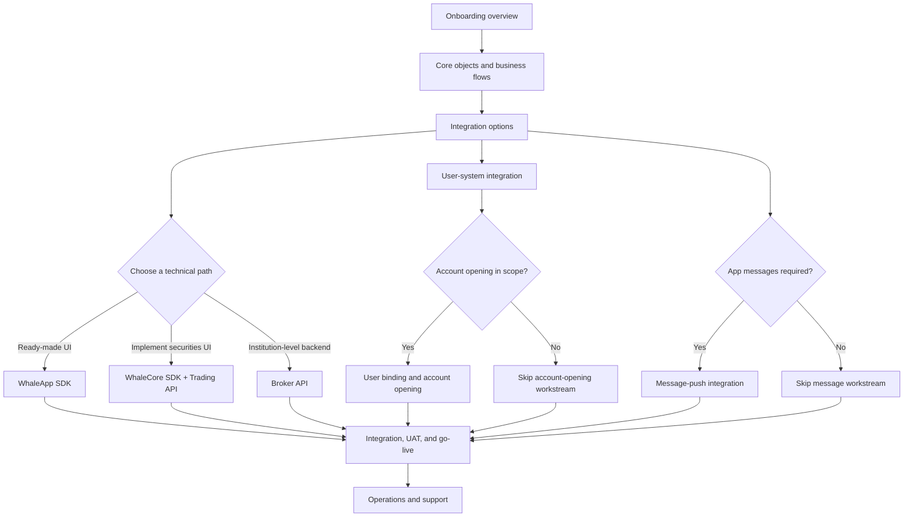
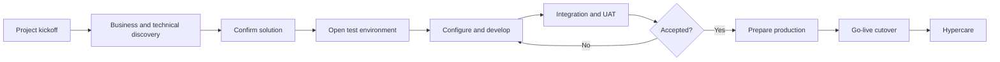

This guide is for Broker project teams integrating Longport Whale for the first time. It covers preparation, solution confirmation, environment setup, integration, acceptance, and go-live after commercial confirmation.

<Note>
This is the main entry point for Broker onboarding. We recommend producing verifiable deliverables by phase; the actual workflow and gates follow the scope agreed by both parties.
</Note>

## Guide route

| Goal | Guide |
| --- | --- |
| Understand Customers, users, applications, accounts, and messages | [Core objects and business flows](/en/docs/concepts) |
| Choose UI, client, and server paths | [Integration options](/en/docs/integration-options) |
| Decide Customer registration, login, and session ownership | [User-system integration](/en/docs/user-system-integration) |
| Integrate a complete UI | [WhaleApp SDK for iOS, Android, and WebTrade](/en/whalesdk/whaleapp/overview) |
| Implement the securities UI in Broker App | [WhaleCore SDK and Trading API](/en/trading-api/introduction) |
| Integrate institution-level backend capabilities | [Broker API](/en/broker-api/overview) |
| If in scope, map users, applications, and brokerage accounts | [User binding and account opening](/en/docs/account-opening) |
| If App messages are required, select and implement the path | [Message-push integration](/en/docs/message-push) |
| Test, accept, and cut over to production | [Integration testing, UAT, and go-live](/en/docs/implementation) |
| Handle post-launch errors, incidents, and escalation | [Operations and support](/en/docs/operations-support) |

## Phases, deliverables, and exit criteria

| Phase | Main deliverable | Exit criterion |
| --- | --- | --- |
| 1. Kickoff | Scope, owners, milestones, communication, and escalation | Both parties confirm owners, scope, and target go-live |
| 2. Solution confirmation | Integration products, user system, account model, and message option | Every technical path, caller, and authorization subject is clear |
| 3. Environment preparation | Endpoints, allowlists, credentials, configuration, and test data | Broker completes one authenticated request from UAT |
| 4. Development and integration | Minimum user, account, core-business, and message loops | Normal and key failure scenarios have reproducible results |
| 5. UAT | Test records, issue list, and acceptance conclusion | Blocking issues are closed and the business owner accepts |
| 6. Production preparation | Production configuration, release steps, monitoring, and rollback | Readiness checks pass and both parties have on-call staff |
| 7. Hypercare | Production verification, incident record, and remaining issues | Core paths are stable and move to normal support |

## End-to-end delivery

## 1. Project kickoff

Both parties name project owners and a stable communication mechanism, including these roles:

| Role | Main responsibility |
| --- | --- |
| Broker project owner | Scope, schedule, cross-team coordination, and acceptance |
| Broker Developer | Server endpoints, networking, and data integration |
| Broker App Developer | WhaleApp SDK (iOS, Android, or WebTrade) or WhaleCore SDK integration |
| Broker Operator | Business acceptance for accounts, cash, trading, and related areas |
| Whale implementation and technical support | Solution confirmation, environments, configuration, and integration support |

Kickoff should produce an implementation plan covering scope, owners, milestones, risks, and open decisions.

### Responsibility boundary

| Work | Broker | Whale |
| --- | --- | --- |
| Broker product scope and Customer experience | Decide and accept | Explain capability boundaries and advise implementation |
| Broker App and Broker Server development | Implement, test, and release | Supply SDKs, APIs, configuration, and technical support |
| User, account, and business-data mapping | Define Broker fields and maintain relationships | Explain Whale fields and constraints |
| Network, domains, and credentials | Configure Broker environment and protect credentials | Open environments, allowlists, and credentials |
| UAT | Prepare scenarios and data and issue acceptance | Diagnose and resolve Whale-side issues |
| Production | Release, monitor, and roll back Broker systems | Configure and support Whale and respond to incidents |

## 2. Discovery

Before requesting an environment, confirm at least:

- **Business scope:** markets, products, account types, currencies, and whether opening, cash, trading, IPO, and other capabilities are included.
- **Integration boundary:** WhaleApp SDK, WhaleCore SDK + Trading API, or Broker API, and which party maintains the Customer user system.
- **Account model:** mappings among Broker's user identifier, Whale user identifier, and brokerage-account number.
- **Compliance flow:** opening information, KYC, risk assessment, approval, and failure handling.
- **Messages:** Whale-managed or Broker-owned push, App identifiers, vendor channels, and distribution responsibility.
- **Infrastructure:** UAT and production outbound IPs, domain access, secret storage, and callback addresses.
- **Delivery:** configuration, initial data, integration cases, UAT criteria, release window, and rollback owner.

See [Integration options](/en/docs/integration-options) for product selection.

Discovery should produce a solution-confirmation record stating:

- Whether Broker App uses WhaleApp SDK (iOS, Android, or WebTrade) or WhaleCore SDK + Trading API to implement the securities UI.
- Which Broker API capabilities Broker Server uses.
- Who manages Customer users and how `open_id` remains stable.
- How opening applications are submitted, queried, and shown after failure.
- Whether Whale sends through managed channels or forwards to Broker Server.
- Which capabilities are outside the current scope and how they will be handled later.

## 3. Environment and material preparation

### Broker provides

- UAT and production outbound-IP allowlists.
- Technical, business-acceptance, and production-incident contacts.
- User, account, and business-field mappings.
- Planned opening, cash, trading, and other scenarios and expected volume.
- UAT data and acceptance participants.

### Whale provides

- Environment endpoints and connectivity requirements.
- Credentials for the approved scope and a secure delivery method.
- Confirmed business configuration, field constraints, and test accounts.
- API documentation, error rules, and integration-support channel.

### Environment exit criteria

- Broker records the UAT endpoint, purpose, and owner.
- DNS, TLS, proxy, outbound IP, and allowlist pass verification.
- Credentials arrived securely and are stored in Broker's secret-management facility.
- Broker authenticates successfully with the simplest read-only endpoint.
- Test accounts, markets, currencies, and required initial data are available.
- UAT and production configuration, credentials, and data cannot mix.

<Warning>
Broker Server must protect credentials. Never place them in an App, browser code, logs, or tickets. Never share credentials between UAT and production.
</Warning>

## 4. Development, integration, and acceptance

Verify a minimum closed loop and expand incrementally:

1. Verify network, credentials, and the simplest read-only request.
2. Complete user linking and account opening and persist every business identifier.
3. Complete cash, trading, status-query, and other core scenarios.
4. Follow [Message-push integration](/en/docs/message-push) to test device delivery or Server-to-Server forwarding.
5. Test asynchronous work, retries, duplicate requests, and failure recovery.
6. Check permissions, rate limits, redacted logs, monitoring, and alerts.
7. Have the business team execute UAT and record acceptance.

See [Integration testing, UAT, and go-live](/en/docs/implementation) for the detailed process.

### Evidence to retain

- Scenario, input, expected result, and actual result.
- Request time, environment, endpoint, redacted business identifier, and correlation ID.
- Intermediate and final asynchronous states.
- Issue owner, resolution, and regression result.
- UAT acceptor and final confirmation.

## 5. Production go-live

Before go-live, jointly confirm:

- Production domains, IP allowlists, and credentials are verified.
- Production configuration matches the accepted configuration and every difference is recorded.
- Critical business outcomes, error rate, latency, and asynchronous work are monitored.
- Release steps, observation signals, stop conditions, and rollback were rehearsed.
- Technical and business owners from both parties can respond during the release window.

After cutover, enter the agreed hypercare period and track production requests, business results, and remaining issues. Move to normal support after hypercare ends.
