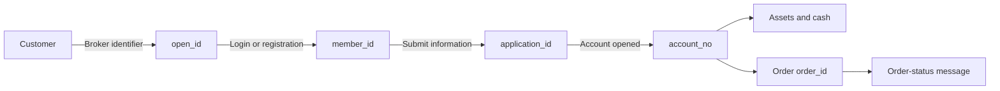
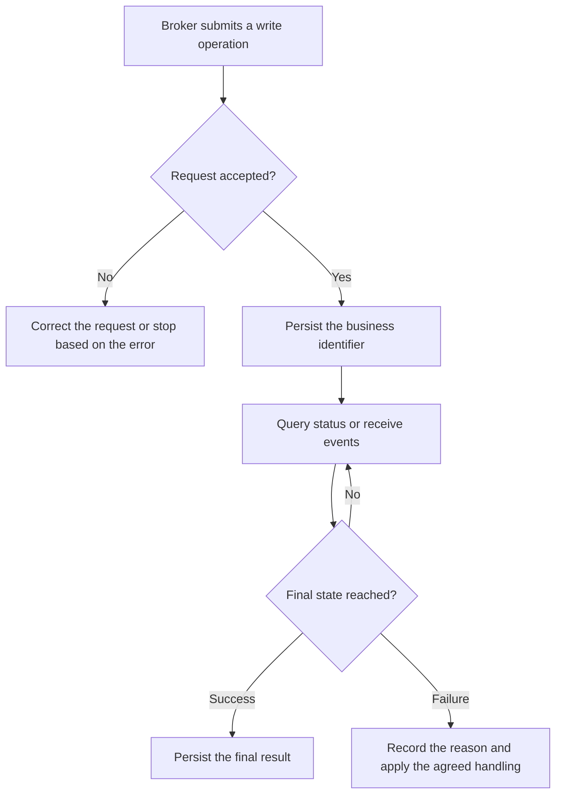

This page establishes the shared business model for a Broker integration. It explains who creates each identifier, when the Broker stores it, and how the identifiers connect. Refer to the relevant API documentation for exact fields.

## Core objects

| Object | Key identifier | Created by | Broker responsibility |
| --- | --- | --- | --- |
| Customer | `open_id` | Broker | Provide a stable identifier that is unique to the Customer and never reused |
| Whale user | `member_id` | Whale | Store its mapping to `open_id` and validate resource ownership |
| Customer session | `token`, `refresh_token`, `sid` | Whale | Set the initial credentials in WhaleSDK or WhaleCoreSDK; the SDK layer validates and renews them |
| Account application | `application_id` | Whale | Persist it after submission and query until success or failure |
| Brokerage account | `account_no` | Whale | Persist it after successful opening and use it to identify asset, cash, and trading operations |
| Order | `order_id` | Whale | Correlate the synchronous submission result with asynchronous status events |
| Message | `post_id` or the project-agreed unique message ID | Whale | Deduplicate it, record the processing result, and route it by message type |

<Warning>
Possessing an identifier does not authorize a request. Broker Server must verify that each `member_id`, `application_id`, `account_no`, and `order_id` belongs to the current Customer or falls within the Broker's authorization scope.
</Warning>

## Users, sessions, and accounts are different objects

- `open_id` links a Broker user to a Whale user.
- `member_id` identifies the Whale user, not a brokerage account.
- After receiving a `member_id`, the business flow may still be not opened, opening, or failed.
- Asset, cash, and trading operations can use the brokerage account only after opening succeeds and an `account_no` is available.
- `token` represents the Customer session. WhaleSDK or WhaleCoreSDK validates and renews it automatically; Broker App handles only unrecoverable invalidation events. A token does not replace Broker Server resource-ownership checks.

See [User-system integration](/en/docs/user-system-integration) and [User binding and account opening](/en/docs/account-opening) for the integration sequence.

## Synchronous responses and asynchronous final states

Account opening, orders, and messages can contain asynchronous stages. An accepted request proves only that the system accepted it, not that the business operation is complete.

Every write operation should therefore define:

1. Which business identifier queries the result.
2. Which states are still processing and which are final.
3. How to query after a timeout before deciding whether to retry.
4. How to deduplicate repeated responses or messages.
5. What to show the Customer after final failure and who owns the follow-up.

## Three technical paths

| Path | Runs in | Identity boundary | Main use |
| --- | --- | --- | --- |
| Broker App to Whale | Broker App or web container | One Customer | WhaleSDK UI, or WhaleCoreSDK + TradingAPI when implementing the securities UI from scratch |
| Broker Server to Whale | Broker Server | Broker institution or project-agreed scope | BrokerAPI, user linking, account opening, and institution-level operations |
| Whale to Broker Server | Both servers | Broker | Message forwarding through Broker-owned push channels |

<Note>
OpenAPI is for a Broker's Developer Customers building algorithmic trading, quantitative analysis, and AI applications. It does not replace an institution-level integration built by the Broker implementation team.
</Note>

## Minimum association records for the Broker

| Field | When to write it | Purpose |
| --- | --- | --- |
| `open_id` | Before first linking a Whale user | Start login or binding |
| `member_id` | After login or registration succeeds | Customer-level calls and ownership checks |
| `application_id` | After an account application is accepted | Query opening status and prevent duplicate submission |
| Opening state and `reason` | After every status synchronization | Broker App presentation and exception handling |
| `account_no` | After account opening succeeds | Assets, cash, trading, and reconciliation |
| Last processed message ID | After message processing | Idempotency and incident tracing |

Logs may include these business identifiers for tracing, but tokens, secrets, identity-document numbers, and contact details must be redacted.
