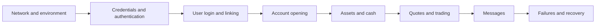

This page follows solution design, user-system integration, and account opening, and explains how to organize integration testing, business acceptance, and production cutover.

## Before you begin {/* before-you-begin */}

Complete the following first:

1. Roles, scope, and environment preparation in [Broker onboarding overview](/en/docs/broker-onboarding).
2. [Integration options](/en/docs/integration-options), with clear boundaries among WhaleAppSDK, WhaleCoreSDK + TradingAPI, and BrokerAPI.
3. [User-system integration](/en/docs/user-system-integration), confirming identity, session, and authorization models.
4. If account opening is in scope, the mappings in [User binding and account opening](/en/docs/account-opening).
5. If App notifications are in scope, the option in [Message-push integration](/en/docs/message-push).

## Integration sequence {/* integration-sequence */}

Expand the scope progressively from a minimum closed loop:

For every stage, record input, expected result, actual result, request correlation ID, and owner. If a write request times out, query business state before deciding whether to retry.

## Acceptance by stage {/* acceptance-by-stage */}

| Stage | Minimum verification | Evidence of passing |
| --- | --- | --- |
| Network and environment | DNS, TLS, outbound IP, allowlist, and timeout settings | Broker Server reaches the confirmed endpoint from the target environment |
| Credentials and authentication | Correct, incorrect, expired, and invalid credentials | Successful requests are traceable and failed requests expose no credentials |
| Users and sessions | New and existing Customers, SDK renewal, and logout | Stable `open_id` to `member_id` mapping and expected session invalidation |
| Account opening | Submit, processing, success, failure, and duplicate submit | Correct persistence of `application_id`, state, `reason`, and `account_no` |
| Assets and cash | Queries, changes, precision, and balance limits | Broker records match Whale results |
| Quotes and trading | Subscription, order submission, order states, and rejected orders | Synchronous results correlate with asynchronous final order states |
| Messages | Foreground, background, disabled permission, and duplicates | Broker App or Broker Server deduplicates, displays, and navigates correctly |
| Recovery | Timeout, rate limit, reconnect, and service failure | Bounded retries and no duplicate business outcome |

## UAT scenarios {/* uat-scenarios */}

### Normal flows {/* normal-flows */}

- Login for a new and an existing Customer.
- First account opening, opening success, and entering with an existing brokerage account.
- Asset queries, cash changes, and trading in each target market.
- Order-state changes and messages.
- Customer logout and login again.

### Failure flows {/* failure-flows */}

- Unrecoverable token or refresh-token invalidation.
- Customer, account, or resource-ownership mismatch.
- Opening rejection, duplicate submit, and prolonged processing.
- Network timeout, server error, and rate limiting.
- Duplicate message, disabled notifications, and invalid navigation link.
- Closing and reopening the App or page while an operation is processing.

### UAT record template {/* uat-record-template */}

Record at least the following for every case:

| Field | Description |
| --- | --- |
| Case ID and name | Stable test identifier and business scenario |
| Preconditions | Environment, Customer, account, market, and configuration |
| Steps | Actual Broker App and Broker Server actions |
| Expected result | Synchronous response, intermediate states, and final business state |
| Actual result | Broker UI, Broker data, and Whale result |
| Trace data | Time and timezone, request correlation ID, and redacted business identifiers |
| Conclusion | Pass, fail, or blocked, plus issue link and owner |

## Production-readiness checklist {/* production-readiness-checklist */}

- Production domain, DNS, TLS, outbound IP, and allowlist are verified.
- Production credentials arrived through a secure channel and are completely isolated from UAT.
- Customer, user, application, and account mappings are queryable and traceable.
- Error rate, latency, asynchronous work, message backlog, and critical final states are monitored.
- Logs are redacted and record environment, endpoint, request correlation ID, and business identifier.
- Release steps, observation signals, stop conditions, and rollback plan were reviewed.
- Technical, business, and incident owners from both parties are available during the release window.

### Go-live gates {/* go-live-gates */}

Do not cut over to production if any of the following remains true:

- A core normal flow or high-impact cash/trading failure flow has not passed acceptance.
- UAT and production configuration differences have not been reviewed.
- Critical operations cannot be traced by business identifier and request correlation ID.
- Monitoring is missing from Broker App, Broker Server, or Whale.
- Stop conditions, rollback steps, or a rollback owner are undefined.
- Production credentials appeared in code, logs, chat, or tickets and have not been rotated.

## Go-live and hypercare {/* go-live-and-hypercare */}

Begin with a small amount of real production activity. Expand only after login, account, trading, and message loops are confirmed. During hypercare, track production requests, Customer feedback, failed work, and configuration differences. Convert every temporary fix into a formal configuration, code, or operations record before hypercare ends.

Before ending hypercare, confirm:

- Every remaining issue has an owner, priority, and target completion date.
- Temporary allowlists, configuration, and manual operations are removed or made permanent.
- Monitoring thresholds, incident contacts, and support entry points are handed to the normal operations team.
- Implementation material, UAT records, and production change records remain available for audit.

<Warning>
Do not treat an API success response in UAT as business acceptance. Account opening, cash, orders, and messages all contain asynchronous stages; acceptance must verify final business states.
</Warning>
