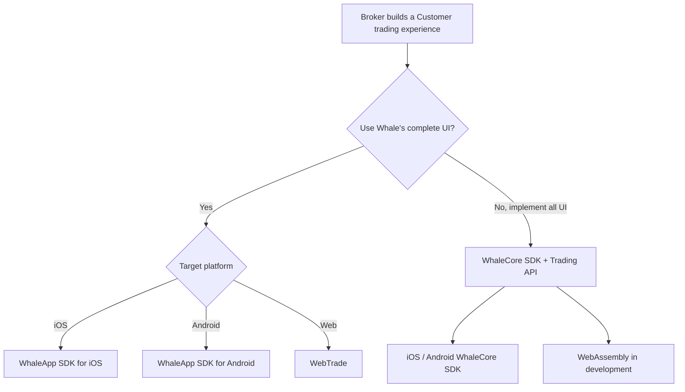

First decide whether Whale should supply the graphical UI. Then decide whether the caller represents the Broker institution or one Customer.

## Comparison

| Product | Caller | Authorization subject | Form | Best fit | Status |
| --- | --- | --- | --- | --- | --- |
| [WhaleApp SDK](/en/whalesdk/overview) | Broker App team | Customer | iOS / Android / WebTrade graphical SDK | Integrate a complete securities UI in Broker App, website, or web container | Available |
| [WhaleCore SDK + Trading API](/en/trading-api/introduction) | Broker App | Customer | iOS / Android / Web data SDK + HTTP API | Broker App implements the complete securities UI | iOS / Android available; WebAssembly in development |
| [Broker API](/en/broker-api/overview) | Broker Server / self-built administration backend | Broker | HTTPS API | Server-to-Server integration or a self-built administration system | Available |
| [OpenAPI ↗](https://open.longportapp.com) | Broker Developer Customers and AI apps | Customer | Open API / SDK / MCP | Algorithmic trading, quantitative analysis, and AI access to Customer-authorized accounts and market data | Available |

## Ready-made or custom UI

- **Ready-made UI:** choose **WhaleApp SDK**. iOS and Android provide native UI; WebTrade integrates through a new tab, iframe, or WebView.
- **Implement the complete securities UI:** use **WhaleCore SDK + Trading API**. WhaleCore SDK supplies market subscriptions, WebSocket connectivity, request signing, token renewal, and other client foundations; Trading API supplies account, asset, trading, and related HTTP capabilities.

## Authorization boundaries

- **Broker-scoped authorization:** Server-to-Server integrations and self-built administration systems use Broker API; requests originate from a Broker-controlled server.
- **Customer-scoped authorization:** WhaleApp SDK, including WebTrade, WhaleCore SDK, Trading API, and OpenAPI access private data as one Customer.
- **Broker Developers and Developer Customers:** a Broker Developer builds the Broker product; a Developer Customer is a Broker Customer building with OpenAPI. They never share credentials or authorization scope.

<Note>
WhaleCore SDK has no graphical UI and does not replace Trading API. A Broker App implementing the complete securities UI normally combines WhaleCore SDK connection and session foundations with Trading API HTTP business endpoints.
</Note>
