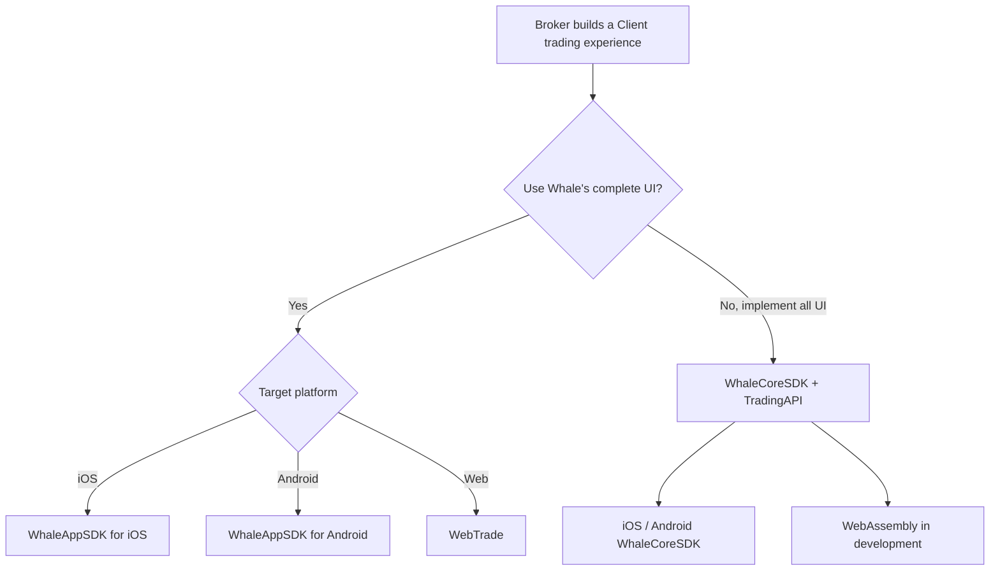

First decide whether Whale should supply the graphical UI. Then decide whether the caller represents the Broker institution or one Client.

## Comparison {/* comparison */}

| Product | Caller | Authorization subject | Form | Best fit | Status |
| --- | --- | --- | --- | --- | --- |
| [WhaleAppSDK](/en/whalesdk/whaleapp/overview) | Broker App team | Client | iOS / Android / WebTrade graphical SDK | Integrate a complete securities UI in Broker App, website, or web container | Available |
| [WhaleCoreSDK + TradingAPI](/en/trading-api/overview) | Broker App | Client | iOS / Android / Web data SDK + HTTP API | Broker App implements the complete securities UI | iOS / Android available; WebAssembly in development |
| [BrokerAPI](/en/broker-api/overview) | Broker Server / self-built administration backend | Broker | HTTPS API | Server-to-Server integration or a self-built administration system | Available |
| [OpenAPI](https://open.longportapp.com) | A Broker's Developers and AI apps | Client | Open API / SDK / MCP | Algorithmic trading, quantitative analysis, and AI access to Client-authorized accounts and market data | Available |

## Ready-made or custom UI {/* ready-made-or-custom-ui */}

- **Ready-made UI:** choose **WhaleAppSDK**. iOS and Android provide native UI; WebTrade can be deployed on a standalone domain for direct user access or embedded in a Broker's website via iframe.
- **Implement the complete securities UI:** use **WhaleCoreSDK + TradingAPI**. WhaleCoreSDK supplies market subscriptions, WebSocket connectivity, request signing, token renewal, and other client foundations; TradingAPI supplies account, asset, trading, and related HTTP capabilities.

## Authorization boundaries {/* authorization-boundaries */}

- **Broker-scoped authorization:** Server-to-Server integrations and self-built administration systems use BrokerAPI; requests originate from a Broker-controlled server.
- **Client-scoped authorization:** WhaleAppSDK, including WebTrade, WhaleCoreSDK, TradingAPI, and OpenAPI access private data as one Client.
- **Broker Developers vs. Developers:** a Broker Developer builds the Broker product on the Broker's behalf; a Developer is a Broker Client building on OpenAPI. The two never share credentials or authorization scope.

<Note>
WhaleCoreSDK has no graphical UI and does not replace TradingAPI. A Broker App implementing the complete securities UI normally combines WhaleCoreSDK connection and session foundations with TradingAPI HTTP business endpoints.
</Note>
