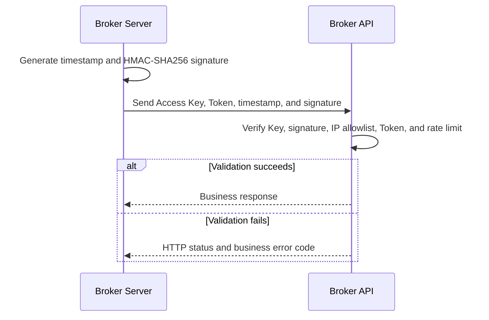

<Note>
Broker API is an institution-grade API for Server-to-Server integration or a Broker's self-built administration system. Requests must originate from Broker Server; Access Keys must not be stored in or used directly by browser code or Broker App.
</Note>

Broker API implements securities back-office operations, mainly covering users, accounts, assets, trading, and IPO subscriptions. See [Broker API](/en/broker-api/overview) for the complete interface reference.

## Authentication

Broker API uses a set of Access Key credentials for institutional authentication.

| Credential | Purpose |
| --- | --- |
| `AccessKeyId` | Sent in the `x-api-key` header with every request |
| `AccessKeySecret` | Used by Broker Server to generate the request signature; never sent directly |
| `AccessKeyToken` | Sent as the Access Token in the `authorization` header |

Broker API verifies that the Access Key exists, the request signature is correct, the source IP is allowlisted, the Access Token is valid, and the request is within the rate limit.

### Request headers

| Header | Description | Example |
| --- | --- | --- |
| `x-api-key` | Access Key ID | `<access-key-id>` |
| `authorization` | Access Token | `<access-token>` |
| `x-timestamp` | Request timestamp | `1685518362.111` |
| `x-api-signature` | Request signature | `HMAC-SHA256 SignedHeaders=x-api-key;authorization;x-timestamp,Signature=<signature>` |

Because this is Server-to-Server communication, session and refresh-session flows do not apply. The basic request flow is:



<Warning>
Never write `AccessKeySecret`, `AccessKeyToken`, or a complete signature to logs, commit them to a repository, or deliver them to Broker App.
</Warning>

## WebSocket trade notifications

Whale provides a WebSocket trade gateway for order-status updates. The Broker API WebSocket trade gateway follows the same connection model as the [OpenAPI WebSocket trade gateway](https://open.longportapp.com/en/docs/socket/subscribe_trade), and its private data protocol follows the [OpenAPI protocol](https://open.longportapp.com/en/docs/socket/protocol/overview). Broker submits orders through Broker API and receives order-status updates through the WebSocket gateway.

References:

- [Order-status notification payload](https://open.longportapp.com/docs/trade/trade-definition#websocket-%E6%8E%A8%E9%80%81%E9%80%9A%E7%9F%A5)
- [Subscribe to the WebSocket trade topic](https://open.longportapp.com/en/docs/socket/subscribe_trade)
- [Private protocol](https://open.longportapp.com/en/docs/socket/protocol/overview)

### Initial connection

<Steps>
  <Step title="Obtain an OTP">
    Call the [OTP API](https://open.longportapp.com/en/docs/socket-token-api).
  </Step>
  <Step title="Open the WebSocket">
    Connect to the trade-gateway address confirmed for the project.
  </Step>
  <Step title="Authenticate">
    Use the OTP in the [auth command](https://open.longportapp.com/en/docs/socket/control-command#auth). A successful response returns the Session ID used for reconnection.
  </Step>
  <Step title="Subscribe to trade messages">
    Subscribe to the `private` topic to receive order-status changes.
  </Step>
</Steps>

### Reconnection

<Steps>
  <Step title="Open a new WebSocket">
    Create a new WebSocket connection.
  </Step>
  <Step title="Reconnect with the Session ID">
    Use the previously stored Session ID in the [reconnect command](https://open.longportapp.com/en/docs/socket/control-command#reconnect). A successful response returns a new Session ID for the next reconnection.
  </Step>
  <Step title="Restore the subscription">
    Subscribe to the `private` topic again, and use `order_id` to handle order messages that may be delivered more than once.
  </Step>
</Steps>

## Historical Go request example

The complete example from the original integration material is preserved below. It demonstrates configuration, HTTP requests, and WebSocket subscription together, but must not be used in a current project without review and modification. Confirm that the client library is still supported, then replace all addresses and credentials with the project's actual configuration.

<Warning>
The `openapi.longbridge.xyz` addresses in this example come from historical material and do not represent the current Broker API environment. Use only the HTTP and WebSocket addresses confirmed by the Whale project team.
</Warning>

```go
package main

import (
        "context"
        "encoding/json"
        "log"
        "net/url"
        std_http "net/http"
        "syscall"
        "time"
        "os"
        "os/signal"

        "github.com/longbridgeapp/openapi-go/config"
        "github.com/longbridgeapp/openapi-go/http"
        "github.com/longbridgeapp/openapi-go/trade"
)

var (
        accessKeyId     = ""
        accessKeySecret = ""
        accessToken     = ""

        httpAddr           = "https://openapi.longbridge.xyz"
        tradeWebsocketAddr = "wss://openapi-trade.longbridge.xyz"
)

func main() {
        // init config
        conf := &config.Config{
                AppKey:      accessKeyId,
                AppSecret:   accessKeySecret,
                AccessToken: accessToken,
                HttpURL:     httpAddr,
                TradeUrl:    tradeWebsocketAddr,
                LogLevel:    "warn",
        }

        // init go std http client
        hc := &std_http.Client{
                Transport: &std_http.Transport{
                        MaxIdleConnsPerHost: 20,
                },
                Timeout: 10 * time.Second,
        }
        conf.Client = hc

        // new trade context
        // this operation will establish websocket connection to trade gateway
        tctx, err := trade.NewFromCfg(conf)

        if err != nil {
                log.Fatal(err)
        }

        // subscribe private topic to receive order change events
        if _, err = tctx.Subscribe(context.Background(), []string{"private"}); err != nil {
                log.Fatal(err)
        }

        // register order change event callback
        tctx.OnTrade(func(ev *trade.PushEvent) {
                log.Println("received trade event")
        })

        // new http client for rest api calling
        client, err := http.New(http.WithAppKey(conf.AppKey), http.WithAppSecret(conf.AppSecret), http.WithURL(conf.HttpURL), http.WithAccessToken(conf.AccessToken))

        if err != nil {
                log.Fatal(err)
        }

        // create order
        createOrder(client)

        ch := make(chan os.Signal, 1)
        signal.Notify(ch, os.Interrupt, syscall.SIGTERM)
        s := <-ch
        log.Println("exit for " + s.String())
}

func createOrder(c *http.Client) {
        doRequest(c, Request{
                Name:   "SubmitOrder",
                Method: std_http.MethodPost,
                Path:   "/v1/whaleapi/trade/order",
                Parameters: Parameters{
                        Body: map[string]interface{}{
                                "account_no":         "<account-no>",
                                "symbol":             "AAPL.US",
                                "order_type":         "MO",
                                "submitted_quantity": "100",
                                "side":               "Buy",
                                "time_in_force":      "Day",
                        },
                },
        })
}

type Request struct {
        Name       string
        Method     string
        Path       string
        Parameters Parameters
}

type Parameters struct {
        Query  map[string]string
        Header map[string]string
        Body   map[string]interface{}
}

func doRequest(c *http.Client, req Request) {
        var resp json.RawMessage

        log.Println("calling api " + req.Name)

        q := make(url.Values)

        for k, v := range req.Parameters.Query {
                q.Set(k, v)
        }

        var body interface{}

        if len(req.Parameters.Body) != 0 {
                body = req.Parameters.Body
        }

        // call api
        err := c.Call(context.Background(), req.Method, req.Path, q, body, &resp)

        if err != nil {
                log.Printf("[ERR] failed to invoke %s error: %v\n", req.Name, err)
        } else {
                log.Println(req.Name + " resp: " + string(resp))
        }

}
```

Save the code as a local Go file, then run these commands in the same directory:

```shell
go mod init main
go mod tidy
go run ./
```

Example output:


### Initialize configuration

```go
conf := &config.Config{
                AppKey:      accessKeyId,
                AppSecret:   accessKeySecret,
                AccessToken: accessToken,
                HttpURL:     httpAddr,
                TradeUrl:    tradeWebsocketAddr,
                LogLevel:    "warn",
        }
```

### Initialize the trade context

```go
// init go std http client
        hc := &std_http.Client{
                Transport: &std_http.Transport{
                        MaxIdleConnsPerHost: 20,
                },
                Timeout: 10 * time.Second,
        }
        conf.Client = hc

        // new trade context
        // this operation will establish websocket connection to trade gateway
        tctx, err := trade.NewFromCfg(conf)

        if err != nil {
                log.Fatal(err)
        }
```

### Connect and subscribe to order events

```go
// subscribe private topic to receive order change events
        if _, err = tctx.Subscribe(context.Background(), []string{"private"}); err != nil {
                log.Fatal(err)
        }

        // register order change event callback
        tctx.OnTrade(func(ev *trade.PushEvent) {
                log.Println("received trade event")
        })
```

### Call an HTTP API

```go
// new http client for rest api calling
        client, err := http.New(http.WithAppKey(conf.AppKey), http.WithAppSecret(conf.AppSecret), http.WithURL(conf.HttpURL), http.WithAccessToken(conf.AccessToken))

        if err != nil {
                log.Fatal(err)
        }

        // create order
        createOrder(client)
```

## Historical integration FAQs

<AccordionGroup>
  <Accordion title="What is the Broker API rate limit?">
    Historical material records an aggregate limit of `200` requests per second per API Key and describes it as normally sufficient for typical workloads. Limits may vary by environment and project; before launch, follow the current Broker API contract and the Whale project team's confirmation.
  </Accordion>
  <Accordion title="Does the daily-trade cutoff follow market close or end-of-day processing?">
    Historical material records the US daily-trade interval as `09:00` Beijing time through `12:00` the next day, after which trades are classified as historical. During daylight saving time, the entire interval is normally one hour earlier. Follow the current trading calendar and project configuration for the actual boundary.
  </Accordion>
</AccordionGroup>
