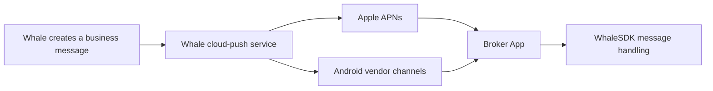
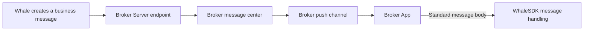

WhaleSDK supports two message-delivery options. In both, Broker App ultimately receives the standard message body and passes it to WhaleSDK. The difference is whether Whale delivers directly through cloud-push channels or first forwards the message to Broker Server.

| Item | Whale-managed push | Broker-owned push |
| --- | --- | --- |
| Path | Whale → cloud push → device → Broker App | Whale → Broker Server → Broker channel → Broker App |
| Broker Server work | None | Build receiving and downstream-distribution services |
| Channel credentials | Broker securely provides them to Whale | Broker retains them |
| Distribution control | Whale-configured channels and policies | Broker decides whether and how to notify |
| Best fit | Lower integration cost and faster delivery | Existing message center or custom distribution control |

## Option 1: Whale-managed push

<CardGroup cols={2}>
  <Card title="Advantage" icon="circle-check">
    Lower Broker integration cost and no message-forwarding service to build.
  </Card>
  <Card title="Consideration" icon="triangle-exclamation">
    Broker must securely provide channel configuration: iOS APNs credentials and Android vendor App IDs, keys, or secrets.
  </Card>
</CardGroup>

<Steps>
  <Step title="Collect channel information">
    Broker prepares UAT and production details with the [Push-channel information form](/en/docs/push-channel-credentials), explicitly marking unused channels as none.
  </Step>
  <Step title="Configure Whale cloud push">
    The Whale project team configures the confirmed channel information in the corresponding environment.
  </Step>
  <Step title="Integrate Broker App">
    Broker App integrates the WhaleSDK message API and tests notification permission, device token, foreground/background receipt, and notification navigation.
  </Step>
</Steps>

## Option 2: Broker-owned push

<CardGroup cols={2}>
  <Card title="Advantage" icon="sliders">
    Whale does not manage downstream channels. Broker controls templates, Customer preferences, whether to notify, and distribution policy.
  </Card>
  <Card title="Consideration" icon="code">
    Broker Server must receive and distribute messages. Authentication, idempotency, durable storage, and monitoring are agreed per project.
  </Card>
</CardGroup>

<Steps>
  <Step title="Build the receiving endpoint">
    Broker Server builds an HTTPS endpoint reachable by Whale.
  </Step>
  <Step title="Configure forwarding">
    Broker gives the Whale project team the UAT and production endpoints, authentication method, network requirements, and contacts.
  </Step>
  <Step title="Test the server path">
    Follow [Broker-owned push channels](/en/docs/server-message-forwarding) to test requests, responses, idempotency, and failures.
  </Step>
  <Step title="Integrate Broker App">
    Broker App passes the final standard message to WhaleSDK and implements safe navigation and compatibility behavior.
  </Step>
</Steps>

<Note>
This page helps select an option. See [Message-push integration](/en/docs/message-push) for the complete responsibility boundary, client requirements, and acceptance scenarios.
</Note>
