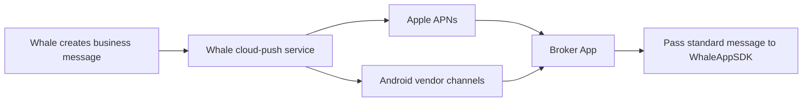
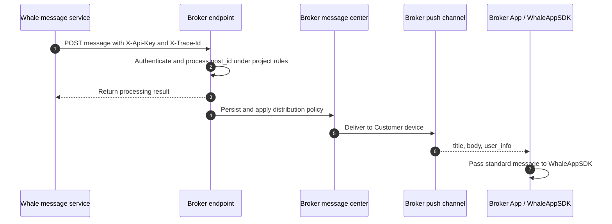

Whale order, account, and other business messages can reach a Customer in two ways: Whale manages the cloud-push channels and delivers directly to devices, or Whale forwards the message to Broker Server and Broker decides whether and how to distribute it.

## Detailed guides {/* detailed-guides */}

This page explains the overall options and responsibility boundaries. The original configuration fields and complete examples are retained in:

- [Choose a message-push option](/en/docs/message-push-options)
- [Push-channel information form](/en/docs/push-channel-credentials)
- [Broker-owned push channels](/en/docs/server-message-forwarding)

## Choose an option {/* choose-an-option */}

| Item | Whale-managed push | Broker-owned push |
| --- | --- | --- |
| Path | Whale → cloud push → APNs / Android vendor → App | Whale → Broker Server → Broker channel → App |
| Broker Server development | None | Build message receipt, handling, and distribution |
| Cloud configuration | Broker securely provides App channel credentials to Whale | Broker manages credentials and normally does not provide them to Whale |
| Message control | Whale-configured templates and policies | Broker can filter, merge, delay, and select channels |
| App work | Register device and pass messages to WhaleAppSDK | Register Broker channel and pass the standard message to WhaleAppSDK |
| Best fit | Faster delivery with less server development | Existing message platform or custom distribution requirements |

<Tip>
Choose Broker-owned push when Broker already has a mature message center, marketing policy, or several downstream channels. Choose Whale-managed push when the goal is standard trading notifications with less development.
</Tip>

## Option 1: Whale-managed push {/* option-1-whale-managed-push */}



### Enablement flow {/* enablement-flow */}

1. Broker confirms production and UAT iOS Bundle IDs, Android Package Names, and required channels.
2. Broker creates the App and enables push in Apple or Android vendor consoles, then generates credentials.
3. Broker delivers credentials to Whale through the agreed encrypted channel.
4. Whale creates and configures the cloud-push application for each environment.
5. Broker App implements notification permission, device-token registration, and WhaleAppSDK message handling.
6. Both parties test foreground, background, terminated-App, and notification-tap behavior.

### Android channel information {/* android-channel-information */}

Mark unused channels explicitly as unused. If production and UAT share a Package Name, only one set may be submitted, but confirm that the vendor console permits sharing across both environments.

| Channel | Required | Optional |
| --- | --- | --- |
| HUAWEI | Client ID, Client Secret | Default receipt ID, Live View service-account key |
| HONOR | App ID, Client ID, Client Secret | — |
| Xiaomi | App Secret | Overseas App Secret |
| FCM | Service-account key | — |
| OPPO | App Key, Master Secret | — |
| Meizu | App ID, App Secret | — |
| vivo | App ID, App Key, App Secret | Default receipt ID |

For every environment, also record:

- Environment: UAT or production.
- Android Package Name.
- App name or project ID in the vendor console.
- Credential expiry, rotation contact, and planned rotation time.

### iOS APNs information {/* ios-apns-information */}

Broker can provide either an APNs token-signing key (`.p8`) or certificate (`.p12`); normally only one is needed.

| Credential | Provide |
| --- | --- |
| `.p8` | Key file, Key ID, Team ID, Bundle ID, and applicable environment |
| `.p12` | Certificate, password, Bundle ID, and development/production environment |

If UAT and production share a Bundle ID, state this explicitly in the delivery form rather than assuming whether credentials can be reused.

<Warning>
Push credentials are production secrets. Never place them in Git, ordinary documents, plaintext chat, email bodies, or client packages. Use an approved secret-delivery channel and record custodian, scope, expiry, and rotation after delivery.
</Warning>

## Option 2: Broker-owned push {/* option-2-broker-owned-push */}

Whale sends standard business messages to an endpoint provided by Broker. Broker can apply filtering, template rendering, Customer preferences, and multi-channel distribution.



### Information from Broker {/* information-from-broker */}

- UAT and production HTTPS endpoints.
- Authentication method and secure key-delivery flow.
- Network allowlist, TLS, and optional mTLS requirements.
- Request timeout, maximum body size, and rate limit.
- Technical contact, monitoring method, and production-escalation channel.

### HTTP convention {/* http-convention */}

The historical design uses `POST` with these headers:

| Header | Description |
| --- | --- |
| `X-Api-Key` | Endpoint authentication key supplied by Broker |
| `X-Trace-Id` | End-to-end trace identifier recorded by both parties |

Example request:

```json
{
  "member_ids": ["<member-id>"],
  "template_key": "order_done_v2_lb",
  "post_id": "<unique-message-id>",
  "channel": "push",
  "language": "en",
  "title": "Buy order fully filled",
  "body": "Security: Example Stock\nQuantity: 500",
  "template_params": {
    "quantity": "500",
    "order_id": "<order-id>"
  },
  "pre_params": {
    "member_real_name": "Example Customer"
  },
  "user_info": {
    "t": "order_done_v2_lb",
    "tn": "<event-trace-id>",
    "id": "<unique-message-id>",
    "lb_push_from": "xx",
    "link": "broker-app://trade/order-detail?id=<order-id>",
    "json": "{\"message_type\":\"order_done_v2_lb\"}"
  }
}
```

| Field | Meaning | Broker handling |
| --- | --- | --- |
| `member_ids` | Whale Customer identifiers | Map to Broker users and devices; never display directly |
| `template_key` | Message-template identifier | Route templates; monitor or handle unknown values compatibly |
| `post_id` | Unique message identifier | Use as idempotency key to prevent duplicate visible notifications |
| `channel` | Target channel | Current example is `push` |
| `language` | Message language | Select localized template or content |
| `title` / `body` | Generated title and summary | Display directly or render under agreed rules |
| `template_params` | Business-template parameters | Vary by template; consumers must be forward compatible |
| `pre_params` | Whale preset parameters | May contain personal data; handle as sensitive |
| `user_info` | App pass-through data | Pass unchanged to WhaleAppSDK after device delivery |

Example response:

```json
{
  "success": true,
  "message": "success",
  "code": 0
}
```

Under the historical convention, `code: 0` means success and a non-zero code means failure. Agree retry policy, attempts, backoff, and retryable codes before go-live. The receiving side must not assume that every failure will be delivered again.

### Broker Server recommendations {/* broker-server-recommendations */}

- Accept HTTPS only and validate `X-Api-Key` if required by the project; production keys should support rotation.
- Use `post_id` for idempotency and retain deduplication records for the required business period.
- Validate and durably accept quickly, then perform vendor delivery asynchronously to avoid upstream timeout.
- Tolerate unknown additive fields so new template parameters do not reject the message.
- Monitor authentication, validation, duplicates, persistence, and downstream delivery failures.
- Log `X-Trace-Id`, `post_id`, and outcome without logging secrets or complete personal data.
- Agree how partial failure across several `member_ids` is represented and compensated.

## Broker App implementation {/* broker-app-implementation */}

Both server paths ultimately deliver the same structure to WhaleAppSDK:

```json
{
  "title": "Message title",
  "body": "Message summary",
  "user_info": {
    "t": "message type",
    "tn": "event trace ID",
    "id": "message ID",
    "lb_push_from": "message source",
    "link": "navigation link",
    "json": "business JSON string"
  }
}
```

Broker App integrating WhaleAppSDK must:

1. Request OS notification permission and obtain the platform device token.
2. Register the token with the selected push service and update its binding when the token, logged-in Customer, or logout state changes.
3. Parse the same standard structure for foreground receipt, background taps, and cold-start taps.
4. Pass `title`, `body`, and complete `user_info` to the current WhaleAppSDK message handler.
5. Validate the `link` scheme, destination, and parameters against an allowlist before navigation.
6. Tolerate unknown message types and missing optional fields and record useful redacted diagnostics.

<Note>
Specific method names and initialization locations vary by iOS and Android WhaleAppSDK version. Follow the documentation delivered for the project version. This page defines the stable responsibility boundary and message shape.
</Note>

## Integration and acceptance {/* integration-and-acceptance */}

Cover at least:

- No mixing of UAT and production App identifiers, credentials, or messages.
- Correct mapping of one and several `member_ids` to Customers.
- Repeated delivery of one `post_id` creates only one visible notification.
- Defined behavior in foreground, background, and terminated states.
- No incorrect delivery after logout, account switch, or disabled permission.
- Simplified Chinese, Traditional Chinese, English, and fallback language meet product expectations.
- Taps reach the correct page and invalid or expired links degrade safely.
- Broker endpoint timeout, failure response, and downstream vendor failure are observable.
- Credential rotation expires the old key as planned without interrupting delivery.

Message push is part of go-live acceptance alongside account, cash, and trading flows. See [Broker onboarding overview](/en/docs/broker-onboarding) for the full delivery lifecycle.
