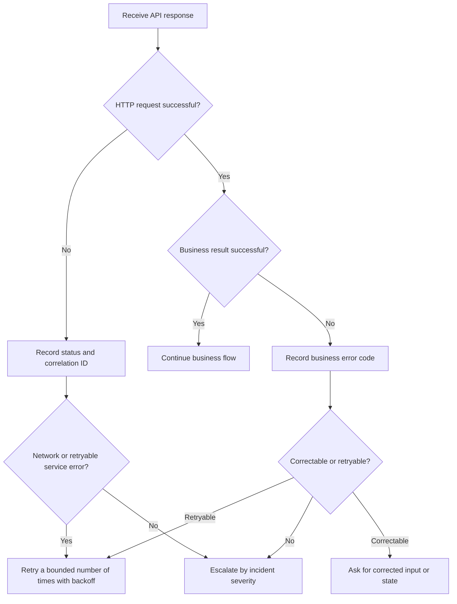

Use this page when diagnosing day-to-day issues involving environments, errors, change notifications, or support escalation.

Each API product documents its own error model and limits. For example, see [BrokerAPI operations](/en/broker-api/operations).

## Environments and connectivity {/* environments-and-connectivity */}

- Maintain test and production endpoints, outbound IPs, DNS, TLS, and proxy settings separately.
- Before business implementation, use a read-only endpoint to verify DNS, TLS, allowlists, and credentials.
- Do not hardcode addresses from historical material. Confirm the current endpoint with the Whale project team before go-live.
- Use bounded retries with backoff for connection failures, timeouts, and eligible server errors. Never retry a business failure blindly.

## Error handling {/* error-handling */}

Record HTTP status, response-body business code, request correlation ID, endpoint, and timestamp. Redact tokens, secrets, identity-document numbers, and contact details from logs.

## Submit a support request {/* submit-a-support-request */}

Include environment, timestamp and timezone, endpoint and method, redacted request summary, HTTP status, business code, request correlation ID, impact, and whether the issue reproduces consistently. Never send secrets or complete Customer-sensitive data through chat or tickets.

## Changes and production incidents {/* changes-and-production-incidents */}

- Version API, configuration, and field-mapping changes and record their effective time.
- During a production incident, contain impact before collecting evidence and restoring service.
- After closure, record root cause, recovery actions, residual risk, and prevention work.
- Update go-live and rollback steps for any change affecting a production release window.
