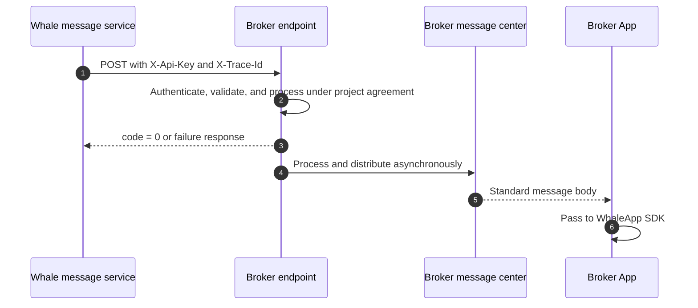

Whale forwards standard business messages to Broker Server through a Server-to-Server endpoint. Broker receives and distributes them downstream; authentication, idempotency, durable storage, and user mapping are agreed per project.

## Integration flow



<Steps>
  <Step title="Broker supplies the endpoint contract">
    Broker supplies UAT and production HTTPS endpoints, authentication, network requirements, timeout limits, and contacts.
  </Step>
  <Step title="Whale configures forwarding">
    Whale configures the endpoint and authentication in each environment and verifies connectivity with a test message.
  </Step>
  <Step title="Both parties test messages">
    Recommended cases include normal messages, repeated `post_id`, authentication failure, endpoint timeout, failure response, and multiple Customers. Both parties confirm the actual scope.
  </Step>
  <Step title="Broker App acceptance">
    Test foreground, background, cold start, Customer logout, disabled permission, and safe navigation.
  </Step>
</Steps>

## HTTP endpoint convention

**Method:** `POST`

| Header | Historical design | Description |
| --- | --- | --- |
| `X-Api-Key` | Supplied | Endpoint authentication key from Broker; confirm whether it is required and how it rotates |
| `X-Trace-Id` | Supplied | Trace identifier; confirm format, requirement, and logging behavior |

### Request fields

This table is organized from the historical example to improve readability. It does not replace the endpoint contract agreed by both parties; confirm types, required fields, and allowed values for the project.

| Field | Type | Description |
| --- | --- | --- |
| `member_ids` | `string[]` | Whale Customer identifiers that Broker maps to users and devices |
| `template_key` | `string` | Message-template key |
| `post_id` | `string` | Unique message identifier, recommended as the idempotency key |
| `channel` | `string` | Message channel; the example uses `push` |
| `language` | `string` | Message language, such as `en` or `zh-CN` |
| `title` | `string` | Message title |
| `body` | `string` | Message summary or body |
| `template_params` | `object` | Business values defined by the selected template |
| `pre_params` | `object` | Whale preset variables that may contain Customer data |
| `user_info` | `object` | Pass-through data for Broker App and WhaleApp SDK |

### Generic request

```json
{
  "member_ids": ["<member-id>"],
  "template_key": "<template-key>",
  "post_id": "<unique-message-id>",
  "channel": "push",
  "language": "en",
  "title": "Message title",
  "body": "Message summary",
  "template_params": {
    "key": "value",
    "date": "2026-01-21",
    "url": "https://example.com"
  },
  "pre_params": {
    "key": "value",
    "member_real_name": "Example Customer"
  },
  "user_info": {
    "t": "<message-type>",
    "tn": "<trace-id>",
    "id": "<unique-message-id>",
    "lb_push_from": "xx",
    "link": "broker-app://example",
    "json": "{\"key\":\"value\"}"
  }
}
```

### Response

```json
{
  "success": true,
  "message": "success",
  "code": 0
}
```

`code` equal to `0` means success and a non-zero code means failure. The historical design states that failed messages are not currently retried. Broker should account for this, but both parties must reconfirm success criteria and retry behavior before go-live.

## Complete order-message example

```json
{
  "member_ids": ["<member-id>"],
  "template_key": "order_done_v2_lb",
  "post_id": "<unique-message-id>",
  "channel": "push",
  "language": "en",
  "title": "Buy order fully filled",
  "body": "Security: Example Stock (00001.HK)\nFilled quantity: 500\nFilled price: 16.0000\nAccount: Example Account (<account-no>)\nSide: Buy\nOrder type: Enhanced Limit\nTime in force: Day\nSubmitted quantity: 500\nSubmitted price: 13.6000\n\n\nExample Securities Limited",
  "template_params": {
    "st": "CS",
    "gtd": "2026.04.14T16:00:00+08:00",
    "qty": "500",
    "code": "2333",
    "doom": "2026-04-14",
    "eqty": "500",
    "time": "",
    "price": "13.6000",
    "action": 1,
    "eprice": "16.0000",
    "market": "",
    "orderID": "<order-id>",
    "orderTag": 1,
    "originId": "<account-no>",
    "orderType": "ELO",
    "cancel_qty": "",
    "messageType": "order_done_v2_lb",
    "timeInForce": 1,
    "tickerRegion": "02333.HK",
    "accountChannel": "lb",
    "multilegDetail": "",
    "multilegStrategy": 0,
    "stock_counter_id": "ST/HK/2333",
    "multilegCombinedCode": ""
  },
  "pre_params": {
    "org_id": "1",
    "org_name": "Example Securities Limited",
    "member_id": "<member-id>",
    "account_aaid": "<account-aaid>",
    "member_email": "",
    "account_email": "customer@example.com",
    "member_app_id": "longbridge",
    "sender_prefix": "Longbridge",
    "account_org_id": "1",
    "member_account": "<member-account>",
    "org_short_name": "Example Securities",
    "account_channel": "lb",
    "member_language": "en",
    "member_timezone": "Asia/Shanghai",
    "org_check_title": "Long Bridge HK Limited",
    "account_language": "en",
    "member_real_name": "Example Customer",
    "org_account_name": "Example Account",
    "org_phone_number": "+852 0000 0000",
    "account_member_id": "<account-member-id>",
    "account_real_name": "Example Customer",
    "account_account_no": "<account-no>",
    "member_user_region": "CN",
    "org_recipient_name": "Account Opening Team",
    "member_phone_number": "+86 13800000000",
    "account_phone_number": "+86 13900000000",
    "org_delivery_address": "Example institution address",
    "org_check_description": "A cheque from a Hong Kong bank account for at least HKD 10,000 or USD 1,500.",
    "member_phone_number_suffix": "2596",
    "account_phone_number_suffix": "5021",
    "member_privacy_phone_number": "86-888****2596",
    "account_privacy_phone_number": "86-666****5021"
  },
  "user_info": {
    "t": "order_done_v2_lb",
    "tn": "<trace-id>",
    "id": "<unique-message-id>",
    "lb_push_from": "",
    "link": "lb://page/trade/order_detail?id=<order-id>&account_channel=lb",
    "json": "{\n  \"message_type\": \"order_done_v2_lb\"\n}"
  }
}
```

## WhaleApp SDK message format

Broker App retains `title`, `body`, and complete `user_info` from its own push channel and passes them to WhaleApp SDK.

```jsonc
{
  "title": "Message title", // Required by WhaleApp SDK
  "body": "Message summary",
  "user_info": {
    "t": "xx", // Message type or analytics field
    "tn": "xx", // Trace or analytics field
    "id": "xx", // Message identifier
    "lb_push_from": "xx", // Historical source field; confirm actual value
    "link": "navigation link",
    "json": "business JSON string"
  }
}
```

<Warning>
Broker App must validate the `link` scheme, destination, and parameters before navigating. Never execute an unknown external URL directly. Unknown message types must degrade safely without crashing the App.
</Warning>

## Existing template files

- `pre_function`: descriptions of built-in functions currently used by templates
- `templates`: template definitions
- `template_locales`: localized template content and configuration

[Download the complete template archive](/files/whalesdk/gbltpl.zip)

```text
tpl.xxx reads from request-body template_params.
pre.xxx reads from request-body pre_params.

For example, {{stock_name(tpl.stock_counter_id)}}
uses this request value:

template_params: {
  stock_counter_id: "ST/US/BABA"
}
```
