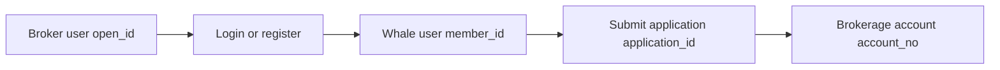

Broker App development involves Customer registration, login, authorization, and brokerage-account state. An integration can use either of the following models.

<CardGroup cols={2}>
  <Card title="Broker-managed users" icon="users">
    User data stays in the Broker system. Broker API links the Customer to a Whale user and brokerage account only when account opening begins.
  </Card>
  <Card title="Whale user system" icon="key">
    Broker performs the initial login handoff and sets the Whale credentials in Whale SDK or WhaleCore SDK. The SDK layer manages subsequent validation and renewal.
  </Card>
</CardGroup>

## Broker-managed user system

User information stays in the Broker system. Broker persists the relationships among `open_id`, `member_id`, the account application, and the brokerage account, and uses its local state to drive Broker App.

<Steps>
  <Step title="Link the user">
    When the Customer opens an account for the first time, Broker calls the login and registration endpoint with `open_id` and receives Whale's `member_id`. Reuse the established mapping for that Customer.
  </Step>
  <Step title="Submit and store the application">
    After submitting the account-opening information, Broker stores `application_id` and changes its local account state to pending.
  </Step>
  <Step title="Synchronize brokerage-account state">
    Until opening succeeds, Broker periodically queries Broker API. After success, it stores `account_no`; normal queries can then prefer the result already stored by Broker.
  </Step>
  <Step title="Handle account closure">
    Broker stores a pending-closure state and continues querying Broker API until closure reaches a final state.
  </Step>
</Steps>

### Recommended local states

| State | Meaning | Broker App behavior |
| --- | --- | --- |
| Not opened | No application submitted | Show the opening entry point |
| Pending opening | Submitted and processing asynchronously | Show processing and allow a status refresh |
| Opened | A usable brokerage account exists | Store and use `account_no` |
| Opening failed | The application failed | Show the reason and determine whether retry is allowed |
| Pending closure | Closure started but is not final | Continue querying account state |

## Using the Whale user system

Broker Server performs the initial user login or linking and securely hands the returned credentials to Broker App. Broker App sets `token` and `refresh_token` in Whale SDK; a Broker App implementing the securities UI with WhaleCore SDK sets them in WhaleCore SDK. The Whale SDK layer manages the credentials thereafter.

<Steps>
  <Step title="Obtain initial credentials">
    After login, Broker API returns `token` and `refresh_token`. Broker only needs to hand the initial credentials securely to Broker App according to the project design.
  </Step>
  <Step title="Set credentials in the Whale SDK layer">
    Broker App sets the initial credentials in Whale SDK during initialization, or in WhaleCore SDK when using WhaleCore SDK. Broker App does not call check token itself.
  </Step>
  <Step title="Let the SDK validate and renew automatically">
    Whale SDK or WhaleCore SDK checks the token lifetime and renews it automatically with the refresh token. As long as renewal continues to succeed, Broker can treat the Customer session as long-lived.
  </Step>
  <Step title="Handle the rare unrecoverable failure">
    If credentials are centrally revoked, the refresh token cannot be used, or another unrecoverable authorization error occurs, the SDK notifies Broker App. Broker App destroys the SDK session, returns the entire App to the logged-out state, and performs the login handoff again.
  </Step>
</Steps>

<Warning>
Broker App must not implement its own token-expiry checks, check-token call, or refresh-token renewal, and must not maintain a second refresh state alongside Whale SDK or WhaleCore SDK. Broker Server must still verify ownership and authorization for resources it handles directly.
</Warning>

Next, see [User binding and brokerage-account opening](/en/docs/account-opening) for identifiers, states, and endpoint order.
