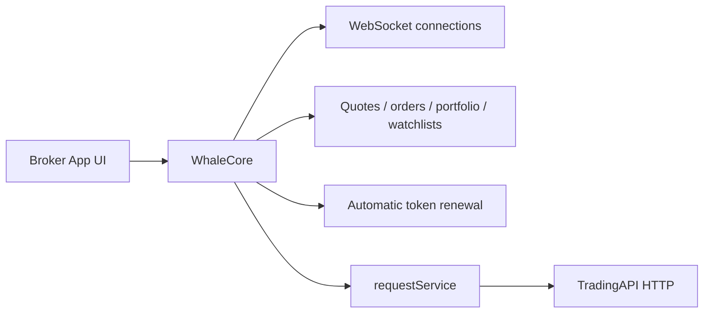

Brokers building the securities UI in their Broker App from scratch combine **WhaleCore** with **TradingAPI**.

- **WhaleCore** is the UI-free data layer in the Whale SDK product family. It provides market data subscriptions, WebSocket connectivity, request signing, token renewal, and the only call path to TradingAPI.
- **TradingAPI** is the HTTP layer WhaleCore calls for account, asset, trading, and related business capabilities that the typed services do not cover yet.

<Warning>
TradingAPI is reachable only through WhaleCore's `requestService()`. Request signing, auth headers, common parameters, and recovery after auth expiry all come from WhaleCore's managed session, so a Broker App or Broker Server that calls a TradingAPI endpoint directly, bypassing WhaleCore, fails. The operations in this reference describe the paths, parameters, and response shapes you pass to `requestService()`.
</Warning>

## Combined architecture {/* combined-architecture */}

## How to call it {/* how-to-call */}

Your Broker App supplies the path, query parameters, and body; WhaleCore sends the request and returns the raw response. For operations that need trade authorization, declare the trade token requirement and the SDK obtains it before sending. Capabilities WhaleCore already exposes as typed services — quotes, orders, portfolio, watchlists — should go through those services instead of being rebuilt on TradingAPI.

Request types, sample code, and error details per platform:

- [iOS general HTTP requests](/en/whalesdk/whalecore/ios#general-http-requests)
- [Android general HTTP requests](/en/whalesdk/whalecore/android#general-http-requests)
- [TypeScript general HTTP requests](/en/whalesdk/whalecore/typescript#general-http-requests)

## Platform status {/* platform-status */}

| Platform | WhaleCore delivery | Status |
| --- | --- | --- |
| iOS | Native client library | Available |
| Android | Native client library | Available |
| Web | WebAssembly | Available |

## API coverage {/* api-coverage */}

The TradingAPI operations listed in the sidebar are ready to build against. Their paths, parameters, and responses match the current service.

Coverage is still expanding. More operations are being documented and will be added to this reference over time. If a capability you need is not listed yet, ask the Whale project team about its current status and availability.

## When to use it {/* when-to-use */}

- You need complete control over information architecture, visual design, and interactions.
- You already maintain market data, asset, and trading screens and do not want to embed Whale-provided UI.
- You are prepared to combine data streams, HTTP operations, page state, and error recovery on top of WhaleCore.

Use [WhaleApp SDK](/en/whalesdk/whaleapp/overview) instead when you want a complete trading UI for iOS, Android, or WebTrade.

<Note>
WhaleCore provides client foundations but no graphical UI or complete business flows. The Whale project team provides the applicable libraries, TradingAPI operations, and compatibility matrix for each integration scope.
</Note>
