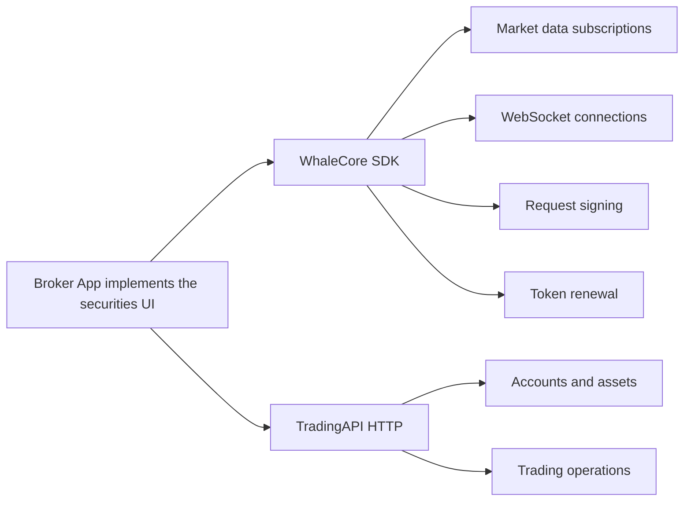

Brokers building the securities UI in their Broker App from scratch combine **WhaleCore SDK** with **TradingAPI**.

- **WhaleCore SDK** is the UI-free data layer in the Whale SDK product family. It provides market data subscriptions, WebSocket connectivity, request signing, and token renewal.
- **TradingAPI** is a client-scoped HTTP API for account, asset, trading, and related business capabilities.

## Combined architecture {/* combined-architecture */}

## Platform status {/* platform-status */}

| Platform | WhaleCore SDK delivery | Status |
| --- | --- | --- |
| iOS | Native client library | Available |
| Android | Native client library | Available |
| Web | WebAssembly | In development |

## API coverage {/* api-coverage */}

The TradingAPI operations listed in the sidebar are ready to build against. Their paths, parameters, and responses match the current service.

Coverage is still expanding. More operations are being documented and will be added to this reference over time. If a capability you need is not listed yet, ask the Whale project team about its current status and availability.

## When to use it {/* when-to-use */}

- You need complete control over information architecture, visual design, and interactions.
- You already maintain market data, asset, and trading screens and do not want to embed Whale-provided UI.
- You are prepared to combine data streams, HTTP operations, page state, and error recovery.

Use [WhaleApp SDK](/en/whalesdk/whaleapp/overview) instead when you want a complete trading UI for iOS, Android, or WebTrade.

<Note>
WhaleCore SDK provides client foundations but no graphical UI or complete business flows. The Whale project team provides the applicable libraries, TradingAPI operations, and compatibility matrix for each integration scope.
</Note>
