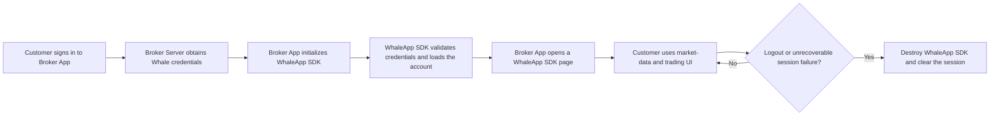

WhaleApp SDK for iOS and Android provides a complete graphical securities experience. Broker App integrates the SDK, supplies the Customer session, connects operating-system capabilities, and manages the App and SDK lifecycle.

## Responsibility boundary

| WhaleApp SDK provides | Broker App is responsible for |
| --- | --- |
| Market-data, asset, and trading UI | Integrating the delivered SDK package and resolving build dependencies |
| Internal page routing | Customer sign-in and obtaining Whale credentials |
| Internal networking, token validation, and automatic renewal | Supplying initial credentials and handling unrecoverable authentication failure |
| Theme, language, and price-color support | Supplying initial values and synchronizing App-level changes |
| Display and routing for recognized messages | System-notification permission, device tokens, and non-Whale messages |
| Lifecycle and error callbacks | Monitoring errors and handling reauthentication or fallback behavior |

## Before integration

Obtain the SDK package and environment-matched configuration from the Whale project team:

- `appKey`, `appSecret`, and `appId`.
- Default account channel and Web-domain prefix.
- The Server-to-Server flow used to obtain the Customer's initial `token` and `refreshToken`.
- UAT and production environments and allowed App identifiers.
- Push key, secret, and cloud-channel configuration when Whale-managed push is enabled.

Never mix UAT and production configuration. Do not place credentials in public repositories, example logs, or screenshots.

## Shared lifecycle

1. **Install the SDK:** integrate the delivered version and resolve build dependencies.
2. **Initialize the process:** call the platform initialization entry point at the documented App lifecycle location.
3. **Sign in the Customer:** after Broker sign-in, obtain the Whale session from Broker Server.
4. **Start the SDK:** provide identity, App name, theme, language, and project configuration.
5. **Wait until ready:** call page routes and state-dependent APIs only after the success callback.
6. **Handle changes:** respond to unrecoverable authentication failure, theme and language changes, external URLs, and notifications.
7. **Destroy the SDK:** on logout, account switch, or unrecoverable failure, destroy the SDK before clearing the Broker App session.

## Configuration model

| Configuration | Purpose |
| --- | --- |
| Multilingual App name | Name displayed inside WhaleApp SDK |
| `appKey` / `appSecret` / `appId` | Identify the project and environment |
| `token` / `refreshToken` | Current Customer's Whale session |
| Default account channel | Select the project's default account channel |
| Web-domain prefix | Broker-domain configuration used by Web content in the SDK |
| Theme | Follow system, light, or dark |
| Language | English, Simplified Chinese, or Traditional Chinese |
| Price color | Follow SDK setting, red-up/green-down, or green-up/red-down |
| Advanced configuration | Fonts, colors, device identifier, and project-specific options |

## Callback handling

| Event | Handling |
| --- | --- |
| Start succeeds | End the loading state and enable WhaleApp SDK entry points |
| Start fails | Log a sanitized error; fix configuration errors or require a new sign-in for authentication errors |
| Runtime error | Destroy the SDK and reestablish the Customer session after unrecoverable authentication failure |
| Token renews | WhaleApp SDK manages validity and subsequent renewal; Broker App does not call check-token or refresh-token APIs |
| Token cannot renew | Destroy the SDK session and return Broker App to its logged-out state |
| SDK requests a URL | Validate schemes, domains, and route allowlists before handing the URL to Broker App routing |
| SDK is about to be destroyed | Persist only necessary non-sensitive state and close related UI |
| First SDK page opens / last page closes | Update Broker App navigation or chrome when the optional UI lifecycle callback is needed |

<Warning>
Never log `appSecret`, complete tokens, refresh tokens, or Customer-sensitive data. Never execute an external URL without validating it.
</Warning>

## Message push

Both platforms support Whale-managed and Broker-managed push. See [Message-push integration](/en/docs/message-push/) for server-channel selection, cloud-service setup, and the standard message shape. Platform methods are documented in [iOS integration](/en/whalesdk/ios/) and [Android integration](/en/whalesdk/android/).

## Optional analytics forwarding

Current SDK versions expose analytics-event callbacks on both platforms. Consume only events and properties agreed for the project, and do not depend on undocumented internal business events. See [Optional APIs](/en/whalesdk/optional-apis/).

## Acceptance checklist

- Cold start, warm start, and repeated entry into SDK pages work correctly.
- No state-dependent API is called before SDK startup succeeds.
- Automatic token renewal requires no Broker App intervention; unrecoverable failure, remote login, and Customer switching have explicit handling.
- Theme, language, price color, and Broker App routing meet product requirements.
- Foreground, background, cold-start, and notification-click paths are tested.
- Logout releases SDK pages, network activity, and sensitive session state.
- UAT and production use separate packages, configuration, and push channels.
