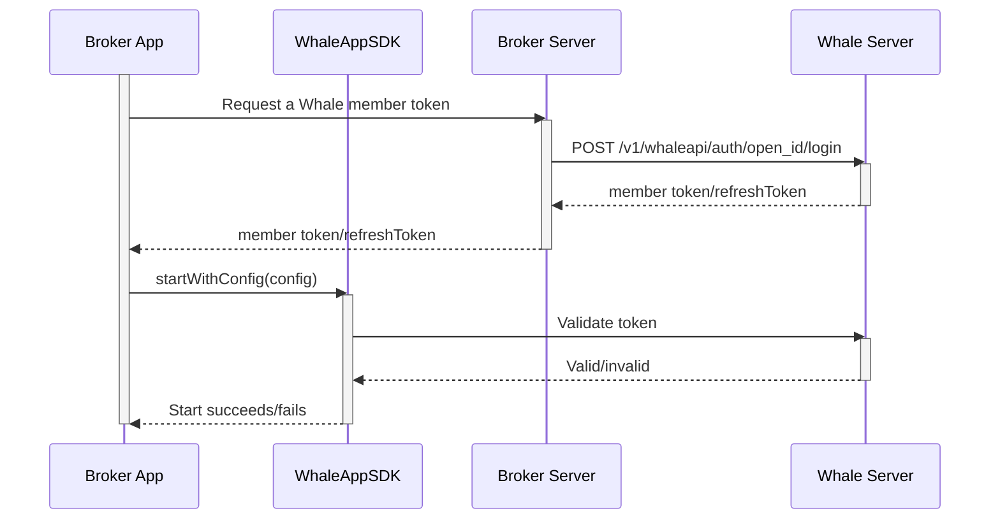

WhaleAppSDK embeds a securities experience in Broker App that is ready to launch — market-data, asset, trading, watchlist, and news pages work out of the box. Broker still keeps its own account system and app shell, and only needs to handle sign-in handoff and lifecycle management.

## Included modules {/* included-modules */}

| Module | Typical capabilities |
| --- | --- |
| Markets | Overview, search, quotes, charts, order book, and instrument details |
| Assets | Real-time total-asset and P&L calculations, multi-currency conversion, historical P&L, and more |
| Trading | HK and US orders, order status, positions, assets, and transaction history |
| Watchlists | Groups, symbol synchronization, and instrument navigation |
| News | Market and instrument news, discovery, and optional community experiences |

## Example screens {/* example-screens */}

<WhaleAppShowcase
  watchlistLabel="Watchlist"
  marketLabel="Market"
  stockLabel="Stock"
  assetsLabel="Assets"
  newsLabel="News"
  ariaLabel="WhaleAppSDK example screens"
  previousLabel="Previous screen"
  nextLabel="Next screen"
/>

Screens are representative. Available modules and appearance depend on project configuration and SDK version.

## Customization boundary {/* customization-boundary */}

Project-level customization includes icons, colors, skins, light/dark/system themes, English/Simplified Chinese/Traditional Chinese, price-color conventions, custom fonts, and notification delivery. Some options require a project build rather than runtime configuration; the exact scope follows the delivery checklist confirmed with the Whale project team.

## Responsibility boundary {/* responsibility-boundary */}

| WhaleAppSDK provides | Broker App is responsible for |
| --- | --- |
| Market-data, asset, and trading UI | Integrating the delivered SDK package and resolving build dependencies |
| Internal page routing | Client sign-in and obtaining Whale credentials |
| Internal networking, token validation, and automatic renewal | Supplying initial credentials and handling unrecoverable authentication failure |
| Theme, language, and price-color support | Supplying initial values and synchronizing App-level changes |
| Display and routing for recognized messages | System-notification permission, device tokens, and non-Whale messages |
| Lifecycle and error callbacks | Monitoring errors and handling reauthentication or fallback behavior |

<Note>
In this document, **Broker App** refers to the Broker iOS or Android App that integrates WhaleAppSDK.
</Note>

## Push channel choice {/* push-channel-choice */}

WhaleAppSDK supports two message-push integration schemes. Broker picks one scheme for both platforms (iOS and Android cannot use different schemes):

| Scheme | Best for | Broker needs to prepare |
| --- | --- | --- |
| Scheme 1: WhaleAppSDK's built-in push channel | Lowest integration cost; no server-side push work | Push-channel credentials per platform (iOS: an APNs certificate; Android: the appId/secret for each vendor push channel needed) |
| Scheme 2: Broker's own push channel | Broker already has its own push infrastructure and wants to control whether a message is delivered | A server-side endpoint that receives messages, provided to the Whale project team for configuration |

See [iOS message push](/en/whalesdk/whaleapp/ios#message-push) and [Android message push](/en/whalesdk/whaleapp/android#configure-push) for how to integrate each scheme.

## Startup flow {/* startup-flow */}

Before starting WhaleAppSDK, Broker App exchanges for a Whale user credential with Broker Server, then calls the SDK's start method:

## Platforms {/* platforms */}

| Platform | Positioning | Guide |
| --- | --- | --- |
| iOS | Native SDK package embedded in Broker's iOS App | [iOS](/en/whalesdk/whaleapp/ios) |
| Android | Native SDK package embedded in Broker's Android App | [Android](/en/whalesdk/whaleapp/android) |
| WebTrade | Deployed on a standalone domain, or embedded via iframe on Broker's website; supports PWA installation | [WebTrade](/en/whalesdk/whaleapp/web) |

See the [FAQ](/en/whalesdk/whaleapp/faq) for technical FAQs and reference performance data.
