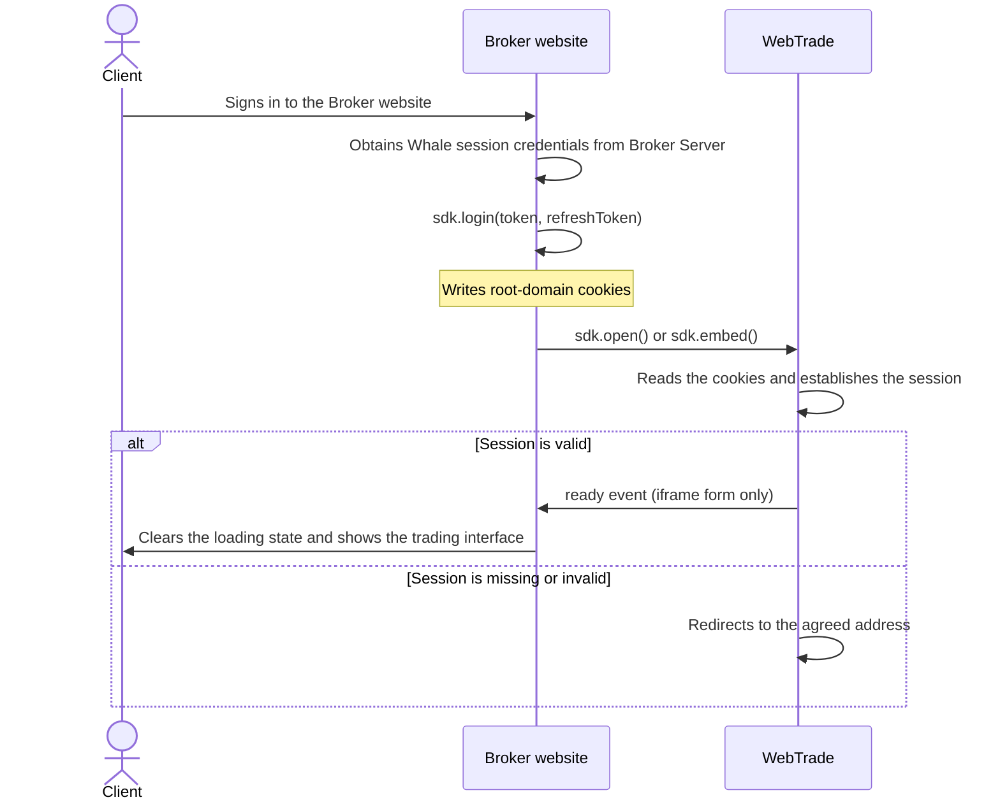
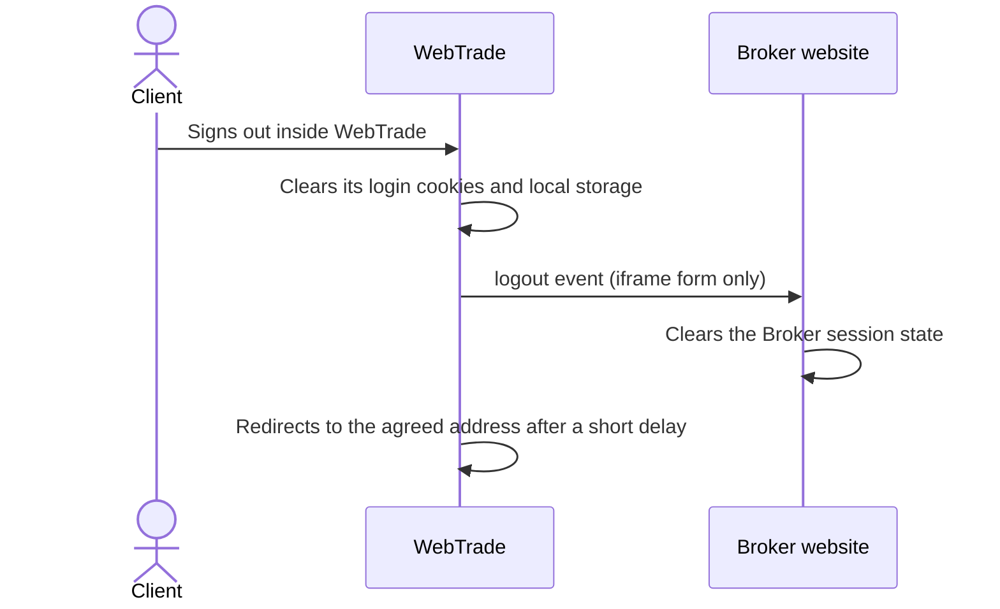

WebTrade is the Web form factor of WhaleAppSDK and provides a complete securities trading interface to a Broker website. A Broker integrates it through the WhaleAppSDK JavaScript library: the library writes the cookies SSO requires, creates the iframe used for embedding, and passes language, theme, and price-color preferences between the Broker page and WebTrade.

This page is for developers who build the Broker website frontend. After reading it you can choose an integration form, complete SSO and page embedding, and handle the events and requests WebTrade sends.

<Note>
On this page, **Broker website** refers to the Broker frontend page that hosts the WebTrade entry point or the iframe container, and **Client** refers to the Broker's end client.
</Note>

## Integration forms {/* integration-model */}

WebTrade supports two integration forms. Choose one based on your product.

|  | New tab | iframe embedding |
| --- | --- | --- |
| Method | `sdk.open()` | `sdk.embed()` |
| Location | A new browser tab | A container inside the Broker page |
| Communication | Shared cookies | Shared cookies and `postMessage` |
| Preference changes apply immediately | No, they apply on the next open | Yes |
| Event callbacks | Not available | `ready`, `logout` |
| Request and response | Not available | Available |
| Integration cost | Low | Medium |

### Responsibility boundary {/* responsibility-boundary */}

| WebTrade and the SDK provide | The Broker website is responsible for |
| --- | --- |
| Quote, watchlist, trading, and asset interfaces | Loading the SDK and supplying the WebTrade address |
| Cookie access, root-domain resolution, iframe creation and teardown | Signing the Client in on the Broker side and handing the Whale session credentials to the SDK |
| Writing and passing language, theme, and price-color values | Calling the preference methods with the Broker website's current settings |
| `postMessage` envelopes, origin validation, request matching | Implementing the business logic behind event callbacks and request handlers |
| Token validation and renewal inside WebTrade | Writing updated Whale session credentials again |

## Before you begin {/* before-integration */}

SSO fails when any of the following conditions is unmet, and in most cases it fails without an error. Confirm each item before writing code.

### A shared root domain {/* shared-root-domain */}

The Broker website and WebTrade must be deployed on subdomains of the same root domain. This is what allows the shared cookies that SSO depends on.

```text
Broker website → broker.example.com
WebTrade       → trade.example.com
Shared root    → .example.com
```

<Warning>
The root domain is derived from the last two labels of the domain. With a second-level suffix such as `.com.hk` or `.co.uk`, `trade.example.com.hk` resolves to `.com.hk` instead of `.example.com.hk`, the cookies cannot be shared between the two subdomains, and SSO fails silently. Confirm with the Whale project team before using such a domain.
</Warning>

Separate root domains, such as `broker-a.com` and `trade-b.com`, cannot share cookies and cannot complete SSO through this approach.

### HTTPS {/* https-requirement */}

WebTrade must be served over HTTPS. The cookies the SDK writes under HTTPS carry `Secure` and `SameSite=None`: the first requires HTTPS, and the second is what makes the cookies available while WebTrade is embedded as a cross-origin iframe.

### Register the Broker website origin {/* register-origin */}

In the iframe form, WebTrade validates the source of `postMessage` against an allowlist maintained on the Whale side. **Send the Broker website origin to the Whale project team before integrating so it can be added to that list.** Otherwise the `ready` and `logout` events and every request never arrive; cookie SSO is unaffected. The new-tab form does not use `postMessage` and needs no registration.

### Project configuration agreed with Whale {/* whale-side-configuration */}

Some WebTrade behavior is set per project at delivery time. Whale writes these values, and no Broker website code is involved. Confirm the following during integration.

| Capability | Description |
| --- | --- |
| Sign-out redirect address | The Broker address WebTrade opens on sign-out or when no valid session exists, usually the Broker sign-in page. Supplied by the Broker |
| Hide the language setting inside WebTrade | Once enabled, the language follows the value the Broker website passes in and the Client cannot change it inside WebTrade |
| Let the Broker control price colors | Once enabled, WebTrade adopts the price-color preference the Broker writes when it loads. See [Preference sync](#preferences) |
| Hide the WebTrade sign-out control | Once enabled, the Client can sign out only on the Broker website |

The cookie names the SDK uses are fixed and managed inside the SDK. The Broker neither supplies nor agrees on them.

<Tip>
Hide the WebTrade sign-out control and let the Broker website own the session state. This avoids the Client getting different outcomes from signing out in two places.
</Tip>

## Load the SDK {/* install */}

The SDK is distributed over CDN in UMD format and requires no build tooling:

```html
<script src="https://assets.lbctrl.com/sdk/webtrade/2.0.0/index.umd.js"></script>
```

The constructor is then available as `window.WhaleAppSDK`. The SDK has no third-party dependencies. Its browser support range is determined by WebTrade — ask the Whale project team for the supported versions in your target environment.

<Warning>
Pin a specific version. The CDN offers no `latest` path, so that a Broker website never receives a breaking change it did not opt into. Read the release notes for a version before upgrading to it.
</Warning>

The cookies the SDK writes use the `whale_app_` prefix. Do not use the same prefix for Broker website cookies.

## Quickstart {/* quickstart */}

Both examples assume the Client has signed in to the Broker website and the Broker has obtained the Whale session credentials from its Broker Server.

New-tab form:

```html
<button id="trade-entry">Open trading</button>

<script src="https://assets.lbctrl.com/sdk/webtrade/2.0.0/index.umd.js"></script>
<script>
  const sdk = new WhaleAppSDK({ baseUrl: 'https://trade.example.com' })

  // Write the session credentials after the Client signs in to the Broker website
  sdk.login({ token: 'xxx', refreshToken: 'xxx' })

  document.getElementById('trade-entry').onclick = function () {
    sdk.open({ tab: 'quote' })
  }
</script>
```

iframe form:

```html
<div id="webtrade" style="width: 100%; height: 80vh;"></div>

<script src="https://assets.lbctrl.com/sdk/webtrade/2.0.0/index.umd.js"></script>
<script>
  const sdk = new WhaleAppSDK({ baseUrl: 'https://trade.example.com' })

  sdk.login({ token: 'xxx', refreshToken: 'xxx' })

  sdk.once('ready', function () {
    // WebTrade has rendered; the Broker page can clear its loading state
  })

  sdk.on('logout', function () {
    // The Client signed out inside WebTrade; run the Broker sign-out logic
  })

  sdk.embed('#webtrade', { tab: 'quote' })
</script>
```

<Warning>
The container element must have an explicit height. The iframe the SDK creates uses `height: 100%`, so WebTrade is invisible when the container height is 0.
</Warning>

## Initialize {/* initialize */}

```typescript
const sdk = new WhaleAppSDK({ baseUrl: 'https://trade.example.com' })
```

| Parameter | Type | Required | Description |
| --- | --- | --- | --- |
| `baseUrl` | `string` | Yes | The WebTrade address. The SDK uses its origin as the `postMessage` target and as the basis for source validation |

The constructor throws when `baseUrl` is not a valid URL. Initialize during application startup so configuration errors surface early.

## Sign-in and sign-out {/* sign-in-and-sign-out */}

WebTrade SSO relies on cookies: the Broker website writes the Whale session credentials, and WebTrade reads them and establishes the signed-in state when it loads.

### Write the session credentials {/* write-session */}

```typescript
sdk.login({ token: 'xxx', refreshToken: 'xxx' })
```

| Parameter | Type | Description |
| --- | --- | --- |
| `token` | `string` | The Client's Whale session token |
| `refreshToken` | `string` | The Client's Whale refresh token |

Neither parameter may be empty; the method throws otherwise. Cookie scope, lifetime, and cross-site attributes are handled inside the SDK, and the Broker does not need to manage them.

WebTrade sign-in requires only these two values. The Broker does not supply `app_id`; Whale manages it in the project build configuration.

### Write again after credentials change {/* renew-session */}

The SDK does not evaluate token expiry and never renews a token on its own; it writes only the value passed to it into a cookie. **Call `login()` again to overwrite the previous value every time the Broker side obtains new Whale session credentials, whether from renewal, a fresh sign-in, or any other reason.**

```typescript
function onWhaleSessionUpdated({ token, refreshToken }) {
  sdk.login({ token, refreshToken })
}
```

`login()` updates only the cookie. An already loaded WebTrade does not re-read it mid-session; the new value takes effect the next time WebTrade loads — a page refresh, or a further call to `embed()` or `open()`.

### Clear the session credentials {/* clear-session */}

```typescript
sdk.logout()
```

The method clears the `token` and `refreshToken` cookies, keeps the language, theme, and price-color preference cookies, and sends nothing to WebTrade. For the complete flow, see [Sign-out flow](#logout-flow).

## Cookies written by the Broker Server {/* server-side-cookies */}

`login()` is a convenience method for writing the session credentials into cookies. When sign-in completes on the Broker Server, the Broker Server can also write them directly with `Set-Cookie`; WebTrade reads them from JavaScript exactly the same way, and the Broker website frontend then does not call `login()` at all.

With this approach the cookies must meet every requirement below, or SSO fails silently.

| Requirement | Description |
| --- | --- |
| Cookie names | The same names the SDK writes; the values are agreed during integration |
| No `HttpOnly` | WebTrade reads the cookies from JavaScript. A Broker Server often sets `HttpOnly` on authentication cookies by default, so turn it off explicitly |
| `SameSite=None; Secure` | WebTrade is embedded as a cross-origin iframe and the cookies must be available in that context |
| `Domain` set to the root domain | For example `.example.com`, so both the Broker website and the WebTrade subdomain can read them |
| `Path=/` | Matches what the SDK writes |
| HTTPS | Required by the `Secure` attribute |

<Warning>
The session credential cookies must be readable from JavaScript. This is inherent to cookie-based SSO and holds whether the frontend or the Broker Server writes them. If Broker security policy requires every authentication cookie to be `HttpOnly`, this approach does not apply to that cookie — use the separate cookies written by `login()` on the frontend instead.
</Warning>

Refreshing the cookies from the Broker Server follows the rule in the previous section: an already loaded WebTrade must reload before it reads the new value.

## Open and embed {/* open-and-embed */}

### Open in a new tab {/* open */}

```typescript
sdk.open()
sdk.open({ tab: 'stock', symbol: '700.HK' })
```

The method opens WebTrade in a new tab with `noopener,noreferrer`, building the URL from `baseUrl` and the navigation parameters. A new tab has no parent page, so event callbacks and request handling do not work in this form.

### Embed in the current page {/* embed */}

```typescript
const iframe = sdk.embed('#webtrade', { tab: 'quote' })
```

| Parameter | Type | Description |
| --- | --- | --- |
| `container` | `string \| HTMLElement` | A CSS selector or a DOM element |
| `params` | `OpenParams` | Optional initial navigation parameters |

The method returns the `HTMLIFrameElement` it created. An existing iframe is torn down first and rebuilt. The iframe uses `width: 100%`, `height: 100%`, and no border, and the method starts a message listener that accepts messages only from the `baseUrl` origin.

### Tear down the iframe {/* destroy */}

```typescript
sdk.destroy()
```

The method removes the iframe from the DOM and stops the message listener. Registered event callbacks and request handlers are kept and work again after the next `embed()`. Call it when a route leaves the trading page or when the Client signs out.

### Navigation parameters {/* navigation-parameters */}

`open()` and `embed()` share the following parameters.

| Parameter | Type | Description |
| --- | --- | --- |
| `tab` | `'quote' \| 'stock' \| 'favorite' \| 'portfolio' \| 'stockSelect'` | The initial location: quotes, instrument detail, watchlist, assets, or the screener |
| `symbol` | `string` | The initial instrument |

Pass `symbol` through unchanged from what a Whale API returns. Those values look like `700.HK` or `AAPL.US` ([`symbol` format](/en/docs/glossary#security-identifiers)); the format is documented for recognition only, so do not assemble it yourself.

## Preference sync {/* preferences */}

Each of the three preference methods does two things: it writes the matching cookie for WebTrade to read on its next load, and, when an iframe is present, it sends a `postMessage` telling WebTrade to switch right away. The new-tab form has no iframe, so only the cookie write applies.

| Method | Values | Meaning |
| --- | --- | --- |
| `sdk.setLang(lang)` | `en`, `zh-CN`, `zh-HK` | English, Simplified Chinese, Traditional Chinese |
| `sdk.setTheme(theme)` | `dark`, `light` | Dark, light |
| `sdk.setPriceColor(color)` | `green_up`, `red_up` | Green for up, red for up |

```typescript
sdk.setTheme('dark')
sdk.setLang('zh-CN')
sdk.setPriceColor('red_up')
```

Given a value that is not listed, WebTrade falls back to `en`, `dark`, and `red_up` respectively.

### How initial preferences are resolved {/* initial-preferences */}

WebTrade resolves each preference in the following order when it loads.

**Language:** a valid value in the language cookie, then a supported language matched from `navigator.language`, and finally `en`.

**Theme:** the value in the theme cookie, or `dark` when it is unset.

**Price colors:** WebTrade adopts the preference the Broker wrote only when the project is configured to let the Broker control price colors. Otherwise price colors follow the Client's account settings in Whale.

<Note>
That configuration affects only where the value comes from at load time. In the iframe form, a switch through `setPriceColor()` is not subject to it and always applies right away; what differs is whether the change survives a page reload.
</Note>

## Events {/* events */}

WebTrade emits two events over `postMessage`, and the SDK exposes them as callbacks. **Both fire only in the iframe form.**

| Event | Fires when | Typical handling |
| --- | --- | --- |
| `ready` | WebTrade has finished rendering | Clear the loading state on the Broker page |
| `logout` | The Client signed out inside WebTrade | Clear the Broker session state and redirect |

```typescript
sdk.on('ready', callback)    // Register; several callbacks per event run in registration order
sdk.once('ready', callback)  // Register once; removed automatically after it fires
sdk.off('ready', callback)   // Remove; pass the same function reference used to register
```

Callbacks receive no arguments. Registering before or after `embed()` both work, but register before `embed()` so a fast WebTrade load cannot make you miss `ready`.

```typescript
sdk.on('logout', () => {
  sdk.logout()      // Clear the session credential cookies the SDK wrote
  sdk.destroy()     // Tear down the iframe
  brokerSignOut()   // Clear the Broker's own session state
  window.location.href = '/login?from=webtrade'
})
```

<Warning>
Event callbacks survive repeated `embed()` calls. Remove the previous callback with `off()` before replacing it, or the old one still runs on the new iframe's events and may redirect twice.
</Warning>

## Request and response {/* request-response */}

In some business scenarios WebTrade calls the Broker website and waits for a return value. WebTrade is always the caller and the Broker website is the responder: the Broker registers a handler for an agreed method, and the SDK receives the request, invokes the handler, returns the value, and takes care of the message envelope, origin validation, and request matching. **Available in the iframe form only.**

```typescript
sdk.handle('methodName', async (payload) => {
  const result = await yourBusinessLogic(payload)
  return result
})

sdk.unhandle('methodName')
```

| Parameter | Type | Description |
| --- | --- | --- |
| `method` | `string` | The method name from the agreed protocol. Registering the same name again replaces the handler |
| `handler` | `(payload) => unknown \| Promise<unknown>` | The handler, which may be async. Its return value is the result |

A handler can be registered before or after `embed()` and survives `embed()` and `destroy()`. Register before `embed()` so you do not miss requests WebTrade sends early in its load.

<Note>
Method names, arguments, and return shapes follow the integration protocol Whale provides during integration. The Broker implements the handlers that protocol defines.
</Note>

### Returning a failure {/* handler-errors */}

When a handler throws an object carrying a **string `code`**, that `code` is returned to WebTrade unchanged so it can branch on it. The `code` values are agreed between the Broker and Whale in the protocol; the SDK does not restrict them.

```typescript
sdk.handle('methodName', async (payload) => {
  const data = await query(payload)
  if (!data.available) {
    throw { code: 'NOT_AVAILABLE', message: 'The resource is currently unavailable' }
  }
  return data
})
```

<Warning>
WebTrade displays `message` to the Client verbatim, so it must be readable text written for the Client in the Client's current language. Omit the field when you have no suitable text and WebTrade uses its own localized copy instead; an internal error string replaces that copy and reaches the Client directly.
</Warning>

The SDK returns two built-in `code` values. Neither carries text, WebTrade supplies its own, and the SDK writes a warning prefixed with `[WhaleAppSDK]` to the browser console.

| code | Meaning |
| --- | --- |
| `METHOD_NOT_FOUND` | No handler is registered for the method |
| `HANDLER_ERROR` | The thrown value carries no string `code`, or the return value cannot be structured-cloned |

### Timeout and source validation {/* rpc-boundaries */}

WebTrade applies a timeout to every request, 5 seconds by default. A timeout only means WebTrade stopped waiting; it does not mean the work on the Broker side failed or did not finish. Agree an adjustment with the Whale project team in advance when a handler can legitimately take longer.

Before responding, the SDK checks that the message origin equals the origin of `baseUrl` and that the source is the iframe the SDK created. A request failing either check is dropped without a response. The response target origin is likewise taken exactly from `baseUrl`, never a wildcard.

## Sign-in flow {/* sign-in-flow */}



WebTrade prefers the cookies over its own local cache when reading the session credentials. When the session is missing or invalid, WebTrade redirects to the Broker address agreed during integration, or to the Whale sign-in page when none was agreed.

## Sign-out flow {/* logout-flow */}

The Client may sign out on the Broker website or inside WebTrade, when the sign-out control is not hidden. Handle both paths.

**The Client signs out on the Broker website:** call `sdk.logout()` to clear the session credential cookies, call the Whale sign-out API so the server-side token becomes invalid, and in the iframe form call `sdk.destroy()`.

**The Client signs out inside WebTrade:**



WebTrade waits briefly after emitting `logout` before performing its own redirect, which gives the Broker website time to respond. After that window WebTrade performs the redirect and an unfinished callback is interrupted, so handling inside the `logout` callback must complete immediately and must not wait for a network request before updating local state.

The new-tab form has no parent page, so WebTrade clears its local state and redirects to the agreed address directly. The Broker should complete its own sign-out on the page behind that address.

## Broker implementation checklist {/* broker-implementation-requirements */}

Confirm each item before going live:

- The Broker website and WebTrade are on subdomains of the same root domain, both over HTTPS.
- In the iframe form, the Broker website origin is on the Whale allowlist.
- `login()` is called after the Client signs in, and again every time new Whale session credentials are obtained.
- The session credential cookies are not `HttpOnly`.
- Signing out on the Broker website clears the session credential cookies and calls the Whale sign-out API so the server-side token becomes invalid.
- In the iframe form the `logout` event is handled, and the handling completes inside the delay window.
- The sign-out redirect address has been supplied to Whale, and that page handles a redirect coming from WebTrade.
- Request handlers follow the agreed protocol, failures return the agreed `code`, and `message` is readable text written for the Client.
- The SDK is loaded from a pinned version.

## Deployment {/* deployment */}

- **Whale-managed:** Whale builds and deploys WebTrade; the Broker supplies the domain and project configuration.
- **Broker-managed:** Whale delivers a WebTrade archive built for the Broker, and the Broker deploys it. This suits a Broker that manages its own certificates or needs several domains.

The integration code is identical either way.
