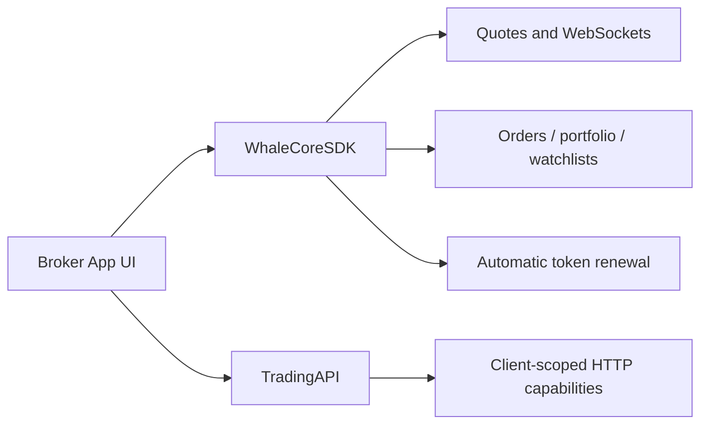

WhaleCoreSDK is a UI-free securities data SDK. Broker App implements its own interface, uses WhaleCore for client sessions, real-time data, and business services, and combines it with TradingAPI for additional Client-scoped HTTP capabilities.

<Note>This documentation is derived from public interfaces in the WhaleCore iOS and Android source. Artifact locations, version compatibility, project credentials, and environments are supplied by the Whale project team.</Note>

## When to use it {/* when-to-use-it */}

<CardGroup cols={2}>
  <Card title="Fully custom UI" icon="palette">Broker designs every securities screen and interaction instead of using WhaleAppSDK UI.</Card>
  <Card title="Reusable client foundations" icon="database">The SDK manages sessions, auth recovery, WebSockets, caching, and business data services.</Card>
</CardGroup>

## Public capabilities {/* public-capabilities */}

| Module | iOS | Android | Capability |
| --- | --- | --- | --- |
| Quotes | `quotesService` | `getQuoteService()` | Real-time quotes, K-lines, snapshots, and option chains |
| Orders | `orderService` | `getOrderService()` | Submit, replace, cancel, query, estimate, and events |
| Validation | `orderService` | `getOrderValidationService()` | Tradability, constraints, qualifications, and pre-submit validation |
| Portfolio | `portfolioService` | `getPortfoliosService()` | Assets, positions, cash details, and updates |
| Watchlist | `watchlistService` | `getWatchlistService()` | Groups, stocks, ordering, pinning, and events |
| Requests | `requestService` | `getRequestService()` | Authenticated pass-through HTTP requests |
| Trade auth | Config delegate | `getTradeAuthService()` | Trade-token acquisition, renewal, and state |

SDK instrument identifiers use the `CounterId` form, such as `ST/US/AAPL` or `ST/HK/00700`.

## Integration model {/* integration-model */}

| Platform | Status | Guide |
| --- | --- | --- |
| iOS | Available; iOS 13+; Swift / Objective-C | [iOS](/en/whalesdk/whalecore/ios) |
| Android | Available; Kotlin / Java | [Android](/en/whalesdk/whalecore/android) |
| Web | WebAssembly in development | No public integration guide yet |

