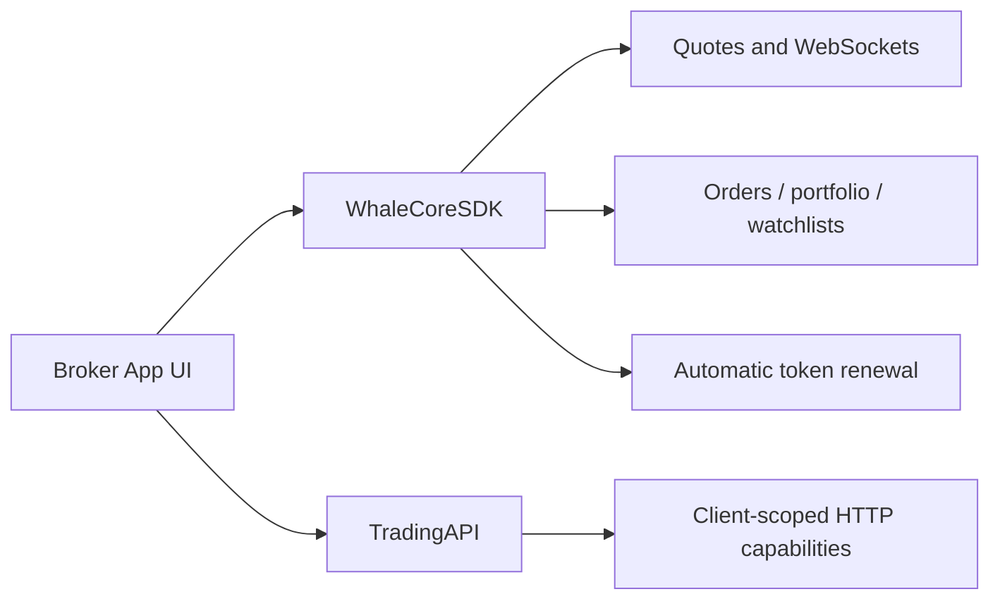

WhaleCoreSDK is a UI-free securities data SDK. Broker App implements its own interface, uses WhaleCore for client sessions, real-time data, and business services, and combines it with TradingAPI for additional Client-scoped HTTP capabilities.

<Note>This documentation is derived from public interfaces in the WhaleCore iOS and Android source. Artifact locations, version compatibility, project credentials, and environments are supplied by the Whale project team.</Note>

## When to use it {/* when-to-use-it */}

<CardGroup cols={2}>
  <Card title="Fully custom UI" icon="palette">Broker designs every securities screen and interaction instead of using WhaleAppSDK UI.</Card>
  <Card title="Reusable client foundations" icon="database">The SDK manages sessions, auth recovery, WebSockets, caching, and business data services.</Card>
</CardGroup>

## Public capabilities {/* public-capabilities */}

| Module | iOS | Android | Capability |
| --- | --- | --- | --- |
| Quotes | `quoteService()` | `getQuoteService()` | Real-time quote subscriptions, K-lines, timeshares, historical trades, and option-chain / option-detail subscriptions |
| Option calculator | `WhaleCoreOptionCalculator` (static utility) | `OptionCalculator` (static utility) | Local Black-Scholes calculations: Greeks, theoretical price, intrinsic/time value, days to expiry, and probability of profit |
| Orders | `orderService()` | `getOrderService()` | Submit, replace, cancel, attached orders, take-profit/stop-loss on a position, order preview, estimates, pre-trade validation, and order events |
| Portfolio | `portfolioService()` | `getPortfoliosService()` | Portfolio subscriptions, cash details, member portfolio settings, and profit-and-loss analysis (iOS also provides exchange-rate conversion) |
| Watchlist | `watchlistService()` | `getWatchlistService()` | Group and stock CRUD, ordering, pinning, invalid-ticker cleanup, and events |
| Requests | `requestService()` | `getRequestService()` | HTTP requests with automatic common parameters and auth headers, with automatic recovery and retry on auth expiry |
| Trade auth | Managed automatically via the `tokenRefreshCallback` config | Managed automatically by the SDK; no host integration needed | Trade-token acquisition and renewal, fully transparent to the host |

<Note>
  The legacy standalone entry points `WhaleCoreService.orderValidationService` (iOS) and `WhaleCore.getOrderValidationService()` (Android) are deprecated — call the same-named methods on `orderService()` / `getOrderService()` instead. Android's former standalone trade-auth entry point, `getTradeAuthService()`, has been removed; trade authentication is now handled automatically by the SDK on every platform, with no host integration required.
</Note>

SDK instrument identifiers use the `CounterId` form, such as `ST/US/AAPL` or `ST/HK/00700`.

## Integration model {/* integration-model */}

## Platforms {/* platforms */}

| Platform | Status | Guide |
| --- | --- | --- |
| iOS | Available; iOS 13+; Swift / Objective-C | [iOS](/en/whalesdk/whalecore/ios) |
| Android | Available; Kotlin / Java | [Android](/en/whalesdk/whalecore/android) |
| Web | Available; WebAssembly in the browser; TypeScript | [TypeScript](/en/whalesdk/whalecore/typescript) |

