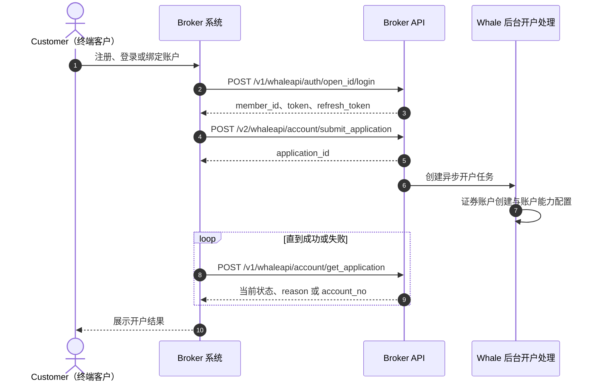
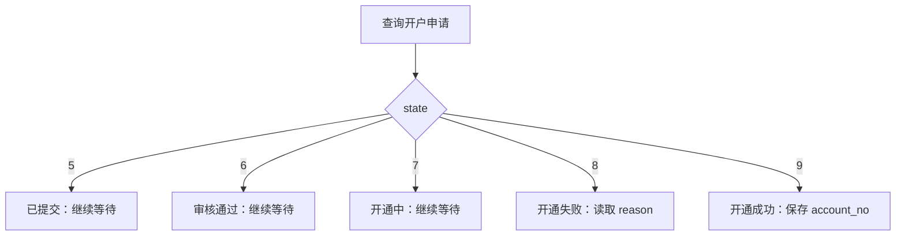

用户绑定与开户不是一次同步调用：先建立 `open_id → member_id` 的用户映射，再提交开户申请，并持续查询异步处理结果，最终获得 `account_no`。

<CardGroup cols={3}>
  <Card title="登录与绑定" icon="link" class="api-step-card">
    `POST /v1/whaleapi/auth/open_id/login`
  </Card>
  <Card title="提交开户申请" icon="file-pen" class="api-step-card">
    `POST /v2/whaleapi/account/submit_application`
  </Card>
  <Card title="查询申请状态" icon="rotate" class="api-step-card">
    `POST /v1/whaleapi/account/get_application`
  </Card>
</CardGroup>

## 接口总览

- 用户注册 / 登录（POST /v1/whaleapi/auth/open_id/login）

    - 首次登录即注册

    - 第三方用户与平台用户关系绑定（open_id -\> member_id）

        - open_id 三方系统用户唯一标识

        - member_id Whale 系统用户唯一标识

    - SDK 登录 token 颁发

- 用户登出 (POST /v1/whaleapi/auth/session/logout)

    - 用 token 将用户登出，设置 token 无效

    - 需要两个参数：

        - `member_id` - 来自于登录接口返回的

        - `sid` - 用 JWT decode 登录接口返回的 `token` 即可获得 `sid`

- 证券账户开户

    - 提交开户资料 (POST /v2/whaleapi/account/submit_application)

    - 主动调用获取开户申请状态（/v1/whaleapi/account/get_application）/ 账户开通通知（定制化开发）

## 绑定关系与状态模型

| 标识 | 所属系统 | 用途 | 建议保存位置 |
| --- | --- | --- | --- |
| `open_id` | Broker | Customer 在 Broker 用户体系中的稳定唯一标识 | Broker 服务端 |
| `member_id` | Whale | Whale 用户唯一标识，由登录接口返回 | Broker 服务端 |
| `application_id` | Whale | 单次开户申请标识，用于查询异步状态 | Broker 服务端 |
| `account_no` | Whale | 开户成功后的证券账户号码 | Broker 服务端 |
| `sid` | Whale 会话 | 登出所需的 Session ID，可从登录 token 的 JWT payload 解码取得 | 按会话管理 |

<Warning>
`open_id` 必须稳定且不可被其他 Customer 复用。Broker 应在服务端校验 `member_id`、`application_id` 和 `account_no` 的归属关系，不能信任 Broker App 直接传入的关联标识。
</Warning>

## 详细设计

### 总体流程



### 流程说明

<Steps>
  <Step title="用户注册、登录与关系绑定">

Broker 服务端调用登录注册接口。

|**场景**|**系统行为**|
|---|---|
|用户未注册|创建平台用户（Member）|
|用户已注册|直接登录|
|第三方首次接入|建立用户关系绑定 `open_id → member_id`|

  </Step>
  <Step title="提交开户资料">

系统在校验开户资料通过后，将生成一条开户申请记录，并返回开户申请 ID

此时仅表示**开户申请已提交成功**，并不代表账户已开通。Broker 必须保存返回的 `application_id`。

  </Step>
  <Step title="等待账户异步开通">
    账户开通由系统后台异步处理，包括证券账户创建和账户能力配置。Broker 主动查询开户申请状态；如项目已约定，也可通过定制通知接收结果。
  </Step>
  <Step title="落库最终结果">
    状态为开通成功时保存 `account_no`；状态为失败时保存 `reason`。只有取得成功状态后，Broker App 才应进入证券账户功能。
  </Step>
</Steps>

### 状态判定



<Note>
状态查询应以 `state` 为准：`5` 已提交、`6` 审核通过、`7` 开通中、`8` 开通失败、`9` 开通成功。失败时同时读取 `reason`；成功时读取 `account_no`。
</Note>

## API 详情

### 用户注册登录

`POST /v1/whaleapi/auth/open_id/login`

##### 请求字段说明

|**字段名**|**类型**|**是否必填**|**说明**|
|---|---|---|---|
|open_id|string|Y|三方用户唯一标识 userid|

#### 请求与响应示例

```json
{
    "open_id": "roleid"
}
```

```json
{
  "code": 0,
  "message":"",
  "data": {
    "member_info": {
      "member": {
        "member_id":"123",
        "uuid": "default_value",
        "phone_number": "default_value",
        "email": "default_value",
        "lang": "default_value",
        "country_code": 0,
        "email_check": false,
        "avatar": "default_value",
        "nickname": "default_value",
        "can_nick_modified": false,
        "user_region": "default_value"
      },
      "lang":"zh-CN",
      "setting": {
        "currency": "USD",
        "lang":"auto"
      }
    },
    "credentials" : {
        "token": "xxxxx",
        "refresh_token":"xxxxx"
    },
    "first_login": true
  }
}
```

|**字段名**|**类型**|**是否必填**|**说明**|
|---|---|---|---|
|code<br />|number|Y<br />|0 成功<br />\>0 失败|
|message|string|Y|错误提示|
|data|object|Y||
|+ member_info|object \[MemberInfo\]|Y|用户信息|

##### MemberInfo

|**字段名**|**类型**|**是否必填**|**说明**|
|---|---|---|---|
|member_info|object|Y|社区基础信息|
|+ member_id|string|Y|Whale 用户 ID|
|+ nickname|string|Y|昵称（默认生成）|
|+ avatar|string |Y |头像（默认生成）|
|+ lang|string|Y|当前语言（默认中文繁体 `zh-HK`）|
|setting|object|Y|用户设置（包含用户语言、行情偏好红涨绿跌等）|
|+ lang<br />|string|Y|语言设置<br />- `auto` - 跟随系统语言<br />- `en` - 英文<br />- `zh-CN` - 简体中文<br />- `zh-HK` - 繁体中文（默认）|

### 提交开户申请

`POST /v2/whaleapi/account/submit_application`

##### **请求字段说明**

|**字段名**|**类型**|**是否必填**|**说明**|
|---|---|---|---|
|member_id|integer|Y|用户 ID|
|client_type|integer|Y|客户类型 1:个人户 2:企业户|
|open_info|object|Y|开户表单信息|
|+ account_no|string|N|证券账号|
|+ mark|string|N|账户标记|
|+ upload|object|Y|证件信息|
|++ card_country|string|Y|证件签发地<br />[国家/地区（ISO_3166-1_alpha-2）](https://en.wikipedia.org/wiki/ISO_3166-1_alpha-2#Officially_assigned_code_elements)|
|++ card_type|integer|Y|证件类型 0:身份证 1:护照|
|++ card_id|string|Y|证件号码|
|++ first_name|string|N|名文姓（名的拼音）|
|++ last_name|string|Y|英文姓（姓的拼音）|
|+ base|object|Y|个人基本信息|
|++ residence_country|string|Y|居住国家/地区<br />[国家/地区（ISO_3166-1_alpha-2）](https://en.wikipedia.org/wiki/ISO_3166-1_alpha-2#Officially_assigned_code_elements)|
|++ residence_part|string|N|居住所在区域|
|++ residence_desc|string|Y|居住详细地址|
|+ employ|object|N|职业信息|
|++ contact|object|Y|联系方式|
|+++ emails|array \[Email\]|Y|邮箱（接单发送邮箱）|
|++ taxes|array \[Tax\]|Y|国家税收信息|
|+ finance|object|Y|金融信息|
|++ account_type|string|Y|账户类型（C现金/M融资）|
|+ risk|Object |N|风险信息|
|++ risk_tolerance|Object|N|风险测评信息|
|+++ audit|bool|Y|风险测评是否通过|
|+++ end_at|integer|Y|风险测评过期时间|

#### 请求与响应示例

```json
{
  "member_id": 123456,
  "client_type": 1,
  "open_info": {
    "upload": {
      "card_type": 0,
      "card_id": "<document-number>",
      "first_name": "SAN",
      "last_name": "ZHANG"
    },
    "base": {
      "residence_country": "CN",
      "residence_desc": "<residential-address>"
    },
    "finance": {
      "account_type": "C"
    },
    "risk": {
      "risk_tolerance": {
        "audit": true,
        "end_at": 1716358996
      }
    }
  }
}

```

```json
{
  "application_id": 123456
}
```

### 获取开户申请信息

`POST /v1/whaleapi/account/get_application`

##### **请求字段说明**

|**字段名**|**类型**|**是否必填**|**说明**|
|---|---|---|---|
|application_id|string|Y|开户申请ID|
|member_id|string|待确认|原始请求示例包含该字段，但原始字段表未声明；请以当前 Broker API 契约为准|

|**字段名**|**类型**|**是否必填**|**说明**|
|---|---|---|---|
|code|integer|Y||
|message|string|Y||
|data|object|||
|open_info|object|Y|开户表单信息|
|+ upload|object|Y|证件信息|
|++ region|string|Y|nationality|
|++ card_type|integer|Y|证件类型 <br />- `0` - 身份证 <br />- `1` - 护照|
|++ card_country|string|Y|证件签发地<br />[国家/地区（ISO_3166-1_alpha-2）](https://en.wikipedia.org/wiki/ISO_3166-1_alpha-2#Officially_assigned_code_elements)|
|++ card_id|string|Y|证件号码|
|++ first_name|stirng|Y|英文名（名的拼音）|
|++ last_name|string|Y|英文姓（姓的拼音）|
|++ name|string|N|中文姓名|
|++ valid_date_end|string|N|证件到期日|
|+ base|object||基础信息|
|++ country_code|string|Y|出生国家/地区|
|++ birth_date|string|Y|出生日期|
|++ gender|string|N|性别<br />- `male` 男<br />- `female` 女|
|++ marital_status|string|N|婚姻状态:  <br />- `single` 单身  <br />- `married` 已婚    <br />- `other`离异<br />- `divorced`  丧偶<br />- `widowed`|
|++ residence_country|string|Y|居住国家/地区|
|++ residence_part|string|Y|居住所在区域|
|++ residence_desc|string|Y|居住详细地址|
|+ employ|object||职业信息|
|++ type|string|N|职业类型|
|state|integer|Y|开户申请状态: <br />- `5` - 已提交<br />- `6` - 审核通过 <br />- `7` - 开通中<br />- `8` - 开通失败<br />- `9` - 开通成功 |
|reason|string||失败原因|
|account_no|string||证券账户号码|

#### 请求与响应示例

```json
{
   "member_id":"1",
   "application_id":"2"
}

```

```json
{
    "code": 0,
    "message":"",
    "data": {
      "state" : 9,
      "account_no" : "<account-no>",
      "open_info": {
        "upload": {
            "region": "MO",
            "card_type": 0,
            "card_country": "MO",
            "first_name": "SAN",
            "last_name": "ZHANG",
            "card_id": "<document-number>",
            "valid_date_end": "1991-01-01"
        },
        "base": {
            "country_code": "CN",
            "gender": "male",
            "education": "Record of formal schooling",
            "birth_date": "1991-01-02",
            "marital_status": "single",
            "residence_country": "CN",
            "residence_part": "part",
            "residence_desc": "desc"
        },
        "employ": {
            "type": "employed",
            "email": "customer@example.com",
            "contact": {
                "phones": [
                  {
                      "country_code":86,
                      "mobile": "13800000000"
                  }
                ],
                "emails": [
                  {
                      "email": "customer@example.com"
                  }
                ]
            },
            "taxes": [{
                "country": "国籍",
                "id": "编号",
                "assets_ids": "证明文件"
            }]
        },
        "finance": {
            "income_level": "annual income(年收入)"
        },
        "risk": {
            "risk_tolerance": {
                "level": "A1"
            }
        },
        "verify": {
          "cash": {
              "bank_id":1111,
              "bank_no":"<bank-account-no>",
              "currency":"HKD"
          }
        }
      }
    }
}
```

### 登出用户

`POST /v1/whaleapi/auth/session/logout`

##### **请求字段说明**

Request

|**字段名**|**类型**|**是否必填**|**说明**|
|---|---|---|---|
|member_id|string|Y|用户编号，来自于登录接口返回。|
|sid|string|Y|Session ID <br />这个信息可以用 JWT decode (标准实现) 登录的 token 获得 sid|

## 错误码

| 错误码 | 含义 | 建议处理 |
| --- | --- | --- |
| `400` | 参数错误 | 检查必填字段、类型和枚举值 |
| `500` | 服务异常 | 记录请求关联信息并联系 Whale 项目团队 |
| `401033` | 用户冻结 | 阻止继续操作并向 Customer 展示账户状态 |
| `401040` | 用户已注销 | 清理本地会话和不可用账户状态 |
| `401047` | 系统基础配置缺失 | 联系 Whale 项目团队补充配置 |
| `404002` | 身份信息已存在，请使用原账号进行证券交易 | 引导 Customer 使用原账户 |
| `404013` | 请勿重复提交 | 查询既有开户申请，不要重复创建 |
| `404050` | 注销账户后 3 个月内不支持重新开户 | 展示限制并停止提交 |
| `404056` | 开户失败 | 展示 `reason` 并确认是否允许重试 |
| `404062` | 账户不可用 | 阻止进入证券账户功能 |
| `404102` | 当前开户申请状态不支持资料修改 | 先查询当前状态，再决定下一步 |
| `404103` | 开户申请不存在 | 校验 `application_id` 及其归属关系 |

## 常见问题与待确认项

<AccordionGroup>
  <Accordion title="如何打通两边的用户？token 和 refresh_token 如何获得？">
    使用稳定的 `open_id` 调用[用户注册登录](#用户注册登录)接口。接口返回 `member_id`、`token` 和 `refresh_token`；Broker 保存用户映射，并将初始凭证交给 Broker App 设置到 WhaleApp SDK 或 WhaleCore SDK。
  </Accordion>
  <Accordion title="开户资料字段如何填写？">
    请参阅 [Broker API 开户字段文档](https://apidocs.longbridgewhale.com/whaleapi/submit-application-v2%E6%8F%90%E4%BA%A4%E5%BC%80%E6%88%B7%E7%94%B3%E8%AF%B7%E8%B5%84%E6%96%99-3469908e0)。
  </Accordion>
  <Accordion title="Token 是否区分客户端？">
    不区分。取得初始 token 后应提供给 Broker App，并设置到 WhaleApp SDK 或 WhaleCore SDK。后续有效性检查和自动续期由 SDK 层管理，Broker App 不自行调用 check token 或实现刷新。任何一方都不能在日志中记录完整 token。
  </Accordion>
</AccordionGroup>

以下信息在原始对接材料中列为待确认项，实施前需与 Whale 项目团队确认：

- 证券账户号码规则。
- `mark` 账户标记的取值和业务含义。
- 接口签名规则示例。
- 项目实际使用的错误码范围。
