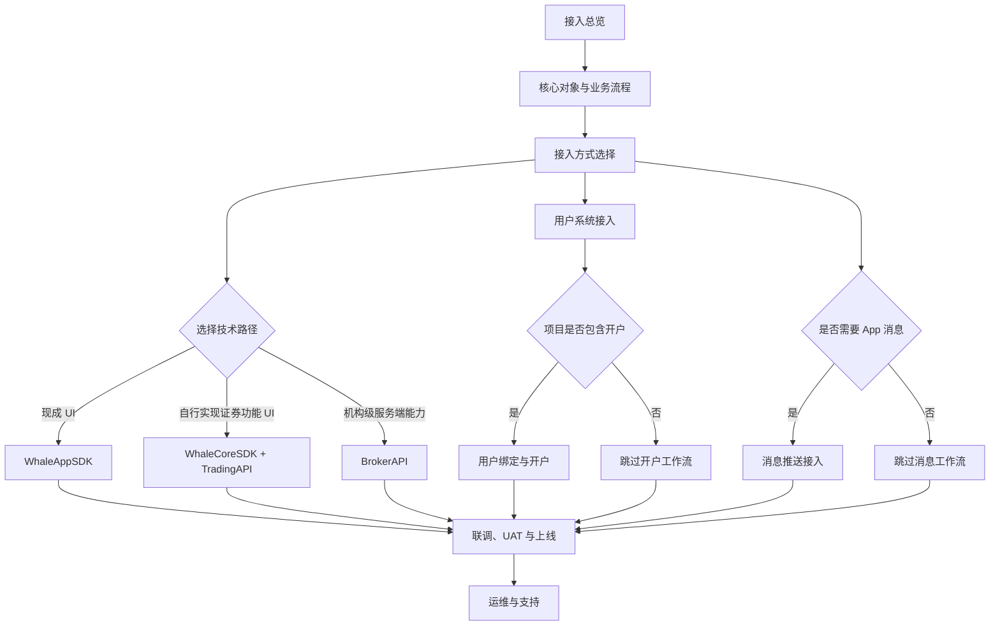
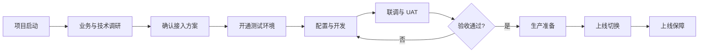

本指南面向首次接入 Longport Whale 的 Broker 项目团队，说明双方在商务确认后需要完成的准备、方案确认、环境开通、联调验收和上线工作。

<Note>
本页是整个 Broker 接入的主入口。建议项目按阶段形成可验证的交付物；具体工作流和阶段门槛应以双方确认的项目范围为准。
</Note>

## 指南路线 {/* guide-route */}

| 阶段 | 指南 |
| --- | --- |
| 理解 Customer、用户、开户申请、账户和消息的关系 | [核心对象与业务流程](/zh-cn/docs/concepts) |
| 确定 UI、客户端和服务端方案 | [接入方式选择](/zh-cn/docs/integration-options) |
| 确定 Customer 注册、登录和会话归属 | [用户系统接入](/zh-cn/docs/user-system-integration) |
| 集成完整 UI | [WhaleAppSDK（iOS、Android、WebTrade）](/zh-cn/whalesdk/whaleapp/overview) |
| Broker App 自行实现证券功能 UI | [WhaleCoreSDK 与 TradingAPI](/zh-cn/trading-api/overview) |
| 接入机构级服务端能力 | [BrokerAPI](/zh-cn/broker-api/overview) |
| 项目包含开户时，建立用户、申请和证券账户映射 | [用户绑定与开户](/zh-cn/docs/account-opening) |
| 项目需要 App 消息时，选择并实现消息链路 | [消息推送接入](/zh-cn/docs/message-push) |
| 执行测试、验收和生产切换 | [联调、UAT 与上线](/zh-cn/docs/implementation) |
| 上线后的错误、事件和升级 | [运维与支持](/zh-cn/docs/operations-support) |

## 阶段、交付物与完成条件 {/* phases-deliverables-and-exit-criteria */}

| 阶段 | 主要产出 | 完成条件 |
| --- | --- | --- |
| 1. 项目启动 | 范围、负责人、里程碑、沟通与升级机制 | 双方确认负责人、范围和目标上线时间 |
| 2. 方案确认 | 接入方式、用户体系、账户模型、消息方案 | 每条技术链路、调用方和授权主体明确 |
| 3. 环境准备 | 地址、白名单、凭证、配置和测试数据 | Broker 能从 UAT 环境完成一次鉴权请求 |
| 4. 开发联调 | 用户、账户、核心业务和消息最小闭环 | 正常与关键异常场景都有可复现结果 |
| 5. UAT 验收 | 测试记录、问题清单、验收结论 | 阻塞问题关闭，业务负责人确认验收 |
| 6. 生产准备 | 生产配置、发布步骤、监控和回退方案 | 上线检查通过，双方值守人员到位 |
| 7. 上线保障 | 生产验证、事件记录和遗留问题 | 核心链路稳定并转入常规支持 |

## 端到端流程 {/* end-to-end-delivery */}

## 1. 项目启动 {/* 1-project-kickoff */}

双方确定项目负责人和固定沟通机制，并明确以下角色：

| 角色 | 主要职责 |
| --- | --- |
| Broker 项目负责人 | 范围、排期、跨团队协调与验收 |
| Broker Developer | 服务端接口、网络与数据对接 |
| Broker App Developer | WhaleAppSDK（iOS、Android、WebTrade）或 WhaleCoreSDK 集成 |
| Broker Operator | 账户、资金、交易等业务验收 |
| Whale 实施与技术支持 | 方案确认、环境与配置、联调支持 |

启动阶段应形成一份包含范围、负责人、里程碑、风险和待决事项的实施计划。

### 责任边界 {/* responsibility-boundary */}

| 工作 | Broker | Whale |
| --- | --- | --- |
| Broker 产品范围和 Customer 体验 | 决策并验收 | 提供能力边界与实施建议 |
| Broker App 与 Broker Server 开发 | 负责实现、测试和发布 | 提供 SDK、API、配置及技术支持 |
| 用户、账户及业务数据映射 | 定义 Broker 字段并维护关联 | 说明 Whale 字段与约束 |
| 网络、域名和凭证 | 配置 Broker 环境并安全保管凭证 | 开通环境、白名单及凭证 |
| UAT | 准备场景、数据并给出验收结论 | 支持定位、修复 Whale 侧问题 |
| 生产上线 | 负责 Broker 侧发布、监控和回退 | 负责 Whale 侧配置、支持和事件响应 |

## 2. 前期调研 {/* 2-discovery */}

在申请环境前，至少确认以下内容：

- **业务范围**：市场、产品、账户类型、币种，以及是否包含开户、资金、交易、新股等能力。
- **接入边界**：采用 WhaleAppSDK、WhaleCoreSDK + TradingAPI 或 BrokerAPI；由哪一方维护 Customer 用户体系。
- **账户体系**：Broker 用户唯一标识、 Whale 用户标识和证券账户号码之间的映射方式。
- **合规流程**：开户资料、KYC、风险测评、审批方式和失败处理。
- **消息通知**：选择 Whale 托管推送或 Broker 自有推送，确认 App 标识、厂商渠道和消息分发责任。
- **基础设施**：测试与生产出口 IP、域名放行、密钥保管和回调地址。
- **交付方式**：配置项、初始化数据、联调案例、UAT 标准、上线窗口和回退负责人。

接入产品的选择见 [接入方式选择](/zh-cn/docs/integration-options)。

调研结束时应形成一份“方案确认记录”，至少写明：

- Broker App 使用 WhaleAppSDK（iOS、Android、WebTrade），还是使用 WhaleCoreSDK + TradingAPI 自行实现证券功能 UI。
- Broker Server 需要使用哪些 BrokerAPI 能力。
- Customer 用户由谁管理，`open_id` 如何生成和保持稳定。
- 开户申请如何提交、查询和展示失败结果。
- 消息由 Whale 托管渠道发送，还是转发到 Broker Server。
- 哪些能力本期不接入，后续如何处理。

## 3. 环境与资料准备 {/* 3-environment-and-material-preparation */}

### Broker 需要提供 {/* broker-provides */}

- 测试和生产环境的出口 IP 白名单。
- 技术联系人、业务验收人和生产事件联系人。
- 用户、账户及业务字段映射。
- 开户、资金、交易等计划接入场景及预期用量。
- UAT 测试数据和验收人员名单。

### Whale 需要提供 {/* whale-provides */}

- 对应环境的访问地址和连通性要求。
- 按接入范围签发的凭证及安全交付方式。
- 已确认的业务配置、字段约束和测试账号。
- 接口文档、错误处理规则及联调支持渠道。

### 环境准备完成条件 {/* environment-exit-criteria */}

- Broker 已记录 UAT 环境地址、用途和负责人。
- DNS、TLS、代理、出口 IP 与白名单验证通过。
- 凭证已通过安全渠道交付并存入 Broker 的密钥管理设施。
- Broker 使用最简单的只读接口验证鉴权成功。
- 测试账号、市场、币种和必要初始化数据可用。
- UAT 与生产的配置、凭证和数据不会混用。

<Warning>
凭证必须由 Broker 服务端保管，不得写入 App、网页代码、日志或工单。测试与生产凭证不可混用。
</Warning>

## 4. 开发、联调与验收 {/* 4-development-integration-and-acceptance */}

建议按“最小闭环”逐步验证，而不是一次性覆盖全部接口：

1. 验证网络、凭证和最简单的只读请求。
2. 跑通用户绑定与开户，并保存所有业务标识。
3. 跑通资金、交易和状态查询等核心场景。
4. 按 [消息推送接入](/zh-cn/docs/message-push) 验证设备通知或 Server-to-Server 消息转发。
5. 验证异步处理、重试、重复请求和失败恢复。
6. 完成权限、限流、日志脱敏和监控告警检查。
7. 由业务团队执行 UAT 并记录验收结果。

详细的技术流程见 [实施与上线](/zh-cn/docs/implementation)。

### 联调阶段必须保留的证据 {/* evidence-to-retain */}

- 测试场景、输入数据、预期结果和实际结果。
- 请求时间、环境、接口、脱敏业务标识和请求关联 ID。
- 异步流程的中间状态与最终状态。
- 问题负责人、处理结论和回归结果。
- UAT 验收人及最终确认记录。

## 5. 生产上线 {/* 5-production-go-live */}

上线前应共同确认：

- 生产域名、IP 白名单和凭证已验证。
- 生产配置与已验收配置一致，差异有明确记录。
- 关键业务、错误率、延迟和异步任务均有监控。
- 发布步骤、观察指标、停止条件和回退方案已演练。
- 上线窗口内双方技术及业务负责人可以响应。

上线后进入约定的保障期，集中跟踪生产请求、业务结果和遗留问题；保障期结束后转入常规支持流程。
