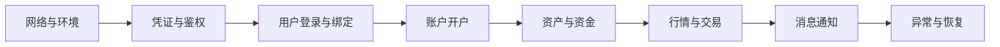

本页承接前期方案、用户系统和开户接入，说明如何组织联调、业务验收和生产切换。

## 开始前

应先完成：

1. [Broker 接入总览](/zh-cn/docs/broker-onboarding)中的角色、范围和环境准备。
2. [接入方式选择](/zh-cn/docs/integration-options)，明确 WhaleApp SDK、WhaleCore SDK + Trading API 或 Broker API 的边界。
3. [用户系统接入](/zh-cn/docs/user-system-integration)，确认身份、会话和授权模型。
4. 如包含开户，完成[账户绑定与开户](/zh-cn/docs/account-opening)的数据映射。
5. 如包含 App 通知，确认[消息推送接入](/zh-cn/docs/message-push)方案。

## 联调顺序

建议按照最小闭环逐步扩大范围：

每个阶段都应记录输入数据、预期结果、实际结果、请求关联 ID 和负责人。写请求发生超时时，应先查询业务状态再决定是否重试。

## 每一阶段如何验收

| 阶段 | 最小验证 | 通过证据 |
| --- | --- | --- |
| 网络与环境 | DNS、TLS、出口 IP、白名单和超时配置 | Broker Server 从目标环境成功访问已确认地址 |
| 凭证与鉴权 | 正确凭证、错误凭证、过期或无效凭证 | 成功请求可追踪，失败请求不会泄露凭证 |
| 用户与会话 | 新 Customer、已有 Customer、刷新和登出 | `open_id` 与 `member_id` 映射稳定，会话失效符合预期 |
| 开户 | 提交、处理中、成功、失败和重复提交 | `application_id`、状态、`reason` 与 `account_no` 正确落库 |
| 资产与资金 | 查询、变动、精度和余额限制 | Broker 记录与 Whale 返回结果一致 |
| 行情与交易 | 订阅、下单、订单状态和异常订单 | 同步结果与异步订单终态能够关联 |
| 消息通知 | 前台、后台、关闭权限、重复消息 | Broker App 或 Broker Server 正确去重、展示和跳转 |
| 恢复能力 | 超时、限流、断线重连和服务异常 | 重试有上限，不产生重复业务结果 |

## UAT 场景

### 正常流程

- 新 Customer 与已有 Customer 登录。
- 首次开户、开户成功及已有证券账户进入产品。
- 资产查询、资金变动和目标市场交易。
- 订单状态变化及消息通知。
- Customer 主动退出及重新登录。

### 异常流程

- token 和 refresh token 失效。
- Customer、账户或资源归属不匹配。
- 开户审核失败、重复提交和长期处理中。
- 网络超时、服务端错误及限流。
- 重复消息、通知关闭和无效跳转链接。
- App 或页面在处理中被关闭后重新进入。

### UAT 记录模板

每个用例至少记录以下字段：

| 字段 | 说明 |
| --- | --- |
| 用例 ID 与名称 | 可稳定引用的测试编号和业务场景 |
| 前置条件 | 环境、Customer、账户、市场和配置 |
| 操作步骤 | Broker App 与 Broker Server 的实际操作 |
| 预期结果 | 同步响应、中间状态和最终业务状态 |
| 实际结果 | 包括 Broker UI、Broker 数据和 Whale 返回结果 |
| 追踪信息 | 时间及时区、请求关联 ID、脱敏业务标识 |
| 结论 | 通过、失败或阻塞，以及问题链接和负责人 |

## 生产就绪检查

- 生产域名、DNS、TLS、出口 IP 和白名单均已验证。
- 生产凭证通过安全渠道交付，且与 UAT 完全隔离。
- Customer、用户、申请和账户映射可以查询和追踪。
- 错误率、延迟、异步任务、消息积压和关键业务终态均有监控。
- 日志已脱敏，并记录环境、接口、请求关联 ID 和业务标识。
- 发布步骤、观察指标、停止条件和回退方案已评审。
- 上线窗口内双方技术、业务和事件负责人可以响应。

### 上线准入门槛

以下任一条件未满足时，不应进入生产切换：

- 核心正常流程或资金、交易等高影响异常流程尚未验收。
- UAT 与生产的配置差异没有完成评审。
- 无法通过业务标识和请求关联 ID 追踪关键操作。
- Broker App、Broker Server 或 Whale 任一侧没有可用监控。
- 没有明确的停止条件、回退步骤或回退负责人。
- 生产凭证曾出现在代码、日志、聊天或工单中，且尚未轮换。

## 上线与保障期

上线时从小范围真实业务开始，确认登录、账户、交易和通知闭环后再扩大范围。保障期内集中跟踪生产请求、Customer 反馈、失败任务和配置差异；所有临时修复都应在保障期结束前形成正式配置、代码或运维记录。

保障期结束前，双方应确认：

- 遗留问题有负责人、优先级和计划完成时间。
- 临时白名单、临时配置和手工操作已清理或转为正式方案。
- 监控阈值、事件联系人和支持入口已经移交给常规运维团队。
- 项目实施资料、UAT 记录和生产变更记录可供后续追溯。

<Warning>
不要用 UAT 的“接口返回成功”代替业务验收。开户、资金、订单和消息均包含异步阶段，验收必须检查最终业务状态。
</Warning>
