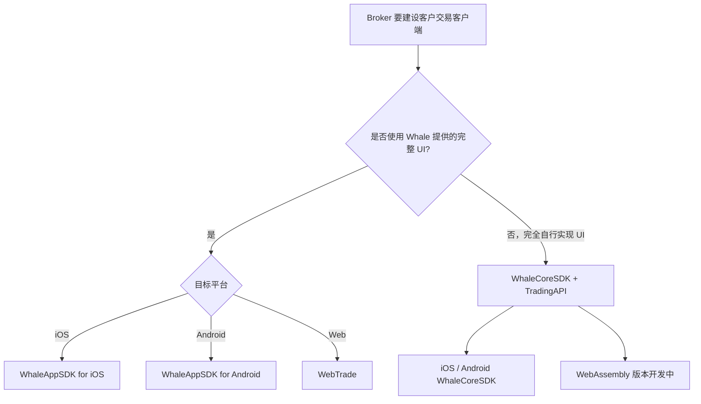

选择接入方式时，先判断是否需要 Whale 提供图形界面，再判断调用方代表 Broker 机构还是单个客户。

## 对比 {/* comparison */}

| 产品 | 调用方 | 授权主体 | 形态 | 适合场景 | 状态 |
| --- | --- | --- | --- | --- | --- |
| [WhaleAppSDK](/zh-cn/whalesdk/whaleapp/overview) | Broker App 开发团队 | 客户 | iOS / Android / WebTrade 图形界面 SDK | 在 Broker App、网站或 Web 容器中集成完整证券业务 UI | 可用 |
| [WhaleCoreSDK + TradingAPI](/zh-cn/trading-api/overview) | Broker App | 客户 | iOS / Android / Web 数据 SDK + HTTP API | Broker App 完全自行实现证券功能 UI | iOS / Android 可用；WebAssembly 开发中 |
| [BrokerAPI](/zh-cn/broker-api/overview) | Broker Server / 自研管理后台服务端 | Broker | HTTPS API | Server-to-Server 集成或自研管理后台 | 可用 |
| [OpenAPI](https://open.longportapp.com) | Broker 的开发者、AI 应用 | 客户 | Open API / SDK / MCP | 策略交易、量化分析及 AI 接入客户账户与市场数据 | 可用（外部站点） |

## 图形界面还是完全自研 {/* ready-made-or-custom-ui */}

- **需要现成 UI**：选择 **WhaleAppSDK**。iOS 和 Android 提供原生图形界面；WebTrade 支持独立域名部署供用户直接访问，或以 iframe 方式嵌入 Broker 官网。
- **完全自行实现证券功能 UI**：使用 **WhaleCoreSDK + TradingAPI**。WhaleCoreSDK 提供行情订阅、WebSocket 连接、认证签名和 token 续期等客户端基础机制；TradingAPI 通过 HTTP 提供账户、资产和交易等业务能力。

## 授权边界 {/* authorization-boundaries */}

- **Broker 机构授权**：代表 Broker 运行的 Server-to-Server 集成或自研管理后台使用 BrokerAPI；实际请求由 Broker 控制的服务端发起。
- **客户授权**：WhaleAppSDK（包括 WebTrade）、WhaleCoreSDK、TradingAPI 和 OpenAPI 均以单个客户的权限访问私有数据。
- **Broker Developer 与开发者**：前者代表 Broker 建设产品；后者是 Broker 的客户，使用 OpenAPI 开发策略交易、量化分析或 AI 应用。两者不共享凭证和授权范围。

<Note>
WhaleCoreSDK 不提供任何图形界面，也不是 TradingAPI 的替代品。完全自行实现证券功能 UI 的 Broker App，通常同时使用 WhaleCoreSDK 的长连接与基础机制，以及 TradingAPI 的 HTTP 业务接口。
</Note>
