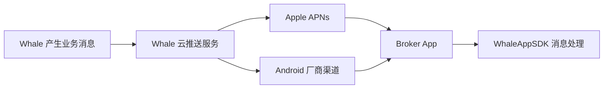
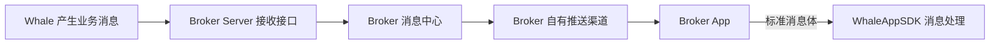

WhaleAppSDK 支持两种消息对接方案。两种方案最终都由 Broker App 接收标准消息体并交给 WhaleAppSDK，区别在于消息由 Whale 直接投递到云推送渠道，还是先转发给 Broker Server。

| 对比项 | Whale 托管推送 | Broker 自有推送 |
| --- | --- | --- |
| 消息链路 | Whale → 云推送 → 设备 → Broker App | Whale → Broker Server → Broker 推送渠道 → Broker App |
| Broker Server 开发 | 不需要 | 需要开发接收、去重和分发服务 |
| 推送渠道凭证 | Broker 安全提供给 Whale | Broker 自行保管 |
| 分发控制 | 使用 Whale 配置的渠道与策略 | Broker 可以决定是否通知及如何分发 |
| 适用情况 | 希望降低接入成本并快速上线 | 已有消息中心或需要自主控制消息 |

## 方案一：Whale 托管推送 {/* option-1-whale-managed-push */}

<CardGroup cols={2}>
  <Card title="优点" icon="circle-check">
    Broker 接入成本较低，不需要开发消息转发服务。
  </Card>
  <Card title="需要考虑" icon="triangle-exclamation">
    Broker 需要向 Whale 安全提供渠道配置：iOS APNs 凭证，以及 Android 各厂商的 App ID、App Key 或 Secret。
  </Card>
</CardGroup>

<Steps>
  <Step title="收集渠道信息">
    Broker 按 [推送渠道信息收集](/zh-cn/docs/push-channel-credentials) 准备 UAT 与生产资料，不使用的渠道明确标记为“无”。
  </Step>
  <Step title="配置 Whale 云推送">
    Whale 项目团队将双方确认的渠道信息配置到对应环境的云推送服务。
  </Step>
  <Step title="集成 Broker App">
    Broker App 对接 WhaleAppSDK 消息 API，并验证通知权限、设备 token、前后台接收和点击跳转。
  </Step>
</Steps>

## 方案二：Broker 自有推送 {/* option-2-broker-owned-push */}

<CardGroup cols={2}>
  <Card title="优点" icon="sliders">
    Whale 不管理具体下游渠道；Broker 可以决定消息是否通知，并控制模板、用户偏好和分发策略。
  </Card>
  <Card title="需要考虑" icon="code">
    Broker Server 需要开发消息接收和下游分发；鉴权、幂等、可靠落库与监控方式由项目双方确认。
  </Card>
</CardGroup>

<Steps>
  <Step title="开发接收接口">
    Broker Server 开发 Whale 可访问的 HTTPS 消息接收接口。
  </Step>
  <Step title="配置转发地址">
    Broker 将 UAT 与生产接收地址、认证方式、网络要求和联系人提供给 Whale 项目团队。
  </Step>
  <Step title="完成服务端联调">
    按 [Broker 自有推送渠道](/zh-cn/docs/server-message-forwarding) 验证请求、响应、幂等和失败处理。
  </Step>
  <Step title="集成 Broker App">
    Broker App 将最终收到的标准消息体交给 WhaleAppSDK，并完成安全跳转和兼容处理。
  </Step>
</Steps>

<Note>
本页用于选择方案；完整责任边界、客户端要求和验收场景见 [消息推送接入](/zh-cn/docs/message-push)。
</Note>
