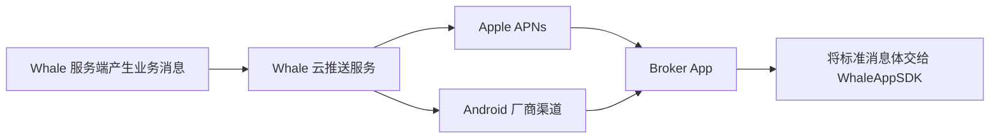
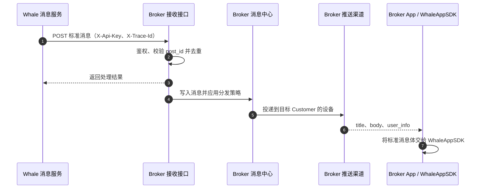

Whale 的订单、账户及其他业务消息可以通过两种方式送达 Customer：由 Whale 管理云推送渠道并直接投递到设备，或先通过 Server-to-Server 接口转发给 Broker，再由 Broker 自行决定是否通知及如何分发。

## 完整接入文档

本页用于说明总体方案和责任边界。原始对接材料中的配置项、字段和完整示例分别保留在以下页面：

- [消息推送方案选择](/zh-cn/docs/message-push-options)
- [推送渠道信息收集](/zh-cn/docs/push-channel-credentials)
- [Broker 自有推送渠道](/zh-cn/docs/server-message-forwarding)

## 选择接入方案

| 对比项 | Whale 托管推送 | Broker 自有推送 |
| --- | --- | --- |
| 消息路径 | Whale → 云推送 → APNs / Android 厂商 → App | Whale → Broker Server → Broker 推送渠道 → App |
| Broker 服务端开发 | 无 | 需要实现消息接收、处理和分发服务 |
| 云推送配置 | Broker 将 App 渠道凭证安全提供给 Whale | Broker 自行管理，通常不向 Whale 提供厂商凭证 |
| 消息控制能力 | 按 Whale 已配置的模板和策略投递 | Broker 可决定过滤、合并、延迟和具体渠道 |
| 客户端工作 | 注册设备，并将推送消息交给 WhaleAppSDK | 注册自有渠道，并将标准消息体交给 WhaleAppSDK |
| 适用场景 | 希望快速上线、减少服务端工作 | 已有统一消息平台，或需要自主控制消息分发 |

<Tip>
如果 Broker 已有成熟的消息中心、营销通知策略或多个下游渠道，通常选择自有推送；如果目标是以较少的开发工作完成标准交易消息通知，通常选择 Whale 托管推送。
</Tip>

## 方案一：Whale 托管推送



### 开通流程

1. Broker 确认生产与 UAT 的 iOS Bundle ID、Android Package Name 以及所需推送渠道。
2. Broker 在 Apple 或 Android 厂商控制台创建 App、启用推送能力并生成对应凭证。
3. Broker 通过双方约定的加密渠道向 Whale 交付凭证信息。
4. Whale 为相应环境创建并配置云推送应用。
5. Broker App 完成系统通知权限、设备 token 注册和 WhaleAppSDK 消息处理。
6. 双方分别验证前台、后台、App 被终止及点击通知后的行为。

### Android 渠道信息

不使用的渠道应明确标记为“不使用”。如果生产和 UAT 使用相同 Package Name，可以只提交一套信息，但必须确认厂商控制台是否允许两套环境共用。

| 渠道 | 必填信息 | 可选信息 |
| --- | --- | --- |
| HUAWEI | Client ID、Client Secret | 默认回执 ID、实况窗服务账号密钥 |
| HONOR | App ID、Client ID、Client Secret | — |
| 小米 | App Secret | 海外 App Secret |
| FCM | 服务账号密钥 | — |
| OPPO | App Key、Master Secret | — |
| 魅族 | App ID、App Secret | — |
| vivo | App ID、App Key、App Secret | 默认回执 ID |

每套环境还应注明：

- 环境名称：UAT 或生产。
- Android Package Name。
- 渠道控制台内的 App 名称或项目 ID。
- 凭证有效期、轮换联系人及计划轮换时间。

### iOS APNs 信息

Broker 可以提供 APNs token signing key（`.p8`）或证书（`.p12`），通常只需选择一种方式。

| 凭证方式 | 需要提供 |
| --- | --- |
| `.p8` | key 文件、Key ID、Team ID、Bundle ID，以及适用环境 |
| `.p12` | 证书文件、证书密码、Bundle ID，并区分开发与生产环境 |

如果 UAT 与生产使用相同 Bundle ID，应在交付表中明确说明，不要通过猜测决定是否复用凭证。

<Warning>
推送凭证属于生产秘密。不得放入 Git、普通文档、即时通讯明文、邮件正文或客户端包内。应使用双方批准的秘密交付渠道，并在交付后记录保管人、使用范围、到期时间和轮换方式。
</Warning>

## 方案二：Broker 自有推送

Whale 将生成的标准业务消息发送给 Broker 的接收接口。 Broker 可以根据自身偏好完成过滤、模板渲染、用户偏好判断和多渠道分发。



### Broker 提供的信息

- UAT 和生产环境的 HTTPS 接收地址。
- Whale 调用时使用的认证方式和密钥安全交付流程。
- 网络白名单、TLS 和可选 mTLS 要求。
- 请求超时、最大请求体和速率限制。
- 技术联系人、监控方式和生产事件升级渠道。

### HTTP 请求约定

历史对接方案使用 `POST`，并约定以下请求头：

| Header | 说明 |
| --- | --- |
| `X-Api-Key` | Broker 提供给 Whale 的接口认证密钥 |
| `X-Trace-Id` | 端到端链路追踪标识；双方日志均应记录 |

请求体示例：

```json
{
  "member_ids": ["1023310"],
  "template_key": "order_done_v2_lb",
  "post_id": "615066553171354100",
  "channel": "push",
  "language": "zh-CN",
  "title": "买入全部成交",
  "body": "股票名称：示例股票\n成交数量：500",
  "template_params": {
    "quantity": "500",
    "order_id": "1228548293068333056"
  },
  "pre_params": {
    "member_real_name": "示例客户"
  },
  "user_info": {
    "t": "order_done_v2_lb",
    "tn": "event-trace-id",
    "id": "615066553171354100",
    "lb_push_from": "whale",
    "link": "broker-app://trade/order-detail?id=1228548293068333056",
    "json": "{\"message_type\":\"order_done_v2_lb\"}"
  }
}
```

| 字段 | 说明 | Broker 处理建议 |
| --- | --- | --- |
| `member_ids` | Whale Customer 标识列表 | 映射到 Broker 用户和设备，不要直接作为展示内容 |
| `template_key` | 消息模板标识 | 用于模板路由；未知值应进入监控或兼容处理 |
| `post_id` | 消息唯一标识 | 作为幂等键，重复请求不得重复通知 |
| `channel` | 目标渠道 | 当前示例为 `push` |
| `language` | 消息语言 | 用于选择本地化模板或内容 |
| `title` / `body` | 已生成的标题和摘要 | 可直接展示，或按双方确认规则重新渲染 |
| `template_params` | 业务模板参数 | 字段随模板变化，消费者应向前兼容 |
| `pre_params` | Whale 内置预设参数 | 可能包含个人资料，按敏感数据处理 |
| `user_info` | 客户端透传数据 | 推送到 App 后原样交给 WhaleAppSDK |

响应示例：

```json
{
  "success": true,
  "message": "success",
  "code": 0
}
```

历史约定中 `code: 0` 表示成功，非 `0` 表示失败。是否重试、重试次数、退避策略和可重试错误码必须在上线前书面确认；接收方不能假定失败一定会被再次投递。

### 服务端实现要求

- 仅接受 HTTPS，并校验 `X-Api-Key`；生产密钥应支持轮换。
- 使用 `post_id` 做幂等处理，并为去重记录设置满足业务要求的保留期。
- 快速完成校验和可靠落库，再异步执行厂商推送，避免上游请求超时。
- 对未知的附加字段保持兼容，不因模板增加参数而拒绝整条消息。
- 为鉴权失败、校验失败、重复消息、落库失败和下游推送失败建立指标及告警。
- 日志记录 `X-Trace-Id`、`post_id` 和处理结果，但不得输出密钥或完整个人资料。
- 明确部分 `member_ids` 处理失败时的响应和补偿规则。

## 客户端实现

无论选择哪一种服务端路径，最终交给 WhaleAppSDK 的消息结构一致：

```json
{
  "title": "消息标题",
  "body": "消息摘要",
  "user_info": {
    "t": "消息类型",
    "tn": "事件追踪标识",
    "id": "消息标识",
    "lb_push_from": "消息来源",
    "link": "跳转链接",
    "json": "业务内容 JSON 字符串"
  }
}
```

集成 WhaleAppSDK 的 Broker App 需要完成：

1. 向操作系统申请通知权限，并按照平台要求取得设备 token。
2. 将 token 注册到所选推送服务，并在 token 更新、登录用户变化或登出时同步更新绑定。
3. 在前台收到消息、后台点击通知和冷启动点击通知时，解析相同的标准结构。
4. 将 `title`、`body` 和完整 `user_info` 交给当前版本 WhaleAppSDK 的消息处理入口。
5. 对 `link` 做允许列表和参数校验后再导航，不能直接执行任意外部 URL 或未识别 scheme。
6. 对未知消息类型或缺少可选字段保持兼容，并记录可诊断但已脱敏的日志。

<Note>
WhaleAppSDK 的具体方法名和初始化位置可能随 iOS、Android 版本变化，应以项目交付的对应版本 SDK 文档为准。本页定义的是稳定的责任边界和消息格式。
</Note>

## 联调与验收

至少覆盖以下场景：

- UAT 与生产 App 标识、凭证和消息数据不会串用。
- 单个与多个 `member_ids` 均能正确映射目标 Customer。
- 同一 `post_id` 重复投递只产生一次用户可见通知。
- App 位于前台、后台、被系统终止时均有明确行为。
- Customer 登出、切换账户或关闭通知权限后不会错误投递。
- 简体中文、繁体中文、英文及缺省语言符合产品约定。
- 通知点击能进入正确页面，无效或过期链接能够安全降级。
- Broker 接收接口超时、返回失败及下游厂商失败均可观测。
- 密钥轮换后旧密钥按计划失效，且消息投递不中断。

消息推送应作为上线验收的一部分，连同账户、资金和交易主流程一起完成生产就绪检查。完整交付阶段见[客户接入与交付流程](/zh-cn/docs/broker-onboarding)。
