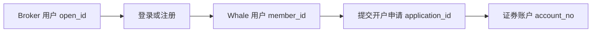

Broker App 涉及 Customer 的注册、登录、鉴权和证券账户状态管理。接入时可采用以下两种模式。

<CardGroup cols={2}>
  <Card title="Broker 管理用户体系" icon="users">
    用户资料保存在 Broker 系统；开户时才通过 BrokerAPI 建立 Customer 与 Whale 用户及证券账户的关联。
  </Card>
  <Card title="使用 Whale 用户体系" icon="key">
    Broker 完成初始登录衔接，并将 Whale 返回的凭证交给 WhaleAppSDK 或 WhaleCoreSDK；后续校验与续期由 SDK 层管理。
  </Card>
</CardGroup>

## Broker 管理用户体系

用户信息保存在 Broker 系统。Broker 需要持久化 `open_id`、`member_id`、开户申请和证券账户之间的映射，并以本地状态驱动 Broker App 展示。

<Steps>
  <Step title="建立用户关联">
    Customer 首次开户时，Broker 使用 `open_id` 调用登录注册接口，获得 Whale 的 `member_id`。同一 Customer 后续应复用既有映射。
  </Step>
  <Step title="提交并保存开户申请">
    Broker 提交开户资料后保存 `application_id`，并将本地账户状态更新为“待开户”。
  </Step>
  <Step title="同步证券账户状态">
    在开户成功前，Broker 定期调用 BrokerAPI 查询申请状态；成功后保存 `account_no`，之后常规查询可优先使用 Broker 已保存的结果。
  </Step>
  <Step title="处理注销">
    Broker 保存“待注销”状态，并在状态最终确认前持续向 BrokerAPI 查询账户状态。
  </Step>
</Steps>

### 建议的本地状态

| 状态 | 含义 | Broker App 建议 |
| --- | --- | --- |
| 未开户 | 尚未提交开户申请 | 展示开户入口 |
| 待开户 | 已提交，仍在异步处理 | 展示处理中并允许刷新状态 |
| 开户成功 | 已获得可用证券账户 | 保存并使用 `account_no` |
| 开户失败 | 申请失败 | 展示失败原因并按状态判断能否重试 |
| 待注销 | 已发起注销但未最终完成 | 持续查询账户状态 |

## 使用 Whale 用户体系

Broker 服务端负责完成初始用户登录或绑定，并把 Whale 返回的初始凭证安全交给 Broker App。Broker App 随后将 `token` 与 `refresh_token` 设置到 WhaleAppSDK；完全自行实现证券功能 UI 时，则设置到 WhaleCoreSDK。两者后续都由 WhaleSDK 层管理凭证。

<Steps>
  <Step title="取得初始凭证">
    登录成功后，BrokerAPI 返回 `token` 和 `refresh_token`。Broker 只需按项目约定安全地把初始凭证交给 Broker App。
  </Step>
  <Step title="设置到 WhaleSDK 层">
    Broker App 在初始化时将初始凭证设置到 WhaleAppSDK；使用 WhaleCoreSDK 的 Broker App 则设置到 WhaleCoreSDK。Broker App 不需要自行调用 check token。
  </Step>
  <Step title="由 SDK 自动校验和续期">
    WhaleAppSDK 或 WhaleCoreSDK 根据 token 有效期自行校验并使用 refresh token 自动续期。正常情况下，只要续期持续成功，Broker 可以把 Customer 会话视为长期有效。
  </Step>
  <Step title="处理极低概率的续期失败">
    如果凭证被统一 revoke、refresh token 无法使用或出现其他不可恢复的鉴权异常，SDK 会通知 Broker App。Broker App 此时销毁 SDK 会话，并将整个 App 退回登出状态，重新执行登录衔接。
  </Step>
</Steps>

<Warning>
Broker App 不应自行实现 token 有效期判断、check token 或 refresh token 续期，也不应与 WhaleAppSDK / WhaleCoreSDK 同时维护两套刷新状态。Broker 服务端仍必须对自己直接处理的资源执行归属和越权检查。
</Warning>

下一步请参阅[用户绑定与证券账户开户](/zh-cn/docs/account-opening)，了解关联字段、开户状态和接口调用顺序。
