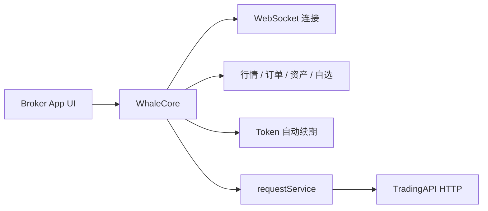

Broker App 如果希望完全自行实现证券功能 UI，可以组合使用 **WhaleCore** 和 **TradingAPI**。

- **WhaleCore** 是 Whale SDK 产品族中的无 UI 数据 SDK，负责连接、会话与鉴权基础能力，并且是 TradingAPI 的唯一调用通道。
- **TradingAPI** 是由 WhaleCore 调用的 HTTP 接口，提供账户、资产、交易等业务能力，用于补充 WhaleCore 尚未类型化封装的部分。

<Warning>
TradingAPI 只能通过 WhaleCore 的 `requestService()` 调用。签名、鉴权头、公共参数以及鉴权失效后的恢复重试都由 WhaleCore 的受管会话完成，Broker App 或 Broker Server 绕开 WhaleCore 直接请求 TradingAPI 端点会调用失败。本文档中的接口定义用于说明请求路径、参数和响应结构，供构造 `requestService()` 请求时参考。
</Warning>

## 组合架构 {/* combined-architecture */}

## 调用方式 {/* how-to-call */}

Broker App 提供接口路径、查询参数和请求体，由 WhaleCore 发出请求并返回原始响应；调用需要交易鉴权的接口时另需声明交易 token 要求，SDK 在发送前自动完成交易鉴权。行情、订单、资产、自选等 WhaleCore 已经类型化封装的能力请直接使用对应的 Service，不必经 TradingAPI 重复实现。

各平台的请求类型、示例代码和错误信息见：

- [iOS 通用 HTTP 请求](/zh-cn/whalesdk/whalecore/ios#general-http-requests)
- [Android 通用 HTTP 请求](/zh-cn/whalesdk/whalecore/android#general-http-requests)
- [TypeScript 通用 HTTP 请求](/zh-cn/whalesdk/whalecore/typescript#general-http-requests)

## 平台状态 {/* platform-status */}

| 平台 | WhaleCore 形态 | 状态 |
| --- | --- | --- |
| iOS | 原生客户端库 | 可用 |
| Android | 原生客户端库 | 可用 |
| Web | WebAssembly | 可用 |

## API 覆盖范围 {/* api-coverage */}

侧边栏中已列出的 TradingAPI 接口可以直接用于开发，接口路径、参数和响应与当前服务一致。

TradingAPI 的接口整理仍在进行中，更多接口会陆续补充到本文档。如果所需能力尚未列出，请与 Whale 项目团队确认该接口的当前状态和可用时间。

## 何时使用 {/* when-to-use */}

- 需要完全控制信息架构、视觉设计和交互体验。
- 已有自己的行情、资产和交易页面，不希望嵌入 Whale 提供的 UI。
- 愿意在 WhaleCore 之上自行组合数据流、HTTP 业务接口、页面状态和错误恢复。

如果希望直接获得完整图形界面，应选择 [WhaleAppSDK](/zh-cn/whalesdk/whaleapp/overview)：iOS、Android 或 WebTrade。

<Note>
WhaleCore 只提供基础机制，不包含图形界面，也不会替 Broker App 组合完整业务流程。具体库、TradingAPI 端点和版本兼容矩阵由 Whale 项目团队按接入范围提供。
</Note>
