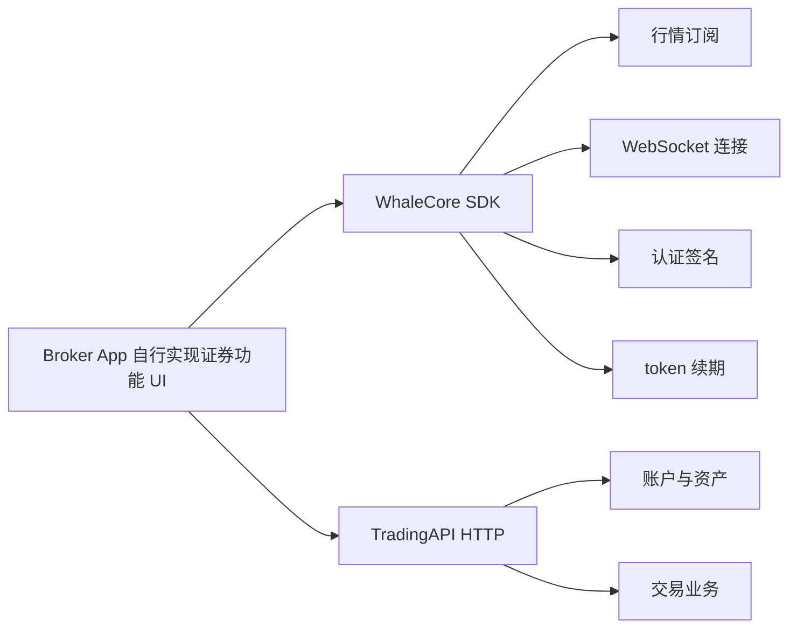

Broker App 如果希望完全自行实现证券功能 UI，可以组合使用 **WhaleCore SDK** 和 **TradingAPI**。

- **WhaleCore SDK** 是 Whale SDK 产品族中的无 UI 数据 SDK，负责适合在 Broker App 中封装的连接与会话基础能力。
- **TradingAPI** 是以单个客户身份授权的 HTTP API，提供账户、资产、交易等业务能力。

## 组合架构 {/* combined-architecture */}

## 平台状态 {/* platform-status */}

| 平台 | WhaleCore SDK 形态 | 状态 |
| --- | --- | --- |
| iOS | 原生客户端库 | 可用 |
| Android | 原生客户端库 | 可用 |
| Web | WebAssembly | 开发中 |

## API 覆盖范围 {/* api-coverage */}

侧边栏中已列出的 TradingAPI 接口可以直接用于开发，接口路径、参数和响应与当前服务一致。

TradingAPI 的接口整理仍在进行中，更多接口会陆续补充到本文档。如果所需能力尚未列出，请与 Whale 项目团队确认该接口的当前状态和可用时间。

## 何时使用 {/* when-to-use */}

- 需要完全控制信息架构、视觉设计和交互体验。
- 已有自己的行情、资产和交易页面，不希望嵌入 Whale 提供的 UI。
- 愿意自行组合数据流、HTTP 业务接口、页面状态和错误恢复。

如果希望直接获得完整图形界面，应选择 [WhaleAppSDK](/zh-cn/whalesdk/whaleapp/overview)：iOS、Android 或 WebTrade。

<Note>
WhaleCore SDK 只提供基础机制，不包含图形界面，也不会替 Broker App 组合完整业务流程。具体库、TradingAPI 端点和版本兼容矩阵由 Whale 项目团队按接入范围提供。
</Note>
