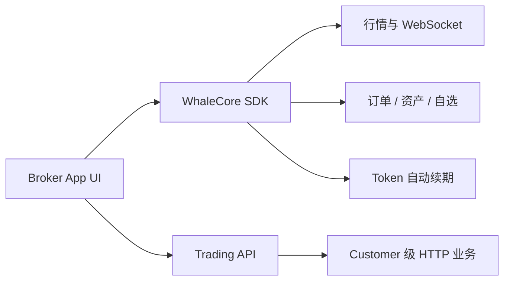

WhaleCore SDK 是无 UI 的证券业务数据 SDK。Broker App 自行实现界面，通过 WhaleCore 管理客户端会话、实时数据和业务服务，并通过 Trading API 补充 Customer 级 HTTP 能力。

<Note>本文档根据 WhaleCore iOS 与 Android 源码中的公开接口整理。具体制品地址、版本兼容矩阵、项目凭证和环境由 Whale 项目团队提供。</Note>

## 适用场景

<CardGroup cols={2}>
  <Card title="完全自定义 UI" icon="palette">Broker 自行设计证券业务页面和交互，不使用 WhaleApp SDK 的现成界面。</Card>
  <Card title="复用客户端基础能力" icon="database">SDK 负责会话、鉴权恢复、WebSocket、缓存和业务数据服务。</Card>
</CardGroup>

## 公开能力

| 模块 | iOS 入口 | Android 入口 | 能力 |
| --- | --- | --- | --- |
| 行情 | `quotesService` | `getQuoteService()` | 实时行情、K 线、快照、期权链 |
| 订单 | `orderService` | `getOrderService()` | 下单、改单、撤单、订单查询、预估与推送 |
| 下单校验 | `orderService` | `getOrderValidationService()` | 可交易性、约束、资格与提交前校验 |
| 资产 | `portfolioService` | `getPortfoliosService()` | 资产、持仓、现金明细与实时更新 |
| 自选 | `watchlistService` | `getWatchlistService()` | 分组、股票、排序、置顶与事件 |
| 透传请求 | `requestService` | `getRequestService()` | 自动附加公共参数和鉴权的 HTTP 请求 |
| 交易鉴权 | Config delegate | `getTradeAuthService()` | trade token 获取、刷新与状态 |

`CounterId` 是 SDK 使用的标的标识，格式如 `ST/US/AAPL`、`ST/HK/00700`。

## 集成模型

## 平台

| 平台 | 状态 | 指南 |
| --- | --- | --- |
| iOS | 可用，iOS 13+，Swift / Objective-C | [iOS](/zh-cn/whalesdk/core-ios/) |
| Android | 可用，Kotlin / Java | [Android](/zh-cn/whalesdk/core-android/) |
| Web | WebAssembly 开发中 | 暂无公开接入指南 |

