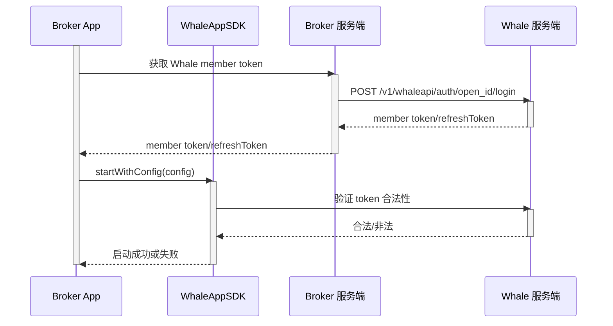

WhaleAppSDK 为 Broker App 内嵌一套可直接上线的证券业务体验——行情、资产、交易、自选和资讯页面开箱即用。Broker 仍然保留自己的账户体系和 App 外壳，只需要负责登录衔接和生命周期管理。

## 产品模块 {/* included-modules */}

| 模块 | 典型能力 |
| --- | --- |
| 行情 | 市场概览、搜索、报价、图表、盘口和标的详情 |
| 资产 | 实时计算总资产、盈亏等数据，多币种折算，历史盈亏等等 |
| 交易 | 港美股下单、订单状态、持仓、资产和成交记录 |
| 自选 | 自选分组、标的同步和详情导航 |
| 资讯 | 市场与个股资讯、内容发现和可选社区体验 |

## 页面示例 {/* example-screens */}

<WhaleAppShowcase
  watchlistLabel="自选"
  marketLabel="行情"
  stockLabel="个股"
  assetsLabel="资产"
  newsLabel="资讯"
  ariaLabel="WhaleAppSDK 页面示例"
  previousLabel="上一页"
  nextLabel="下一页"
/>

截图仅供参考，最终可用模块和视觉效果取决于项目配置与 SDK 版本。

## 定制边界 {/* customization-boundary */}

项目级可定制：图标、颜色、皮肤、浅色/深色/跟随系统主题、英文/简体中文/繁体中文、涨跌颜色模式、自定义字体和消息推送方式。部分能力需要项目构建而非运行时配置，具体范围以 Whale 项目团队确认的交付清单为准。

## 责任边界 {/* responsibility-boundary */}

| WhaleAppSDK 提供 | Broker App 负责 |
| --- | --- |
| 行情、资产、交易等图形界面 | 集成 SDK 交付包及处理依赖 |
| SDK 内部页面路由 | 客户登录及 Whale 凭证获取 |
| SDK 内部网络请求、token 校验及自动续期 | 提供初始凭证，并处理 SDK 报告的不可恢复鉴权失效 |
| 主题、语言和涨跌色能力 | 根据 Broker App 设置传入初始值并同步变化 |
| 可识别消息的展示和页面跳转 | 系统通知权限、设备 token 和非 Whale 消息 |
| SDK 生命周期与错误回调 | 监控错误，并处理重新登录或降级 |

<Note>
文档中的 **Broker App** 指集成 WhaleAppSDK 的 Broker iOS 或 Android App。
</Note>

## 消息推送方案选择 {/* push-channel-choice */}

WhaleAppSDK 支持两种消息推送接入方案，需要 Broker 统一选定一种（iOS 与 Android 保持一致，不支持两端各选一种）：

| 方案 | 适合 | Broker 需要准备 |
| --- | --- | --- |
| 方案一:使用 WhaleAppSDK 内置推送通道 | 希望接入成本最低，不想自建推送服务端 | 提供各平台推送渠道凭证（iOS：APNs 证书；Android：所需厂商推送渠道的 appId/secret） |
| 方案二:使用 Broker 自己的推送通道 | 已有自建推送体系，希望自行决定消息是否推送给客户 | 自行开发接收消息的服务端接口，并提供给 Whale 项目团队完成配置 |

两种方案的具体接入方法见 [iOS 消息推送](/zh-cn/whalesdk/whaleapp/ios#message-push) 和 [Android 消息推送](/zh-cn/whalesdk/whaleapp/android#configure-push)。

## 启动流程 {/* startup-flow */}

Broker App 启动 WhaleAppSDK 前，需要先从 Broker 服务端换取 Whale 用户凭证，再调用 SDK 的启动方法：

## 平台 {/* platforms */}

| 平台 | 定位 | 指南 |
| --- | --- | --- |
| iOS | 嵌入 Broker iOS App 的原生 SDK 包 | [iOS](/zh-cn/whalesdk/whaleapp/ios) |
| Android | 嵌入 Broker Android App 的原生 SDK 包 | [Android](/zh-cn/whalesdk/whaleapp/android) |
| WebTrade | 独立域名部署，或以 iframe 嵌入 Broker 官网，支持 PWA 安装 | [WebTrade](/zh-cn/whalesdk/whaleapp/web) |

技术 FAQ 与参考性能数据见 [FAQ](/zh-cn/whalesdk/whaleapp/faq)。
