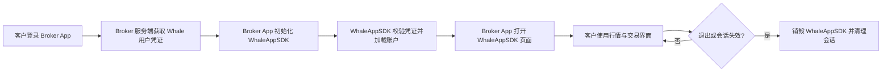

WhaleAppSDK for iOS 和 WhaleAppSDK for Android 向 Broker App 提供完整的证券业务图形界面。Broker App 不需要重新实现行情、资产和交易页面，主要负责集成 SDK、传入客户会话、承接系统能力及管理 App 生命周期。

## 责任边界 {/* responsibility-boundary */}

| WhaleAppSDK 提供 | Broker App 负责 |
| --- | --- |
| 行情、资产、交易等图形界面 | 集成 SDK 交付包及处理依赖 |
| SDK 内部页面路由 | 客户登录及 Whale 凭证获取 |
| SDK 内部网络请求、token 校验及自动续期 | 提供初始凭证，并处理 SDK 报告的不可恢复鉴权失效 |
| 主题、语言和涨跌色能力 | 根据 Broker App 设置传入初始值并同步变化 |
| 可识别消息的展示和页面跳转 | 系统通知权限、设备 token 和非 Whale 消息 |
| SDK 生命周期与错误回调 | 监控错误，并处理重新登录或降级 |

<Note>
文档中的 **Broker App** 指集成 WhaleAppSDK 的 Broker iOS 或 Android App。
</Note>

## 接入前准备 {/* before-integration */}

从 Whale 项目团队获取与目标环境匹配的 SDK 交付包和配置：

- `appKey`、`appSecret`、`appId`。
- 默认账户渠道和 Web 域名前缀等 Broker 配置。
- 客户的 `token` 和 `refreshToken` 获取方式。
- UAT、生产环境及允许的 App 标识。
- 如启用 Whale 托管推送，对应平台的推送 key、secret 和云渠道配置。

测试与生产配置不得混用。任何凭证都不应出现在公开仓库、示例日志或截图中。

## 通用生命周期 {/* shared-lifecycle */}

1. **安装 SDK**：将项目团队交付的版本集成到 Broker App，并解决依赖及构建配置。
2. **进程初始化**：在平台规定的应用生命周期位置完成 SDK 基础初始化。
3. **客户登录**：Broker 完成自身登录后，从服务端取得 Whale 会话凭证。
4. **启动 SDK**：传入身份、App 名称、主题、语言和 Broker 配置。
5. **等待就绪**：只有收到启动成功回调后，才能调用页面路由或依赖 SDK 状态的能力。
6. **处理状态变化**：响应不可恢复的 token 失效、主题和语言变化、外部 URL 以及消息通知。
7. **退出与销毁**：客户登出、切换账号或鉴权失效时销毁 SDK，再清理 Broker App 会话。

## 配置模型 {/* configuration-model */}

两端名称略有差异，但核心配置一致：

| 配置 | 用途 |
| --- | --- |
| App 多语言名称 | SDK 界面内展示 Broker App 名称 |
| `appKey` / `appSecret` / `appId` | 标识项目与环境 |
| `token` / `refreshToken` | 当前客户的 Whale 会话 |
| 默认账户渠道 | 指定项目配置的默认账户渠道 |
| Web 域名前缀 | SDK 内 Web 内容使用的 Broker 域名配置 |
| 主题 | 跟随系统、浅色或深色 |
| 语言 | 英文、简体中文或繁体中文 |
| 涨跌色 | 跟随 SDK 设置、红涨绿跌或绿涨红跌 |
| 高级配置 | 字体、颜色、设备标识等项目级定制 |

## 回调处理 {/* callback-handling */}

Broker App 至少需要处理以下事件：

| 事件 | 建议处理 |
| --- | --- |
| SDK 启动成功 | 关闭加载状态并开放 WhaleAppSDK 页面入口 |
| SDK 启动失败 | 记录脱敏错误；配置错误由开发修复，鉴权错误引导重新登录 |
| SDK 运行时错误 | 对鉴权失效销毁 SDK 并重新建立客户会话 |
| token 自动续期 | 由 WhaleAppSDK 内部管理；Broker App 不自行调用 check token 或 refresh token 接口 |
| token 无法续期 | 销毁 WhaleAppSDK 会话，并将 Broker App 退回登出状态后重新登录 |
| SDK 请求打开 URL | 先进行 scheme、域名和路由允许列表校验，再交给 Broker App 路由 |
| SDK 即将销毁 | 保存必要状态并关闭相关页面 |

<Warning>
日志不得输出 `appSecret`、完整 token、refresh token 或客户敏感资料。外部 URL 不能未经校验直接执行。
</Warning>

## 消息推送 {/* message-push */}

移动端均支持 Whale 托管推送和 Broker 自有推送两种路径。服务端渠道选择、云服务开通及消息格式见 [消息推送接入](/zh-cn/docs/message-push)；平台方法见 [iOS 接入](/zh-cn/whalesdk/whaleapp/ios) 和 [Android 接入](/zh-cn/whalesdk/whaleapp/android)。

## 验收清单 {/* acceptance-checklist */}

- 冷启动、热启动和重复进入 WhaleAppSDK 页面均正常。
- 启动完成前不会调用依赖 SDK 就绪状态的 API。
- WhaleAppSDK 自动续期无需 Broker App 介入；不可恢复的 token 失效、异地登录和客户切换均有明确处理。
- 主题、语言、涨跌色和 Broker App 导航行为符合产品要求。
- 前台、后台、冷启动和通知点击路径均已验证。
- 登出后 SDK 页面、网络活动和敏感状态已被释放。
- UAT 与生产使用各自的包、配置和推送渠道。
