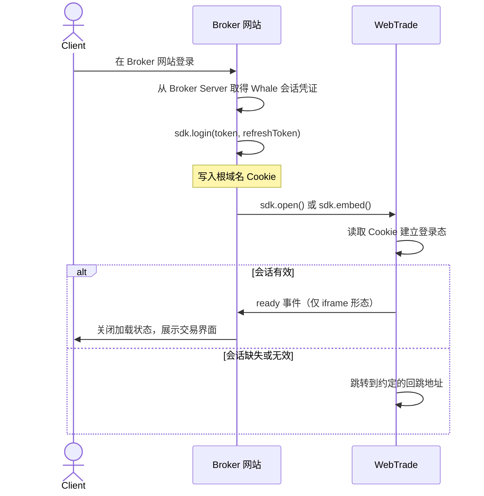
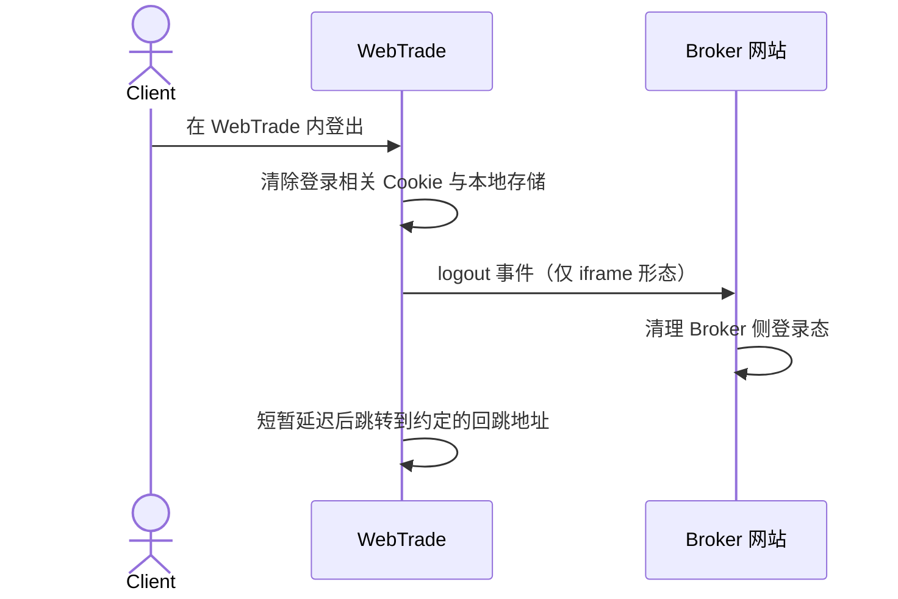

WebTrade 是 WhaleAppSDK 的 Web 形态，向 Broker 网站提供完整的证券业务界面。Broker 通过 WhaleAppSDK 的 JavaScript 库完成接入：它写入 SSO 所需的 Cookie、创建嵌入用的 iframe，并在 Broker 页面与 WebTrade 之间传递语言、主题和涨跌色偏好。

本页面向负责 Broker 网站前端的开发者。读完后你可以选定集成形态、完成 SSO 与页面嵌入，并处理 WebTrade 发来的事件和请求。

<Note>
本页的 **Broker 网站**指承载 WebTrade 入口或 iframe 容器的 Broker 前端页面，**Client** 指 Broker 的终端客户。
</Note>

## 集成形态 {/* integration-model */}

WebTrade 提供两种集成形态，Broker 按产品形态选择其一。

|  | 新标签页 | iframe 嵌入 |
| --- | --- | --- |
| 调用方法 | `sdk.open()` | `sdk.embed()` |
| 展示位置 | 浏览器新标签页 | Broker 页面内的容器 |
| 通信方式 | 共享 Cookie | 共享 Cookie 与 `postMessage` |
| 偏好切换后立即应用 | 否，重新打开后生效 | 是 |
| 事件回调 | 不可用 | `ready`、`logout` |
| 请求应答 | 不可用 | 可用 |
| 接入成本 | 低 | 中 |

### 责任边界 {/* responsibility-boundary */}

| WebTrade 与 SDK 提供 | Broker 网站负责 |
| --- | --- |
| 行情、自选、交易、资产等业务界面 | 引入 SDK 并提供 WebTrade 部署地址 |
| Cookie 读写、根域名计算、iframe 创建与销毁 | Client 在 Broker 侧登录，并把 Whale 会话凭证交给 SDK |
| 语言、主题、涨跌色的写入与传递 | 按 Broker 网站的当前设置调用偏好方法 |
| `postMessage` 信封、来源校验、请求配对 | 实现事件回调与请求应答的业务逻辑 |
| WebTrade 内部的 token 校验与续期 | Whale 会话凭证更新后重新写入 |

## 接入前准备 {/* before-integration */}

以下条件不满足时 SSO 会失败，且多数情况下没有报错，因此在写代码前先逐项确认。

### 同一根域名 {/* shared-root-domain */}

Broker 网站与 WebTrade 必须部署在同一根域名的子域下，这是通过 Cookie 共享实现 SSO 的前提。

```text
Broker 网站 → broker.example.com
WebTrade    → trade.example.com
共享根域名  → .example.com
```

<Warning>
根域名按域名的后两段计算。域名使用二级后缀（例如 `.com.hk`、`.co.uk`）时，`trade.example.com.hk` 会得到 `.com.hk` 而非 `.example.com.hk`，Cookie 无法在两个子域间共享，SSO 静默失败。使用此类域名前请与 Whale 项目团队确认。
</Warning>

跨根域名（例如 `broker-a.com` 与 `trade-b.com`）无法共享 Cookie，不能通过本方案完成 SSO。

### HTTPS {/* https-requirement */}

WebTrade 需要通过 HTTPS 访问。SDK 在 HTTPS 下写入的 Cookie 带 `Secure` 与 `SameSite=None`，前者要求 HTTPS，后者是 WebTrade 以跨源 iframe 嵌入时 Cookie 可用的条件。

### 登记 Broker 网站 origin {/* register-origin */}

iframe 形态下，WebTrade 通过 Whale 侧维护的允许列表校验 `postMessage` 来源。**接入前请把 Broker 网站的 origin 提供给 Whale 项目团队录入该列表**，否则 `ready`、`logout` 事件与请求应答都不会送达，Cookie SSO 不受影响。新标签页形态不使用 `postMessage`，无需登记。

### 与 Whale 约定的项目配置 {/* whale-side-configuration */}

WebTrade 的部分行为在交付时按项目配置，由 Whale 负责写入，Broker 网站代码不涉及。对接时确认下列几项即可。

| 能力 | 说明 |
| --- | --- |
| 登出回跳地址 | WebTrade 登出或无有效会话时跳转的 Broker 地址，通常是 Broker 的登录页。由 Broker 提供 |
| 隐藏 WebTrade 内的语言设置项 | 启用后语言完全以 Broker 网站传入的值为准，Client 无法在 WebTrade 内改语言 |
| 由 Broker 控制涨跌色 | 启用后 WebTrade 加载时采用 Broker 传入的涨跌色偏好，详见[偏好同步](#preferences) |
| 隐藏 WebTrade 的登出入口 | 启用后 Client 只能在 Broker 网站登出 |

SDK 使用的 Cookie 名固定、由 SDK 内部管理，无需 Broker 提供或约定。

<Tip>
建议隐藏 WebTrade 的登出入口，由 Broker 网站统一控制登录态，避免 Client 在两处登出得到不同结果。
</Tip>

## 引入 SDK {/* install */}

SDK 以 UMD 格式通过 CDN 分发，不依赖构建工具：

```html
<script src="https://assets.lbctrl.com/sdk/webtrade/2.0.0/index.umd.js"></script>
```

引入后构造函数挂载在 `window.WhaleAppSDK`。SDK 不依赖第三方库，浏览器支持范围由 WebTrade 决定，请向 Whale 项目团队索取目标环境的支持结论。

<Warning>
请锁定到具体版本号。CDN 不提供 `latest` 路径，以免 Broker 网站被动接受破坏性变更。升级版本前请阅读该版本的变更说明。
</Warning>

SDK 写入的 Cookie 使用 `whale_app_` 前缀，请不要在 Broker 网站的业务 Cookie 中使用相同前缀。

## 快速开始 {/* quickstart */}

两段示例均假设 Client 已在 Broker 网站登录，且 Broker 已从 Broker Server 取得 Whale 会话凭证。

新标签页形态：

```html
<button id="trade-entry">进入交易</button>

<script src="https://assets.lbctrl.com/sdk/webtrade/2.0.0/index.umd.js"></script>
<script>
  const sdk = new WhaleAppSDK({ baseUrl: 'https://trade.example.com' })

  // Client 在 Broker 网站登录后写入会话凭证
  sdk.login({ token: 'xxx', refreshToken: 'xxx' })

  document.getElementById('trade-entry').onclick = function () {
    sdk.open({ tab: 'quote' })
  }
</script>
```

iframe 形态：

```html
<div id="webtrade" style="width: 100%; height: 80vh;"></div>

<script src="https://assets.lbctrl.com/sdk/webtrade/2.0.0/index.umd.js"></script>
<script>
  const sdk = new WhaleAppSDK({ baseUrl: 'https://trade.example.com' })

  sdk.login({ token: 'xxx', refreshToken: 'xxx' })

  sdk.once('ready', function () {
    // WebTrade 已渲染，可关闭 Broker 页面的加载状态
  })

  sdk.on('logout', function () {
    // Client 在 WebTrade 内登出，执行 Broker 侧登出逻辑
  })

  sdk.embed('#webtrade', { tab: 'quote' })
</script>
```

<Warning>
容器元素必须有明确高度。SDK 创建的 iframe 使用 `height: 100%`，容器高度为 0 时 WebTrade 不可见。
</Warning>

## 初始化 {/* initialize */}

```typescript
const sdk = new WhaleAppSDK({ baseUrl: 'https://trade.example.com' })
```

| 参数 | 类型 | 必填 | 说明 |
| --- | --- | --- | --- |
| `baseUrl` | `string` | 是 | WebTrade 部署地址。SDK 取其 origin 作为 `postMessage` 的目标与来源校验依据 |

`baseUrl` 不是合法 URL 时构造函数抛出错误。建议在应用启动阶段初始化，以便尽早发现配置错误。

## 登录与登出 {/* sign-in-and-sign-out */}

WebTrade 的 SSO 依赖 Cookie：Broker 网站写入 Whale 会话凭证，WebTrade 加载时读取并建立登录态。

### 写入会话凭证 {/* write-session */}

```typescript
sdk.login({ token: 'xxx', refreshToken: 'xxx' })
```

| 参数 | 类型 | 说明 |
| --- | --- | --- |
| `token` | `string` | Client 的 Whale 会话 token |
| `refreshToken` | `string` | Client 的 Whale 刷新 token |

两个参数都不能为空，否则抛出错误。Cookie 的作用域、有效期和跨站属性由 SDK 内部处理，Broker 不需要关心。

WebTrade 的登录只需要这两个值。Broker 无需提供 `app_id`，它由 Whale 在项目构建配置中管理。

### 会话凭证更新后重新写入 {/* renew-session */}

SDK 不判断 token 是否过期，也不会主动续期，仅将传入的值写入 Cookie。**每次在 Broker 侧重新取得 Whale 会话凭证后（续期、重新登录或其他原因），都要再调用一次 `login()` 覆盖旧值。**

```typescript
function onWhaleSessionUpdated({ token, refreshToken }) {
  sdk.login({ token, refreshToken })
}
```

`login()` 只更新 Cookie。已经加载的 WebTrade 不会在会话中途重新读取，新值在 WebTrade 下次加载时生效——页面刷新，或重新调用 `embed()` 与 `open()`。

### 清除会话凭证 {/* clear-session */}

```typescript
sdk.logout()
```

方法清除 `token` 与 `refreshToken` 两个 Cookie，保留语言、主题、涨跌色的偏好 Cookie，也不向 WebTrade 发送消息。完整的登出流程见[登出流程](#logout-flow)。

## 由 Broker Server 写入 Cookie {/* server-side-cookies */}

`login()` 是把会话凭证写入 Cookie 的便捷方法。登录在 Broker Server 完成时，也可以由 Broker Server 直接通过 `Set-Cookie` 写入，WebTrade 一样用 JavaScript 读取，此时 Broker 网站前端不必再调用 `login()`。

采用这种方式时，Cookie 必须满足下列全部要求，否则 SSO 静默失败。

| 要求 | 说明 |
| --- | --- |
| Cookie 名 | 与 SDK 写入的一致，取值以对接约定为准 |
| 不设 `HttpOnly` | WebTrade 通过 JavaScript 读取。Broker Server 签发鉴权 Cookie 时常默认带 `HttpOnly`，必须显式关闭 |
| `SameSite=None; Secure` | WebTrade 以跨源 iframe 嵌入，Cookie 需要在该上下文中可用 |
| `Domain` 为根域名 | 例如 `.example.com`，使 Broker 网站与 WebTrade 两个子域都能读取 |
| `Path=/` | 与 SDK 写入行为一致 |
| HTTPS | `Secure` 属性的前提 |

<Warning>
会话凭证 Cookie 必须可被 JavaScript 读取，这是 Cookie SSO 的固有约束，由前端还是 Broker Server 写入都一样。如果 Broker 的安全规范要求鉴权 Cookie 一律 `HttpOnly`，则本方案不适用于该 Cookie，请改用前端 `login()` 写入的独立 Cookie。
</Warning>

Broker Server 刷新 Cookie 后同样遵循上一节的规则：已加载的 WebTrade 需要重新加载才会读到新值。

## 打开与嵌入 {/* open-and-embed */}

### 新标签页打开 {/* open */}

```typescript
sdk.open()
sdk.open({ tab: 'stock', symbol: '700.HK' })
```

方法以 `noopener,noreferrer` 在新标签页打开 WebTrade，URL 由 `baseUrl` 与导航参数拼接。新标签页没有父页面，事件回调与请求应答在此形态下不生效。

### 嵌入当前页面 {/* embed */}

```typescript
const iframe = sdk.embed('#webtrade', { tab: 'quote' })
```

| 参数 | 类型 | 说明 |
| --- | --- | --- |
| `container` | `string \| HTMLElement` | CSS 选择器或 DOM 元素 |
| `params` | `OpenParams` | 可选，初始导航参数 |

方法返回创建的 `HTMLIFrameElement`。已存在 iframe 时先销毁再重建。iframe 使用 `width: 100%`、`height: 100%`、无边框，并建立只接受来自 `baseUrl` origin 的消息监听。

### 销毁 iframe {/* destroy */}

```typescript
sdk.destroy()
```

方法从 DOM 移除 iframe 并解除消息监听，已注册的事件回调与请求应答 handler 保留，下次 `embed()` 后继续生效。适合在路由离开交易页或 Client 登出时调用。

### 导航参数 {/* navigation-parameters */}

`open()` 与 `embed()` 共用下列参数。

| 参数 | 类型 | 说明 |
| --- | --- | --- |
| `tab` | `'quote' \| 'stock' \| 'favorite' \| 'portfolio' \| 'stockSelect'` | 初始导航位置：行情、个股详情、自选、资产、选股器 |
| `symbol` | `string` | 初始标的 |

`symbol` 取 Whale 接口返回的标的标识，原样传入。返回值形如 `700.HK`、`AAPL.US`（[`symbol` 格式](/zh-cn/docs/glossary#security-identifiers)），该格式仅供识别，请不要自行拼接。

## 偏好同步 {/* preferences */}

三个偏好方法都做两件事：写入对应 Cookie 供 WebTrade 下次加载读取，以及在存在 iframe 时发送 `postMessage` 通知 WebTrade 当即切换。新标签页形态下没有 iframe，只有 Cookie 写入生效。

| 方法 | 取值 | 含义 |
| --- | --- | --- |
| `sdk.setLang(lang)` | `en`、`zh-CN`、`zh-HK` | 英文、简体中文、繁体中文 |
| `sdk.setTheme(theme)` | `dark`、`light` | 深色、浅色 |
| `sdk.setPriceColor(color)` | `green_up`、`red_up` | 绿涨红跌、红涨绿跌 |

```typescript
sdk.setTheme('dark')
sdk.setLang('zh-CN')
sdk.setPriceColor('red_up')
```

传入未列出的取值时，WebTrade 分别回退到 `en`、`dark`、`red_up`。

### 初始偏好的确定顺序 {/* initial-preferences */}

WebTrade 加载时按下列顺序确定偏好。

**语言：** 语言 Cookie 的有效取值，其次是 `navigator.language` 中匹配到的受支持语言，最后回退到 `en`。

**主题：** 主题 Cookie 的取值，未设置时为 `dark`。

**涨跌色：** 仅当项目配置为「由 Broker 控制涨跌色」时，WebTrade 加载时才采用 Broker 写入的偏好。未启用时，涨跌色以 Client 在 Whale 的账户设置为准。

<Note>
该配置只影响加载时的取值来源。iframe 形态下 `setPriceColor()` 的切换不受它限制，始终当即生效；区别在于页面重新加载后能否保留。
</Note>

## 事件 {/* events */}

WebTrade 通过 `postMessage` 发出两个事件，SDK 接收后以回调形式暴露。**两个事件都只在 iframe 形态下触发。**

| 事件 | 触发时机 | 典型处理 |
| --- | --- | --- |
| `ready` | WebTrade 渲染完成 | 关闭 Broker 页面的加载状态 |
| `logout` | Client 在 WebTrade 内登出 | 清理 Broker 侧登录态并跳转 |

```typescript
sdk.on('ready', callback)    // 注册，同一事件可注册多个回调，按注册顺序触发
sdk.once('ready', callback)  // 注册一次，触发后自动移除
sdk.off('ready', callback)   // 移除，须传入注册时的同一函数引用
```

回调不接收参数。`embed()` 之前或之后注册都有效，但建议在 `embed()` 之前注册，避免 WebTrade 加载较快时错过 `ready`。

```typescript
sdk.on('logout', () => {
  sdk.logout()      // 清除 SDK 写入的会话凭证 Cookie
  sdk.destroy()     // 销毁 iframe
  brokerSignOut()   // 清理 Broker 自身登录态
  window.location.href = '/login?from=webtrade'
})
```

<Warning>
多次调用 `embed()` 时事件回调会保留。需要替换回调时先用 `off()` 移除旧的，否则旧回调仍会在新 iframe 的事件上触发，可能导致重复跳转。
</Warning>

## 请求应答 {/* request-response */}

部分业务场景下 WebTrade 需要向 Broker 网站发起带返回值的调用，并等待结果。调用方始终是 WebTrade，Broker 网站是应答方：Broker 为约定的方法注册 handler，SDK 负责接收请求、调用 handler、回传返回值，并完成消息信封、来源校验与请求配对。**仅 iframe 形态可用。**

```typescript
sdk.handle('methodName', async (payload) => {
  const result = await yourBusinessLogic(payload)
  return result
})

sdk.unhandle('methodName')
```

| 参数 | 类型 | 说明 |
| --- | --- | --- |
| `method` | `string` | 方法名，与对接时约定的协议一致。重复注册以最后一次为准 |
| `handler` | `(payload) => unknown \| Promise<unknown>` | 处理函数，可为 async。返回值即结果 |

handler 可在 `embed()` 之前或之后注册，并跨 `embed()` 与 `destroy()` 保留。建议在 `embed()` 之前注册，避免错过 WebTrade 加载初期发出的请求。

<Note>
具体的方法名、入参与返回结构以对接时 Whale 提供的集成协议为准，Broker 按协议实现对应 handler。
</Note>

### 返回失败 {/* handler-errors */}

handler 抛出带**字符串 `code`** 的对象时，该 `code` 原样回传给 WebTrade，供其按业务分支处理。`code` 是 Broker 与 Whale 在协议中约定的取值，SDK 不限定其范围。

```typescript
sdk.handle('methodName', async (payload) => {
  const data = await query(payload)
  if (!data.available) {
    throw { code: 'NOT_AVAILABLE', message: '资源暂不可用' }
  }
  return data
})
```

<Warning>
`message` 会被 WebTrade 原样展示给 Client，因此必须是面向 Client 的可读文案，并使用 Client 当前的语言。没有合适文案时请省略该字段，WebTrade 会使用自己的本地化文案；填入内部错误串会顶掉这层文案，直接暴露给 Client。
</Warning>

SDK 另有两个内建 `code`，均不带文案，由 WebTrade 侧文案兜底，同时在浏览器控制台输出带 `[WhaleAppSDK]` 前缀的告警。

| code | 含义 |
| --- | --- |
| `METHOD_NOT_FOUND` | 该方法没有注册 handler |
| `HANDLER_ERROR` | handler 抛出的值不带字符串 `code`，或返回值无法被结构化克隆 |

### 超时与来源校验 {/* rpc-boundaries */}

WebTrade 对每个请求设有超时，默认 5 秒。超时只表示 WebTrade 停止等待，不代表 Broker 侧的处理失败或未完成。handler 的正常耗时可能超过该阈值时，请提前与 Whale 项目团队约定调整。

SDK 在应答前校验消息 origin 等于 `baseUrl` 的 origin，且来源是 SDK 创建的那个 iframe。任一条件不满足时请求被丢弃且不回传。回传时目标 origin 同样精确取 `baseUrl` 的 origin，不使用通配。

## 登录流程 {/* sign-in-flow */}



WebTrade 读取会话凭证时，Cookie 优先于其本地缓存。会话缺失或无效时，WebTrade 跳转到对接时约定的 Broker 回跳地址；未约定时跳转 Whale 登录页。

## 登出流程 {/* logout-flow */}

Client 可能在 Broker 网站登出，也可能在 WebTrade 内登出（未隐藏登出入口时），两条路径都需要处理。

**Client 在 Broker 网站登出：** 调用 `sdk.logout()` 清除会话凭证 Cookie，调用 Whale 登出接口使服务端 token 失效，iframe 形态下再调用 `sdk.destroy()`。

**Client 在 WebTrade 内登出：**



WebTrade 发出 `logout` 事件后会短暂延迟再执行自身跳转，为 Broker 网站留出响应时间。超过该窗口后 WebTrade 执行跳转，未完成的回调随之中断，因此 `logout` 回调中的处理应当立即完成，不要等待网络请求返回后才更新本地状态。

新标签页形态下没有父页面，WebTrade 清除本地状态后直接跳转到约定的回跳地址。Broker 应在该地址对应的页面上完成自身登出。

## Broker 侧实现清单 {/* broker-implementation-requirements */}

上线前逐项确认：

- Broker 网站与 WebTrade 部署在同一根域名的子域下，且均为 HTTPS。
- iframe 形态下，Broker 网站的 origin 已由 Whale 录入允许列表。
- Client 登录后调用 `login()`，且每次重新取得 Whale 会话凭证后再次调用。
- 会话凭证 Cookie 未被设置为 `HttpOnly`。
- Broker 网站登出时清除会话凭证 Cookie，并调用 Whale 登出接口使服务端 token 失效。
- iframe 形态下已处理 `logout` 事件，且处理逻辑在延迟窗口内完成。
- 已向 Whale 提供登出回跳地址，且该页面能处理来自 WebTrade 的跳转。
- 已按对接协议实现请求应答 handler，失败分支返回约定的 `code`，`message` 为面向 Client 的可读文案。
- SDK 引入地址锁定到具体版本号。

## 部署方式 {/* deployment */}

- **Whale 部署：** Whale 完成 WebTrade 的构建与部署，Broker 提供域名与项目配置。
- **Broker 自行部署：** Whale 交付为 Broker 定制构建的 WebTrade 压缩包，由 Broker 部署。适用于 Broker 自行管理证书或需要多个域名的情况。
