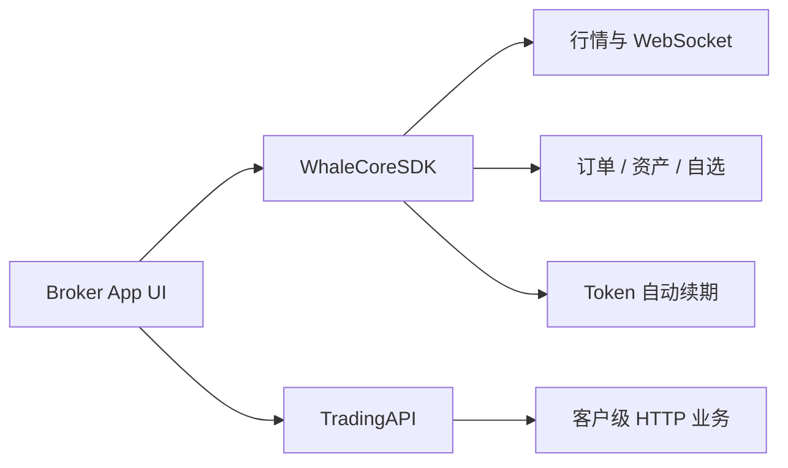

WhaleCoreSDK 是无 UI 的证券业务数据 SDK。Broker App 自行实现界面，通过 WhaleCore 管理客户端会话、实时数据和业务服务，并通过 TradingAPI 补充客户级 HTTP 能力。

<Note>本文档根据 WhaleCore iOS 与 Android 源码中的公开接口整理。具体制品地址、版本兼容矩阵、项目凭证和环境由 Whale 项目团队提供。</Note>

## 适用场景 {/* when-to-use-it */}

<CardGroup cols={2}>
  <Card title="完全自定义 UI" icon="palette">Broker 自行设计证券业务页面和交互，不使用 WhaleAppSDK 的现成界面。</Card>
  <Card title="复用客户端基础能力" icon="database">SDK 负责会话、鉴权恢复、WebSocket、缓存和业务数据服务。</Card>
</CardGroup>

## 公开能力 {/* public-capabilities */}

| 模块 | iOS 入口 | Android 入口 | 能力 |
| --- | --- | --- | --- |
| 行情 | `quoteService()` | `getQuoteService()` | 实时行情订阅、K 线、分时数据、历史逐笔成交、期权链 / 期权详情订阅 |
| 期权计算 | `WhaleCoreOptionCalculator`（静态工具） | `OptionCalculator`（静态工具） | 本地 Black-Scholes 计算：Greeks、理论价、内在 / 时间价值、到期天数、到期盈利概率 |
| 订单 | `orderService()` | `getOrderService()` | 下单、改单、撤单、附加单、持仓止盈止损、订单预览、预估信息、下单前置校验、订单事件推送 |
| 资产 | `portfolioService()` | `getPortfoliosService()` | 资产订阅、现金明细、会员资产设置、盈亏分析（iOS 另提供汇率换算） |
| 自选 | `watchlistService()` | `getWatchlistService()` | 分组与股票增删改、排序、置顶、失效标的清理与事件 |
| 透传请求 | `requestService()` | `getRequestService()` | 自动附加公共参数与鉴权头的 HTTP 请求，鉴权失效自动恢复重试 |
| 交易鉴权 | 经 `tokenRefreshCallback` 配置，SDK 自动管理 | SDK 内部自动管理，无需宿主接入 | trade token 获取与续期，全程对宿主透明 |

<Note>
  历史独立入口 `WhaleCoreService.orderValidationService`（iOS）与 `WhaleCore.getOrderValidationService()`（Android）已弃用，下单前置校验请直接使用 `orderService()` / `getOrderService()` 上的同名方法；Android 曾经的独立交易鉴权入口 `getTradeAuthService()` 已移除，交易鉴权现全平台由 SDK 自动完成，宿主无需接入。
</Note>

`CounterId` 是 SDK 使用的标的标识，格式如 `ST/US/AAPL`、`ST/HK/00700`。

## 集成模型 {/* integration-model */}

## 平台 {/* platforms */}

| 平台 | 状态 | 指南 |
| --- | --- | --- |
| iOS | 可用，iOS 13+，Swift / Objective-C | [iOS](/zh-cn/whalesdk/whalecore/ios) |
| Android | 可用，Kotlin / Java | [Android](/zh-cn/whalesdk/whalecore/android) |
| Web | 可用，浏览器内的 WebAssembly，TypeScript | [TypeScript](/zh-cn/whalesdk/whalecore/typescript) |

