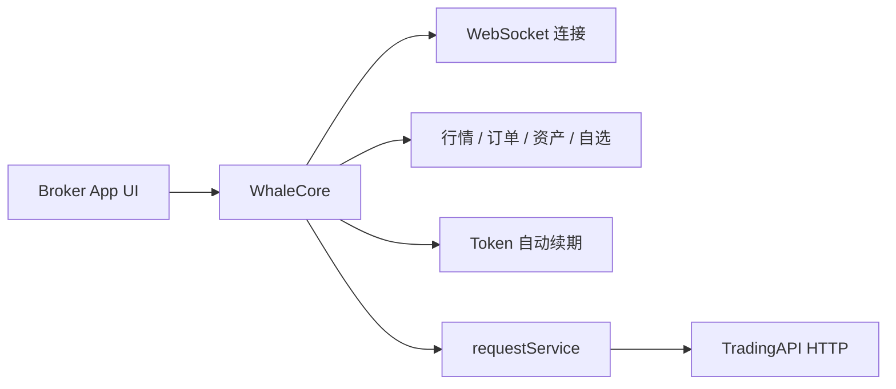

WhaleCore 是无 UI 的证券业务数据 SDK。Broker App 自行实现界面，通过 WhaleCore 管理客户端会话、实时数据和业务服务；尚未由类型化 Service 封装的能力，通过 WhaleCore 的 `requestService()` 调用 [TradingAPI](/zh-cn/trading-api/overview) 补充。TradingAPI 只能经 WhaleCore 调用，Broker App 或 Broker Server 绕开 WhaleCore 直接请求会失败。

<Note>本文档根据 WhaleCore iOS 与 Android 源码中的公开接口整理。具体制品地址、版本兼容矩阵、项目凭证和环境由 Whale 项目团队提供。</Note>

## 适用场景 {/* when-to-use-it */}

<CardGroup cols={2}>
  <Card title="完全自定义 UI" icon="palette">Broker 自行设计证券业务页面和交互，不使用 WhaleAppSDK 的现成界面。</Card>
  <Card title="复用客户端基础能力" icon="database">SDK 负责会话、鉴权恢复、WebSocket、缓存和业务数据服务。</Card>
</CardGroup>

## 公开能力 {/* public-capabilities */}

| 模块 | iOS 入口 | Android 入口 | 能力 |
| --- | --- | --- | --- |
| 行情 | `quoteService()` | `getQuoteService()` | 实时行情订阅、K 线、分时数据、历史逐笔成交、期权链 / 期权详情订阅、行情等级与设备占用 |
| 期权计算 | `WhaleCoreOptionCalculator`（静态工具） | `OptionCalculator`（静态工具） | 本地 Black-Scholes 计算：Greeks、理论价、内在 / 时间价值、到期天数、到期盈利概率 |
| 订单 | `orderService()` | `getOrderService()` | 下单、改单、撤单、附加单、持仓止盈止损、订单预览、预估信息、下单前置校验、交易卡券选券、订单事件推送 |
| 资产 | `portfolioService()` | `getPortfoliosService()` | 资产订阅、现金明细、会员资产设置、盈亏分析（跨币种换算由 SDK 内部完成，两端均不提供汇率查询接口） |
| 自选 | `watchlistService()` | `getWatchlistService()` | 分组与股票增删改、排序、置顶、失效标的清理与事件 |
| 透传请求 | `requestService()` | `getRequestService()` | 调用 TradingAPI 的唯一通道，自动附加公共参数与鉴权头，鉴权失效自动恢复重试 |
| 交易令牌 | `updateTradeToken(_:...)` / `hasTradeToken()` | `updateTradeToken()` / `hasTradeToken()` | 仅交易密码验证模式（初始化传 `tradePasswordEnabled`）需要：由 Broker App 验证交易密码后送入交易令牌；默认模式下 SDK 自动获取与续期 |

<Note>
  历史独立入口 `WhaleCoreService.orderValidationService`（iOS）与 `WhaleCore.getOrderValidationService()`（Android）已弃用，下单前置校验请直接使用 `orderService()` / `getOrderService()` 上的同名方法。
</Note>

`CounterId` 是 SDK 使用的标的标识，格式如 `ST/US/AAPL`、`ST/HK/00700`。

## 集成模型 {/* integration-model */}

## 平台 {/* platforms */}

| 平台 | 状态 | 指南 |
| --- | --- | --- |
| iOS | 可用，iOS 13+，Swift / Objective-C | [iOS](/zh-cn/whalesdk/whalecore/ios) |
| Android | 可用，Kotlin / Java | [Android](/zh-cn/whalesdk/whalecore/android) |
| Web | 可用，浏览器内的 WebAssembly，TypeScript | [TypeScript](/zh-cn/whalesdk/whalecore/typescript) |

