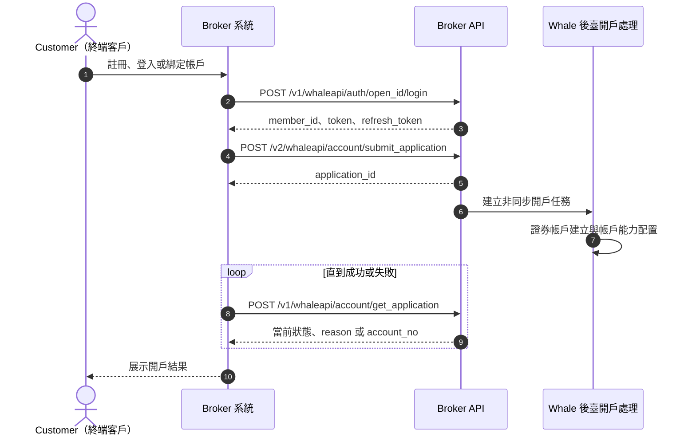
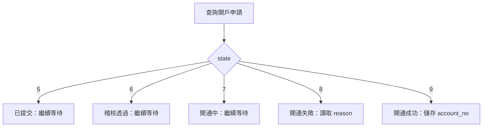

使用者綁定與開戶不是一次同步呼叫：先建立 `open_id → member_id` 的使用者映射，再提交開戶申請，並持續查詢非同步處理結果，最終獲得 `account_no`。

<CardGroup cols={3}>
  <Card title="登入與綁定" icon="link" class="api-step-card">
    `POST /v1/whaleapi/auth/open_id/login`
  </Card>
  <Card title="提交開戶申請" icon="file-pen" class="api-step-card">
    `POST /v2/whaleapi/account/submit_application`
  </Card>
  <Card title="查詢申請狀態" icon="rotate" class="api-step-card">
    `POST /v1/whaleapi/account/get_application`
  </Card>
</CardGroup>

## 介面總覽

- 使用者註冊 / 登入（POST /v1/whaleapi/auth/open_id/login）

    - 首次登入即註冊

    - 第三方使用者與平臺使用者關係綁定（open_id -\> member_id）

        - open_id 三方系統使用者唯一標識

        - member_id Whale 系統使用者唯一標識

    - SDK 登入 token 頒發

- 使用者登出 (POST /v1/whaleapi/auth/session/logout)

    - 用 token 將使用者登出，設定 token 無效

    - 需要兩個引數：

        - `member_id` - 來自於登入介面返回的

        - `sid` - 用 JWT decode 登入介面返回的 `token` 即可獲得 `sid`

- 證券帳戶開戶

    - 提交開戶資料 (POST /v2/whaleapi/account/submit_application)

    - 主動呼叫獲取開戶申請狀態（/v1/whaleapi/account/get_application）/ 帳戶開通通知（定製化開發）

## 綁定關係與狀態模型

| 標識 | 所屬系統 | 用途 | 建議儲存位置 |
| --- | --- | --- | --- |
| `open_id` | Broker | Customer 在 Broker 使用者體系中的穩定唯一標識 | Broker 服務端 |
| `member_id` | Whale | Whale 使用者唯一標識，由登入介面返回 | Broker 服務端 |
| `application_id` | Whale | 單次開戶申請標識，用於查詢非同步狀態 | Broker 服務端 |
| `account_no` | Whale | 開戶成功後的證券帳戶號碼 | Broker 服務端 |
| `sid` | Whale 會話 | 登出所需的 Session ID，可從登入 token 的 JWT payload 解碼取得 | 按會話管理 |

<Warning>
`open_id` 必須穩定且不可被其他 Customer 複用。Broker 應在服務端校驗 `member_id`、`application_id` 和 `account_no` 的歸屬關係，不能信任 Broker App 直接傳入的關聯標識。
</Warning>

## 詳細設計

### 總體流程



### 流程說明

<Steps>
  <Step title="使用者註冊、登入與關係綁定">

Broker 服務端呼叫登入註冊介面。

|**場景**|**系統行為**|
|---|---|
|使用者未註冊|建立平臺使用者（Member）|
|使用者已註冊|直接登入|
|第三方首次接入|建立使用者關係綁定 `open_id → member_id`|

  </Step>
  <Step title="提交開戶資料">

系統在校驗開戶資料通過後，將生成一條開戶申請記錄，並返回開戶申請 ID

此時僅表示**開戶申請已提交成功**，並不代表帳戶已開通。Broker 必須儲存返回的 `application_id`。

  </Step>
  <Step title="等待帳戶非同步開通">
    帳戶開通由系統後臺非同步處理，包括證券帳戶建立和帳戶能力配置。Broker 主動查詢開戶申請狀態；如專案已約定，也可透過定製通知接收結果。
  </Step>
  <Step title="落庫最終結果">
    狀態為開通成功時儲存 `account_no`；狀態為失敗時儲存 `reason`。只有取得成功狀態後，Broker App 才應進入證券帳戶功能。
  </Step>
</Steps>

### 狀態判定



<Note>
狀態查詢應以 `state` 為準：`5` 已提交、`6` 稽核透過、`7` 開通中、`8` 開通失敗、`9` 開通成功。失敗時同時讀取 `reason`；成功時讀取 `account_no`。
</Note>

## API 詳情

### 使用者註冊登入

`POST /v1/whaleapi/auth/open_id/login`

##### 請求欄位說明

|**欄位名**|**型別**|**是否必填**|**說明**|
|---|---|---|---|
|open_id|string|Y|三方使用者唯一標識 userid|

#### 請求與響應示例

```json
{
    "open_id": "roleid"
}
```

```json
{
  "code": 0,
  "message":"",
  "data": {
    "member_info": {
      "member": {
        "member_id":"123",
        "uuid": "default_value",
        "phone_number": "default_value",
        "email": "default_value",
        "lang": "default_value",
        "country_code": 0,
        "email_check": false,
        "avatar": "default_value",
        "nickname": "default_value",
        "can_nick_modified": false,
        "user_region": "default_value"
      },
      "lang":"zh-CN",
      "setting": {
        "currency": "USD",
        "lang":"auto"
      }
    },
    "credentials" : {
        "token": "xxxxx",
        "refresh_token":"xxxxx"
    },
    "first_login": true
  }
}
```

|**欄位名**|**型別**|**是否必填**|**說明**|
|---|---|---|---|
|code<br />|number|Y<br />|0 成功<br />\>0 失敗|
|message|string|Y|錯誤提示|
|data|object|Y||
|+ member_info|object \[MemberInfo\]|Y|使用者資訊|

##### MemberInfo

|**欄位名**|**型別**|**是否必填**|**說明**|
|---|---|---|---|
|member_info|object|Y|社群基礎資訊|
|+ member_id|string|Y|Whale 使用者 ID|
|+ nickname|string|Y|暱稱（預設生成）|
|+ avatar|string |Y |頭像（預設生成）|
|+ lang|string|Y|當前語言（預設中文繁體 `zh-HK`）|
|setting|object|Y|使用者設定（包含使用者語言、行情偏好紅漲綠跌等）|
|+ lang<br />|string|Y|語言設定<br />- `auto` - 跟隨系統語言<br />- `en` - 英文<br />- `zh-CN` - 簡體中文<br />- `zh-HK` - 繁體中文（預設）|

### 提交開戶申請

`POST /v2/whaleapi/account/submit_application`

##### **請求欄位說明**

|**欄位名**|**型別**|**是否必填**|**說明**|
|---|---|---|---|
|member_id|integer|Y|使用者 ID|
|client_type|integer|Y|客戶型別 1:個人戶 2:企業戶|
|open_info|object|Y|開戶表單資訊|
|+ account_no|string|N|證券賬號|
|+ mark|string|N|帳戶標記|
|+ upload|object|Y|證件資訊|
|++ card_country|string|Y|證件簽發地<br />[國家/地區（ISO_3166-1_alpha-2）](https://en.wikipedia.org/wiki/ISO_3166-1_alpha-2#Officially_assigned_code_elements)|
|++ card_type|integer|Y|證件型別 0:身份證 1:護照|
|++ card_id|string|Y|證件號碼|
|++ first_name|string|N|名文姓（名的拼音）|
|++ last_name|string|Y|英文姓（姓的拼音）|
|+ base|object|Y|個人基本資訊|
|++ residence_country|string|Y|居住國家/地區<br />[國家/地區（ISO_3166-1_alpha-2）](https://en.wikipedia.org/wiki/ISO_3166-1_alpha-2#Officially_assigned_code_elements)|
|++ residence_part|string|N|居住所在區域|
|++ residence_desc|string|Y|居住詳細地址|
|+ employ|object|N|職業資訊|
|++ contact|object|Y|聯絡方式|
|+++ emails|array \[Email\]|Y|郵箱（接單傳送郵箱）|
|++ taxes|array \[Tax\]|Y|國家稅收資訊|
|+ finance|object|Y|金融資訊|
|++ account_type|string|Y|帳戶型別（C現金/M融資）|
|+ risk|Object |N|風險資訊|
|++ risk_tolerance|Object|N|風險測評資訊|
|+++ audit|bool|Y|風險測評是否透過|
|+++ end_at|integer|Y|風險測評過期時間|

#### 請求與響應示例

```json
{
  "member_id": 123456,
  "client_type": 1,
  "open_info": {
    "upload": {
      "card_type": 0,
      "card_id": "<document-number>",
      "first_name": "SAN",
      "last_name": "ZHANG"
    },
    "base": {
      "residence_country": "CN",
      "residence_desc": "<residential-address>"
    },
    "finance": {
      "account_type": "C"
    },
    "risk": {
      "risk_tolerance": {
        "audit": true,
        "end_at": 1716358996
      }
    }
  }
}

```

```json
{
  "application_id": 123456
}
```

### 獲取開戶申請資訊

`POST /v1/whaleapi/account/get_application`

##### **請求欄位說明**

|**欄位名**|**型別**|**是否必填**|**說明**|
|---|---|---|---|
|application_id|string|Y|開戶申請ID|
|member_id|string|待確認|原始請求示例包含該欄位，但原始欄位表未宣告；請以當前 Broker API 契約為準|

|**欄位名**|**型別**|**是否必填**|**說明**|
|---|---|---|---|
|code|integer|Y||
|message|string|Y||
|data|object|||
|open_info|object|Y|開戶表單資訊|
|+ upload|object|Y|證件資訊|
|++ region|string|Y|nationality|
|++ card_type|integer|Y|證件型別 <br />- `0` - 身份證 <br />- `1` - 護照|
|++ card_country|string|Y|證件簽發地<br />[國家/地區（ISO_3166-1_alpha-2）](https://en.wikipedia.org/wiki/ISO_3166-1_alpha-2#Officially_assigned_code_elements)|
|++ card_id|string|Y|證件號碼|
|++ first_name|stirng|Y|英文名（名的拼音）|
|++ last_name|string|Y|英文姓（姓的拼音）|
|++ name|string|N|中文姓名|
|++ valid_date_end|string|N|證件到期日|
|+ base|object||基礎資訊|
|++ country_code|string|Y|出生國家/地區|
|++ birth_date|string|Y|出生日期|
|++ gender|string|N|性別<br />- `male` 男<br />- `female` 女|
|++ marital_status|string|N|婚姻狀態:  <br />- `single` 單身  <br />- `married` 已婚    <br />- `other`離異<br />- `divorced`  喪偶<br />- `widowed`|
|++ residence_country|string|Y|居住國家/地區|
|++ residence_part|string|Y|居住所在區域|
|++ residence_desc|string|Y|居住詳細地址|
|+ employ|object||職業資訊|
|++ type|string|N|職業型別|
|state|integer|Y|開戶申請狀態: <br />- `5` - 已提交<br />- `6` - 稽核透過 <br />- `7` - 開通中<br />- `8` - 開通失敗<br />- `9` - 開通成功 |
|reason|string||失敗原因|
|account_no|string||證券帳戶號碼|

#### 請求與響應示例

```json
{
   "member_id":"1",
   "application_id":"2"
}

```

```json
{
    "code": 0,
    "message":"",
    "data": {
      "state" : 9,
      "account_no" : "<account-no>",
      "open_info": {
        "upload": {
            "region": "MO",
            "card_type": 0,
            "card_country": "MO",
            "first_name": "SAN",
            "last_name": "ZHANG",
            "card_id": "<document-number>",
            "valid_date_end": "1991-01-01"
        },
        "base": {
            "country_code": "CN",
            "gender": "male",
            "education": "Record of formal schooling",
            "birth_date": "1991-01-02",
            "marital_status": "single",
            "residence_country": "CN",
            "residence_part": "part",
            "residence_desc": "desc"
        },
        "employ": {
            "type": "employed",
            "email": "customer@example.com",
            "contact": {
                "phones": [
                  {
                      "country_code":86,
                      "mobile": "13800000000"
                  }
                ],
                "emails": [
                  {
                      "email": "customer@example.com"
                  }
                ]
            },
            "taxes": [{
                "country": "國籍",
                "id": "編號",
                "assets_ids": "證明檔案"
            }]
        },
        "finance": {
            "income_level": "annual income(年收入)"
        },
        "risk": {
            "risk_tolerance": {
                "level": "A1"
            }
        },
        "verify": {
          "cash": {
              "bank_id":1111,
              "bank_no":"<bank-account-no>",
              "currency":"HKD"
          }
        }
      }
    }
}
```

### 登出使用者

`POST /v1/whaleapi/auth/session/logout`

##### **請求欄位說明**

Request

|**欄位名**|**型別**|**是否必填**|**說明**|
|---|---|---|---|
|member_id|string|Y|使用者編號，來自於登入介面返回。|
|sid|string|Y|Session ID <br />這個資訊可以用 JWT decode (標準實現) 登入的 token 獲得 sid|

## 錯誤碼

| 錯誤碼 | 含義 | 建議處理 |
| --- | --- | --- |
| `400` | 引數錯誤 | 檢查必填欄位、型別和列舉值 |
| `500` | 服務異常 | 記錄請求關聯資訊並聯系 Whale 專案團隊 |
| `401033` | 使用者凍結 | 阻止繼續操作並向 Customer 展示帳戶狀態 |
| `401040` | 使用者已註銷 | 清理本地會話和不可用帳戶狀態 |
| `401047` | 系統基礎配置缺失 | 聯絡 Whale 專案團隊補充配置 |
| `404002` | 身份資訊已存在，請使用原賬號進行證券交易 | 引導 Customer 使用原帳戶 |
| `404013` | 請勿重複提交 | 查詢既有開戶申請，不要重複建立 |
| `404050` | 註銷帳戶後 3 個月內不支援重新開戶 | 展示限制並停止提交 |
| `404056` | 開戶失敗 | 展示 `reason` 並確認是否允許重試 |
| `404062` | 帳戶不可用 | 阻止進入證券帳戶功能 |
| `404102` | 當前開戶申請狀態不支援資料修改 | 先查詢當前狀態，再決定下一步 |
| `404103` | 開戶申請不存在 | 校驗 `application_id` 及其歸屬關係 |

## 常見問題與待確認項

<AccordionGroup>
  <Accordion title="如何打通兩邊的使用者？token 和 refresh_token 如何獲得？">
    使用穩定的 `open_id` 呼叫[使用者註冊登入](#使用者註冊登入)介面。介面返回 `member_id`、`token` 和 `refresh_token`；Broker 儲存使用者映射，並將初始憑證交給 Broker App 設定到 WhaleApp SDK 或 WhaleCore SDK。
  </Accordion>
  <Accordion title="開戶資料欄位如何填寫？">
    請參閱 [Broker API 開戶欄位文件](https://apidocs.longbridgewhale.com/whaleapi/submit-application-v2%E6%8F%90%E4%BA%A4%E5%BC%80%E6%88%B7%E7%94%B3%E8%AF%B7%E8%B5%84%E6%96%99-3469908e0)。
  </Accordion>
  <Accordion title="Token 是否區分客戶端？">
    不區分。取得初始 token 後應提供給 Broker App，並設定到 WhaleApp SDK 或 WhaleCore SDK。後續有效性檢查和自動續期由 SDK 層管理，Broker App 不自行呼叫 check token 或實作刷新。任何一方都不能在日誌中記錄完整 token。
  </Accordion>
</AccordionGroup>

以下資訊在原始對接材料中列為待確認項，實施前需與 Whale 專案團隊確認：

- 證券帳戶號碼規則。
- `mark` 帳戶標記的取值和業務含義。
- 介面簽名規則示例。
- 專案實際使用的錯誤碼範圍。
