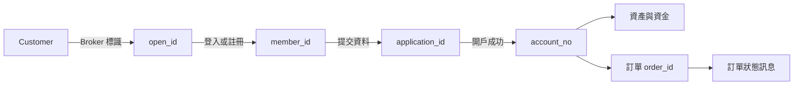
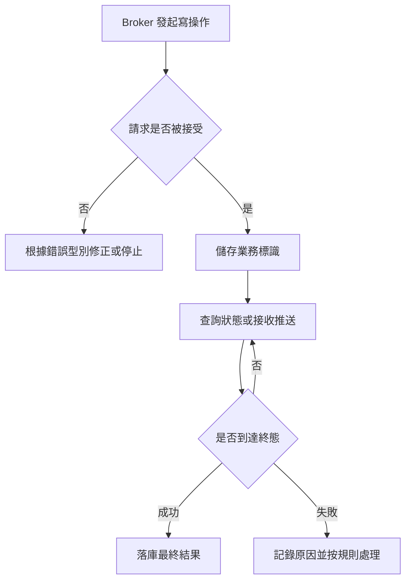

本頁建立 Broker 接入時共同使用的業務模型。它說明各標識由誰產生、何時儲存以及它們如何串聯；具體欄位仍以對應 API 文件為準。

## 核心物件 {/* core-objects */}

| 物件 | 關鍵標識 | 產生方 | Broker 需要做什麼 |
| --- | --- | --- | --- |
| Customer | `open_id` | Broker | 為同一 Customer 提供穩定且唯一的標識，不得複用 |
| Whale 使用者 | `member_id` | Whale | 儲存與 `open_id` 的映射，並校驗資源歸屬 |
| Customer 會話 | `token`、`refresh_token`、`sid` | Whale | 將初始憑證設定到 WhaleAppSDK / WhaleCoreSDK；校驗與續期由 SDK 層管理 |
| 開戶申請 | `application_id` | Whale | 提交後落庫，持續查詢直至成功或失敗 |
| 證券帳戶 | `account_no` | Whale | 開戶成功後落庫；資產、資金和交易操作以其定位帳戶 |
| 訂單 | `order_id` | Whale | 將同步提交結果與非同步狀態推送關聯起來 |
| 訊息 | `post_id` 或專案約定的唯一訊息 ID | Whale | 去重、記錄處理結果，並按訊息型別分發 |

<Warning>
標識存在不等於呼叫合法。Broker 服務端必須校驗 `member_id`、`application_id`、`account_no` 和 `order_id` 是否屬於當前 Customer 或當前 Broker 的授權範圍。
</Warning>

## 使用者、會話與帳戶不是同一物件 {/* users-sessions-and-accounts-are-different-objects */}

- `open_id` 用於將 Broker 使用者與 Whale 使用者關聯起來。
- `member_id` 標識 Whale 使用者，不等同於證券帳戶。
- 一個業務流程在獲得 `member_id` 後，仍可能處於未開戶、開戶中或開戶失敗狀態。
- 只有開戶成功並獲得 `account_no` 後，才能按證券帳戶執行資產、資金和交易操作。
- `token` 表示 Customer 會話。WhaleAppSDK / WhaleCoreSDK 負責有效性檢查和自動續期；Broker App 僅處理不可恢復的失效事件。token 不會替代 Broker Server 的資源歸屬校驗。

詳細接入順序見[使用者系統接入](/zh-hk/docs/user-system-integration)和[使用者綁定與證券帳戶開戶](/zh-hk/docs/account-opening)。

## 同步響應與非同步終態 {/* synchronous-responses-and-asynchronous-final-states */}

開戶、訂單和訊息都可能包含非同步階段。介面接受請求，只能證明請求已被接收，不能直接證明業務已經完成。

因此，所有寫操作都應明確：

1. 用哪個業務標識查詢結果。
2. 哪些狀態仍在處理中，哪些狀態是終態。
3. 超時後如何查詢狀態，避免直接重複提交。
4. 重複響應或重複訊息如何去重。
5. 最終失敗時向 Customer 展示什麼資訊、由誰處理。

## 三條技術鏈路 {/* three-technical-paths */}

| 鏈路 | 執行位置 | 身份邊界 | 主要用途 |
| --- | --- | --- | --- |
| Broker App 與 Whale | Broker App / Web 容器 | 單個 Customer | WhaleAppSDK UI，或 WhaleCoreSDK + TradingAPI 自行實現證券功能 UI |
| Broker Server 與 Whale | Broker 服務端 | Broker 機構或專案約定範圍 | BrokerAPI、使用者關聯、開戶及機構級業務 |
| Whale 與 Broker Server | 雙方服務端 | Broker | Broker 自有推送渠道的訊息轉發 |

<Note>
OpenAPI 面向 Broker 的 Developer Customer，用於策略交易、量化分析和 AI 應用，不是 Broker 實施團隊建設機構級整合的替代方案。
</Note>

## Broker 應維護的最小關聯記錄 {/* minimum-association-records-for-the-broker */}

| 欄位 | 何時寫入 | 用途 |
| --- | --- | --- |
| `open_id` | 首次建立 Whale 使用者關聯前 | 發起登入或綁定 |
| `member_id` | 登入註冊成功後 | 後續使用者級呼叫與歸屬校驗 |
| `application_id` | 開戶申請被接受後 | 查詢開戶狀態及防止重複提交 |
| 開戶狀態與 `reason` | 每次狀態同步後 | Broker App 展示及異常處理 |
| `account_no` | 開戶成功後 | 資產、資金、交易和對賬 |
| 最近處理的訊息 ID | 訊息處理後 | 訊息冪等與問題追蹤 |

日誌可以記錄這些業務標識以便追蹤，但 token、金鑰、證件號碼和聯絡方式必須脫敏。
