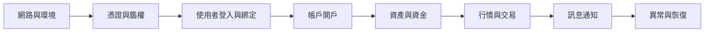

本頁承接前期方案、使用者系統和開戶接入，說明如何組織聯調、業務驗收和生產切換。

## 開始前

應先完成：

1. [Broker 接入總覽](/zh-hk/docs/broker-onboarding/)中的角色、範圍和環境準備。
2. [接入方式選擇](/zh-hk/docs/integration-options/)，明確 WhaleApp SDK、WhaleCore SDK + Trading API 或 Broker API 的邊界。
3. [使用者系統接入](/zh-hk/docs/user-system-integration/)，確認身份、會話和授權模型。
4. 如包含開戶，完成[帳戶綁定與開戶](/zh-hk/docs/account-opening/)的資料映射。
5. 如包含 App 通知，確認[訊息推送接入](/zh-hk/docs/message-push/)方案。

## 聯調順序

建議按照最小閉環逐步擴大範圍：

每個階段都應記錄輸入資料、預期結果、實際結果、請求關聯 ID 和負責人。寫請求發生超時時，應先查詢業務狀態再決定是否重試。

## 每一階段如何驗收

| 階段 | 最小驗證 | 透過證據 |
| --- | --- | --- |
| 網路與環境 | DNS、TLS、出口 IP、白名單和超時配置 | Broker Server 從目標環境成功訪問已確認地址 |
| 憑證與鑑權 | 正確憑證、錯誤憑證、過期或無效憑證 | 成功請求可追蹤，失敗請求不會洩露憑證 |
| 使用者與會話 | 新 Customer、已有 Customer、重新整理和登出 | `open_id` 與 `member_id` 映射穩定，會話失效符合預期 |
| 開戶 | 提交、處理中、成功、失敗和重複提交 | `application_id`、狀態、`reason` 與 `account_no` 正確落庫 |
| 資產與資金 | 查詢、變動、精度和餘額限制 | Broker 記錄與 Whale 返回結果一致 |
| 行情與交易 | 訂閱、下單、訂單狀態和異常訂單 | 同步結果與非同步訂單終態能夠關聯 |
| 訊息通知 | 前臺、後臺、關閉許可權、重複訊息 | Broker App 或 Broker Server 正確去重、展示和跳轉 |
| 恢復能力 | 超時、限流、斷線重連和服務異常 | 重試有上限，不產生重複業務結果 |

## UAT 場景

### 正常流程

- 新 Customer 與已有 Customer 登入。
- 首次開戶、開戶成功及已有證券帳戶進入產品。
- 資產查詢、資金變動和目標市場交易。
- 訂單狀態變化及訊息通知。
- Customer 主動退出及重新登入。

### 異常流程

- token 和 refresh token 失效。
- Customer、帳戶或資源歸屬不匹配。
- 開戶稽核失敗、重複提交和長期處理中。
- 網路超時、服務端錯誤及限流。
- 重複訊息、通知關閉和無效跳轉連結。
- App 或頁面在處理中被關閉後重新進入。

### UAT 記錄模板

每個用例至少記錄以下欄位：

| 欄位 | 說明 |
| --- | --- |
| 用例 ID 與名稱 | 可穩定引用的測試編號和業務場景 |
| 前置條件 | 環境、Customer、帳戶、市場和配置 |
| 操作步驟 | Broker App 與 Broker Server 的實際操作 |
| 預期結果 | 同步響應、中間狀態和最終業務狀態 |
| 實際結果 | 包括 Broker UI、Broker 資料和 Whale 返回結果 |
| 追蹤資訊 | 時間及時區、請求關聯 ID、脫敏業務標識 |
| 結論 | 透過、失敗或阻塞，以及問題連結和負責人 |

## 生產就緒檢查

- 生產域名、DNS、TLS、出口 IP 和白名單均已驗證。
- 生產憑證透過安全渠道交付，且與 UAT 完全隔離。
- Customer、使用者、申請和帳戶映射可以查詢和追蹤。
- 錯誤率、延遲、非同步任務、訊息積壓和關鍵業務終態均有監控。
- 日誌已脫敏，並記錄環境、介面、請求關聯 ID 和業務標識。
- 釋出步驟、觀察指標、停止條件和回退方案已評審。
- 上線視窗內雙方技術、業務和事件負責人可以響應。

### 上線准入門檻

以下任一條件未滿足時，不應進入生產切換：

- 核心正常流程或資金、交易等高影響異常流程尚未驗收。
- UAT 與生產的配置差異沒有完成評審。
- 無法透過業務標識和請求關聯 ID 追蹤關鍵操作。
- Broker App、Broker Server 或 Whale 任一側沒有可用監控。
- 沒有明確的停止條件、回退步驟或回退負責人。
- 生產憑證曾出現在程式碼、日誌、聊天或工單中，且尚未輪換。

## 上線與保障期

上線時從小範圍真實業務開始，確認登入、帳戶、交易和通知閉環後再擴大範圍。保障期內集中跟蹤生產請求、Customer 反饋、失敗任務和配置差異；所有臨時修復都應在保障期結束前形成正式配置、程式碼或運維記錄。

保障期結束前，雙方應確認：

- 遺留問題有負責人、優先順序和計劃完成時間。
- 臨時白名單、臨時配置和手工操作已清理或轉為正式方案。
- 監控閾值、事件聯絡人和支援入口已經移交給常規運維團隊。
- 專案實施資料、UAT 記錄和生產變更記錄可供後續追溯。

<Warning>
不要用 UAT 的“介面返回成功”代替業務驗收。開戶、資金、訂單和訊息均包含非同步階段，驗收必須檢查最終業務狀態。
</Warning>
