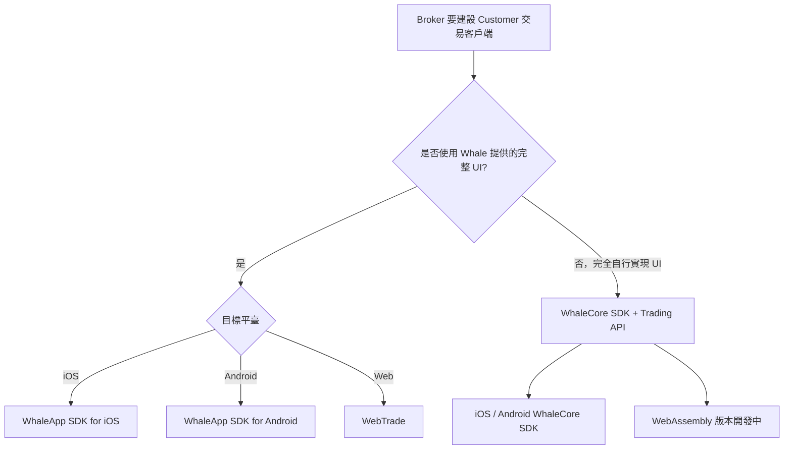

選擇接入方式時，先判斷是否需要 Whale 提供圖形介面，再判斷呼叫方代表 Broker 機構還是單個 Customer。

## 對比

| 產品 | 呼叫方 | 授權主體 | 形態 | 適合場景 | 狀態 |
| --- | --- | --- | --- | --- | --- |
| [WhaleApp SDK](/zh-Hant/whalesdk/overview) | Broker App 開發團隊 | Customer | iOS / Android / WebTrade 圖形介面 SDK | 在 Broker App、網站或 Web 容器中整合完整證券業務 UI | 可用 |
| [WhaleCore SDK + Trading API](/zh-Hant/trading-api/introduction) | Broker App | Customer | iOS / Android / Web 資料 SDK + HTTP API | Broker App 完全自行實現證券功能 UI | iOS / Android 可用；WebAssembly 開發中 |
| [Broker API](/zh-Hant/broker-api/overview) | Broker Server / 自研管理後臺服務端 | Broker | HTTPS API | Server-to-Server 整合或自研管理後臺 | 可用 |
| [OpenAPI](https://open.longportapp.com) | Broker 的開發者 Customer、AI 應用 | Customer | Open API / SDK / MCP | 策略交易、量化分析及 AI 接入 Customer 帳戶與市場資料 | 可用（外部站點） |

## 圖形介面還是完全自研

- **需要現成 UI**：選擇 **WhaleApp SDK**。iOS 和 Android 提供原生圖形介面；WebTrade 透過新標籤頁、iframe 或 WebView 整合。
- **完全自行實現證券功能 UI**：使用 **WhaleCore SDK + Trading API**。WhaleCore SDK 提供行情訂閱、WebSocket 連線、認證簽名和 token 續期等客戶端基礎機制；Trading API 透過 HTTP 提供帳戶、資產和交易等業務能力。

## 授權邊界

- **Broker 機構授權**：代表 Broker 執行的 Server-to-Server 整合或自研管理後臺使用 Broker API；實際請求由 Broker 控制的服務端發起。
- **Customer 授權**：WhaleApp SDK（包括 WebTrade）、WhaleCore SDK、Trading API 和 OpenAPI 均以單個 Customer 的許可權訪問私有資料。
- **Broker Developer 與 Developer Customer**：前者代表 Broker 建設產品；後者是 Broker 的 Customer，使用 OpenAPI 開發策略交易、量化分析或 AI 應用。兩者不共享憑證和授權範圍。

<Note>
WhaleCore SDK 不提供任何圖形介面，也不是 Trading API 的替代品。完全自行實現證券功能 UI 的 Broker App，通常同時使用 WhaleCore SDK 的長連線與基礎機制，以及 Trading API 的 HTTP 業務介面。
</Note>
