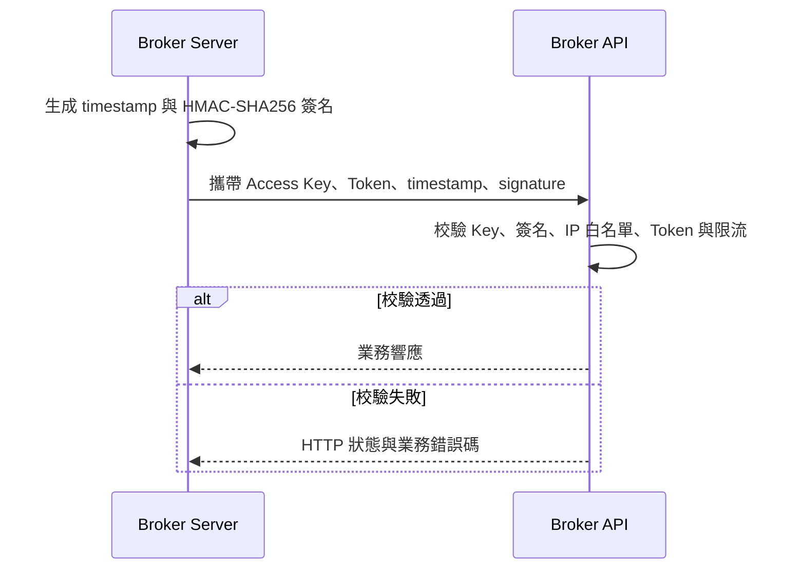

<Note>
Broker API 是機構級 API，可用於 Server-to-Server 整合，也可作為 Broker 自研管理後臺的資料與業務介面。實際請求應由 Broker 服務端發起，不應在瀏覽器程式碼或 Broker App 中儲存 Access Key 或直接請求。
</Note>

Broker API 用於實現證券櫃檯業務，主要覆蓋使用者帳戶、資產、交易和新股等模組。完整介面參考見 [Broker API](/zh-hk/broker-api/overview/)。

## 認證

Broker API 使用一組 Access Key 憑證完成機構級認證。

| 憑證 | 用途 |
| --- | --- |
| `AccessKeyId` | 每次請求透過 `x-api-key` Header 傳送 |
| `AccessKeySecret` | 在 Broker Server 內生成請求籤名，不隨請求直接傳送 |
| `AccessKeyToken` | 作為 Access Token 透過 `authorization` Header 傳送 |

Broker API 會校驗：Access Key 是否存在、請求籤名是否正確、請求 IP 是否在白名單中、Access Token 是否有效，以及介面是否觸發限流。

### 請求頭

| Header | 說明 | 示例 |
| --- | --- | --- |
| `x-api-key` | Access Key ID | `<access-key-id>` |
| `authorization` | Access Token | `<access-token>` |
| `x-timestamp` | 請求時間戳 | `1685518362.111` |
| `x-api-signature` | 請求籤名 | `HMAC-SHA256 SignedHeaders=x-api-key;authorization;x-timestamp,Signature=<signature>` |

由於是服務端呼叫服務端，這裡不會有 session 和 refresh session 的場景。基本呼叫流程如下：



<Warning>
AccessKeySecret、AccessKeyToken 和完整簽名不得寫入日誌、提交到倉庫或下發給 Broker App。
</Warning>

## WebSocket 交易推送

我們會提供 WebSocket 交易閘道器用於訂單狀態變更資訊的推送。Broker API 的 WebSocket 交易閘道器與 [OpenAPI WebSocket 交易閘道器](https://open.longportapp.com/en/docs/socket/subscribe_trade)一致，資料互動使用的私有協議也與 [OpenAPI 協議](https://open.longportapp.com/en/docs/socket/protocol/overview)一致。Broker 透過 Broker API 提交訂單，訂單狀態更新時會透過 WebSocket 閘道器推送。

相關參考：

- [訂單狀態推送內容](https://open.longportapp.com/docs/trade/trade-definition#websocket-%E6%8E%A8%E9%80%81%E9%80%9A%E7%9F%A5)
- [WebSocket 訂閱交易主題](https://open.longportapp.com/en/docs/socket/subscribe_trade)
- [私有協議說明](https://open.longportapp.com/en/docs/socket/protocol/overview)

### 首次連線

<Steps>
  <Step title="獲取 OTP">
    呼叫[獲取 OTP 介面](https://open.longportapp.com/en/docs/socket-token-api)。
  </Step>
  <Step title="建立 WebSocket">
    使用專案確認的交易閘道器地址建立連線。
  </Step>
  <Step title="完成認證">
    使用 OTP 執行 [auth 操作](https://open.longportapp.com/en/docs/socket/control-command#auth)。成功響應會返回可用於重連的 Session ID。
  </Step>
  <Step title="訂閱交易訊息">
    訂閱 `private` Topic，接收訂單狀態變化。
  </Step>
</Steps>

### 斷線重連

<Steps>
  <Step title="重新建立 WebSocket">
    建立新的 WebSocket 連線。
  </Step>
  <Step title="使用 Session ID 重連">
    使用上一次儲存的 Session ID 執行 [reconnect 操作](https://open.longportapp.com/en/docs/socket/control-command#reconnect)。成功響應會返回下一次重連使用的新 Session ID。
  </Step>
  <Step title="恢復訂閱">
    重新訂閱 `private` Topic，並按 `order_id` 處理可能重複到達的訂單訊息。
  </Step>
</Steps>

## 歷史 Go 呼叫示例

以下程式碼保留原始對接材料中的完整示例，用於說明配置、HTTP 呼叫和 WebSocket 訂閱的組合方式，不應不經修改直接用於當前專案。執行前需要確認當前仍支援的客戶端庫，並把地址和憑證替換為專案實際配置。

<Warning>
示例中的 `openapi.longbridge.xyz` 地址來自歷史材料，不代表當前 Broker API 環境。必須使用 Whale 專案團隊為當前專案確認的 HTTP 與 WebSocket 地址。
</Warning>

```go
package main

import (
        "context"
        "encoding/json"
        "log"
        "net/url"
        std_http "net/http"
        "syscall"
        "time"
        "os"
        "os/signal"

        "github.com/longbridgeapp/openapi-go/config"
        "github.com/longbridgeapp/openapi-go/http"
        "github.com/longbridgeapp/openapi-go/trade"
)

var (
        accessKeyId     = ""
        accessKeySecret = ""
        accessToken     = ""

        httpAddr           = "https://openapi.longbridge.xyz"
        tradeWebsocketAddr = "wss://openapi-trade.longbridge.xyz"
)

func main() {
        // init config
        conf := &config.Config{
                AppKey:      accessKeyId,
                AppSecret:   accessKeySecret,
                AccessToken: accessToken,
                HttpURL:     httpAddr,
                TradeUrl:    tradeWebsocketAddr,
                LogLevel:    "warn",
        }

        // init go std http client
        hc := &std_http.Client{
                Transport: &std_http.Transport{
                        MaxIdleConnsPerHost: 20,
                },
                Timeout: 10 * time.Second,
        }
        conf.Client = hc

        // new trade context
        // this operation will establish websocket connection to trade gateway
        tctx, err := trade.NewFromCfg(conf)

        if err != nil {
                log.Fatal(err)
        }

        // subscribe private topic to receive order change events
        if _, err = tctx.Subscribe(context.Background(), []string{"private"}); err != nil {
                log.Fatal(err)
        }

        // register order change event callback
        tctx.OnTrade(func(ev *trade.PushEvent) {
                log.Println("received trade event")
        })

        // new http client for rest api calling
        client, err := http.New(http.WithAppKey(conf.AppKey), http.WithAppSecret(conf.AppSecret), http.WithURL(conf.HttpURL), http.WithAccessToken(conf.AccessToken))

        if err != nil {
                log.Fatal(err)
        }

        // create order
        createOrder(client)

        ch := make(chan os.Signal, 1)
        signal.Notify(ch, os.Interrupt, syscall.SIGTERM)
        s := <-ch
        log.Println("exit for " + s.String())
}

func createOrder(c *http.Client) {
        doRequest(c, Request{
                Name:   "SubmitOrder",
                Method: std_http.MethodPost,
                Path:   "/v1/whaleapi/trade/order",
                Parameters: Parameters{
                        Body: map[string]interface{}{
                                "account_no":         "<account-no>",
                                "symbol":             "AAPL.US",
                                "order_type":         "MO",
                                "submitted_quantity": "100",
                                "side":               "Buy",
                                "time_in_force":      "Day",
                        },
                },
        })
}

type Request struct {
        Name       string
        Method     string
        Path       string
        Parameters Parameters
}

type Parameters struct {
        Query  map[string]string
        Header map[string]string
        Body   map[string]interface{}
}

func doRequest(c *http.Client, req Request) {
        var resp json.RawMessage

        log.Println("calling api " + req.Name)

        q := make(url.Values)

        for k, v := range req.Parameters.Query {
                q.Set(k, v)
        }

        var body interface{}

        if len(req.Parameters.Body) != 0 {
                body = req.Parameters.Body
        }

        // call api
        err := c.Call(context.Background(), req.Method, req.Path, q, body, &resp)

        if err != nil {
                log.Printf("[ERR] failed to invoke %s error: %v\n", req.Name, err)
        } else {
                log.Println(req.Name + " resp: " + string(resp))
        }

}
```

將程式碼儲存為本地 Go 檔案，然後在同一目錄執行：

```shell
go mod init main
go mod tidy
go run ./
```

示例執行結果：


### 初始化配置

```go
conf := &config.Config{
                AppKey:      accessKeyId,
                AppSecret:   accessKeySecret,
                AccessToken: accessToken,
                HttpURL:     httpAddr,
                TradeUrl:    tradeWebsocketAddr,
                LogLevel:    "warn",
        }
```

### 初始化交易上下文

```go
// init go std http client
        hc := &std_http.Client{
                Transport: &std_http.Transport{
                        MaxIdleConnsPerHost: 20,
                },
                Timeout: 10 * time.Second,
        }
        conf.Client = hc

        // new trade context
        // this operation will establish websocket connection to trade gateway
        tctx, err := trade.NewFromCfg(conf)

        if err != nil {
                log.Fatal(err)
        }
```

### 建立連線並訂閱訂單事件

```go
// subscribe private topic to receive order change events
        if _, err = tctx.Subscribe(context.Background(), []string{"private"}); err != nil {
                log.Fatal(err)
        }

        // register order change event callback
        tctx.OnTrade(func(ev *trade.PushEvent) {
                log.Println("received trade event")
        })
```

### 呼叫 HTTP API

```go
// new http client for rest api calling
        client, err := http.New(http.WithAppKey(conf.AppKey), http.WithAppSecret(conf.AppSecret), http.WithURL(conf.HttpURL), http.WithAccessToken(conf.AccessToken))

        if err != nil {
                log.Fatal(err)
        }

        // create order
        createOrder(client)
```

## 歷史對接問答

<AccordionGroup>
  <Accordion title="Broker API 的訪問限頻是多少？">
    歷史材料記錄為按 API Key 總計每秒 `200` 次，並認為該數量通常足夠、一般業務難以達到。限頻可能按環境和專案調整，上線前應以當前 Broker API 契約和 Whale 專案團隊確認結果為準。
  </Accordion>
  <Accordion title="當日成交以收市還是日清流程作為截止時間？">
    歷史材料記錄：美股當日成交的時間範圍為北京時間 `09:00` 至次日 `12:00`，之後歸入歷史成交；夏令時通常整體提前一小時。實際時間邊界應以當前交易日曆和專案配置為準。
  </Accordion>
</AccordionGroup>
