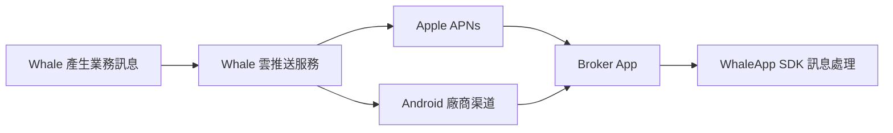
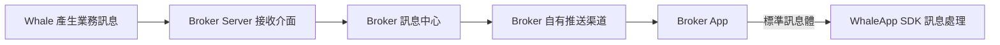

WhaleApp SDK 支援兩種訊息對接方案。兩種方案最終都由 Broker App 接收標準訊息體並交給 WhaleApp SDK，區別在於訊息由 Whale 直接投遞到雲推送渠道，還是先轉發給 Broker Server。

| 對比項 | Whale 託管推送 | Broker 自有推送 |
| --- | --- | --- |
| 訊息鏈路 | Whale → 雲推送 → 裝置 → Broker App | Whale → Broker Server → Broker 推送渠道 → Broker App |
| Broker Server 開發 | 不需要 | 需要開發接收、去重和分發服務 |
| 推送渠道憑證 | Broker 安全提供給 Whale | Broker 自行保管 |
| 分發控制 | 使用 Whale 配置的渠道與策略 | Broker 可以決定是否通知及如何分發 |
| 適用情況 | 希望降低接入成本並快速上線 | 已有訊息中心或需要自主控制訊息 |

## 方案一：Whale 託管推送

<CardGroup cols={2}>
  <Card title="優點" icon="circle-check">
    Broker 接入成本較低，不需要開發訊息轉發服務。
  </Card>
  <Card title="需要考慮" icon="triangle-exclamation">
    Broker 需要向 Whale 安全提供渠道配置：iOS APNs 憑證，以及 Android 各廠商的 App ID、App Key 或 Secret。
  </Card>
</CardGroup>

<Steps>
  <Step title="收集渠道資訊">
    Broker 按[推送渠道資訊收集](/zh-Hant/docs/push-channel-credentials)準備 UAT 與生產資料，不使用的渠道明確標記為“無”。
  </Step>
  <Step title="配置 Whale 雲推送">
    Whale 專案團隊將雙方確認的渠道資訊配置到對應環境的雲推送服務。
  </Step>
  <Step title="整合 Broker App">
    Broker App 對接 WhaleApp SDK 訊息 API，並驗證通知許可權、裝置 token、前後臺接收和點選跳轉。
  </Step>
</Steps>

## 方案二：Broker 自有推送

<CardGroup cols={2}>
  <Card title="優點" icon="sliders">
    Whale 不管理具體下游渠道；Broker 可以決定訊息是否通知，並控制模板、使用者偏好和分發策略。
  </Card>
  <Card title="需要考慮" icon="code">
    Broker Server 需要開發訊息接收和下游分發；鑑權、冪等、可靠落庫與監控方式由專案雙方確認。
  </Card>
</CardGroup>

<Steps>
  <Step title="開發接收介面">
    Broker Server 開發 Whale 可訪問的 HTTPS 訊息接收介面。
  </Step>
  <Step title="配置轉發地址">
    Broker 將 UAT 與生產接收地址、認證方式、網路要求和聯絡人提供給 Whale 專案團隊。
  </Step>
  <Step title="完成服務端聯調">
    按[Broker 自有推送渠道](/zh-Hant/docs/server-message-forwarding)驗證請求、響應、冪等和失敗處理。
  </Step>
  <Step title="整合 Broker App">
    Broker App 將最終收到的標準訊息體交給 WhaleApp SDK，並完成安全跳轉和相容處理。
  </Step>
</Steps>

<Note>
本頁用於選擇方案；完整責任邊界、客戶端要求和驗收場景見[訊息推送接入](/zh-Hant/docs/message-push)。
</Note>
